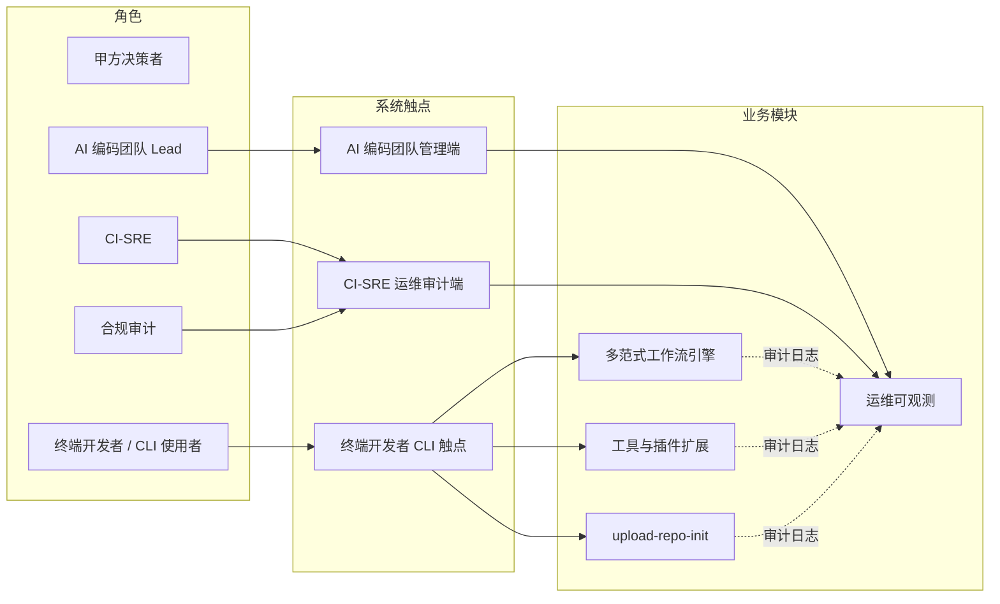
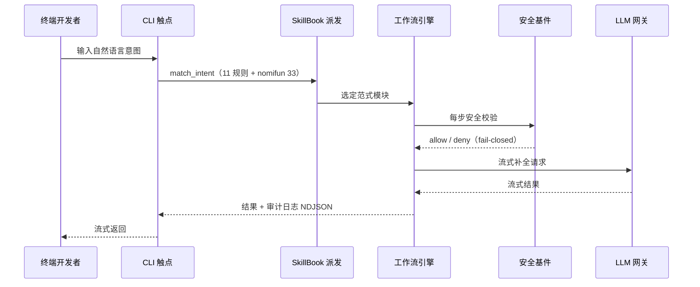
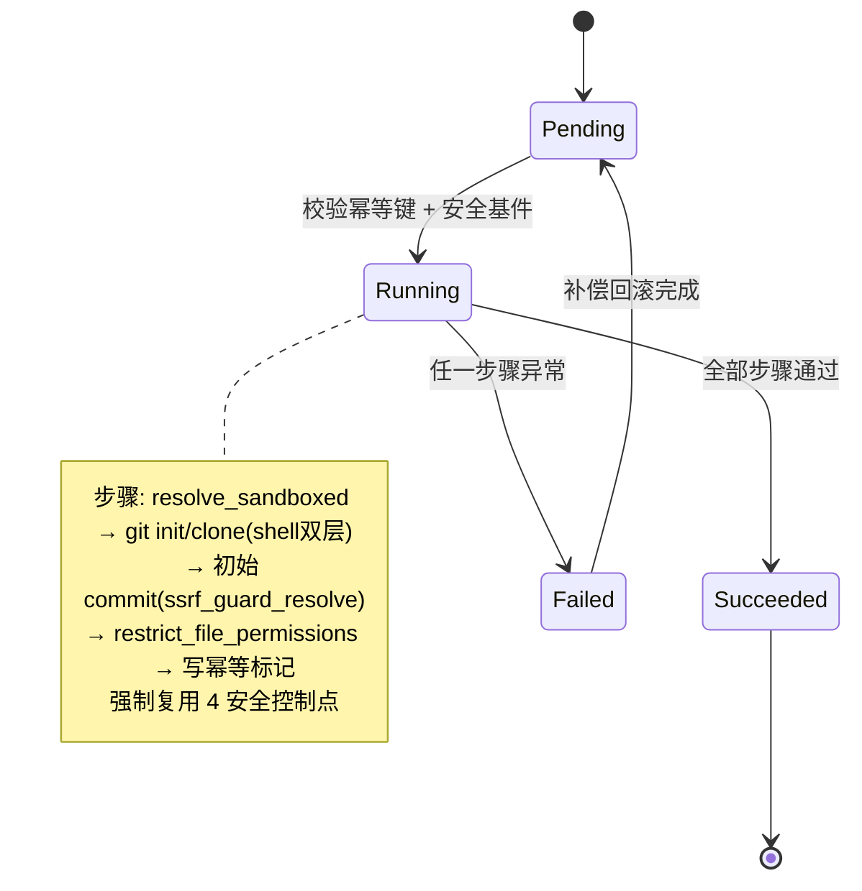

# AICoding 架构设计 · UserStory

> 本文档为《AICoding 架构设计》核心产物之一，定位为**产品需求与用户故事（UserStory）**。
> 上游输入：《高层架构设计》（G3 已通过，角色/场景/功能边界唯一基线）、《资料摘要》（G1）、《行业调研报告》（G2）；
> 下游输出：驱动《系统设计》《部署设计》《安全设计》的具体功能实现与可验证验收标准。
> 本文档严格继承高层架构已冻结的系统定位、模块范围、MVP 范围、角色场景与功能清单（F1~F14 + N1~N3 In-Scope；O1/O2/O3 Out-of-Scope），不扩张、不裁剪。

---

## 1. 业务背景与价值

### 1.1 业务背景

- **当前业务现状（行业 / 产品 / 用户规模）**：ganyu-agent 是一款 Rust 单二进制 CLI AI agent（约 7.6k LOC、34 个 .rs 文件），以 `Unit × RunContext × Workflow` 为核心抽象，6 个 workflow 模块实现 7 个范式（single 模块兼 single+ReAct），服务终端开发者与 AI 编码团队。其工程审计报告（9 维度，总体 🟡 有条件通过 B+）暴露 4 项运维就绪度 🔴 缺口、若干技术债（F1 缺 sandbox、A1/A2/U1 上帝模块、M1~M4 待实现）与一项经五位专家与源码核验**确认不存在**的缺失能力「上传仓库初始化（upload-repo-init）」。
- **触发本次需求的事件（新场景 / 痛点修复）**：由工程审计报告 + 现有安全/架构文档 + 代码事实溯源共同驱动，启动「整体架构方案 + 该缺失能力的边界冻结设计」。G0 运行时决策锁定架构范围为「整体方案 + 含 upload-repo-init 缺失能力设计」，不做 SaaS 多租户云端。
- **本系统在产品矩阵中的位置**：ganyu-agent 在「终端 AI 编码工具」产品矩阵中承担核心执行引擎职责，向上对接 LLM 网关与记忆后端、向外通过 vetted 插件/skill 扩展生态，向下经 CI 构建发布自托管二进制，与上游资料/调研、下游系统/部署/安全设计形成完整闭环。
- **系统本质（关键定位）**：ganyu-agent 是 **CLI 工具，非 Web 多租户系统**。UserStory 的「用户」= 终端开发者（CLI 使用者）、AI 编码团队 Lead、CI-SRE、合规审计；无传统 Web 页面，触点即终端 REPL/命令入口与运维/审计端。多租户 = 否（单机用户，N1）。

### 1.2 行业方案

> 同类功能、痛点的行业标杆系统及解决方案（事实摘要，完整原文见 `research_report.md`，G2 已通过）。

| 标杆系统 | 厂商 / 来源 | 部署形态 | 场景覆盖 | 技术亮点 | 对本项目的可借鉴点 |
| --- | --- | --- | --- | --- | --- |
| B1 Claude Code | Anthropic（闭源 SaaS/订阅制） | 本地 CLI + 云端托管会话 | 终端 AI 编程助手 | 分层多 agent、OS 级沙箱（bubblewrap/seatbelt，FS+网络双隔离）、6 种权限模式、MCP | OS 级 FS+网络双隔离对 F1 债务直接有用；闭源不可自托管，合规可控性弱 |
| B2 Goose | Block → Linux 基金会 AAIF（Apache-2.0 开源，Rust） | 本地 CLI + 桌面 + API | 通用 agent（编码/工作流/研究） | Rust 引擎、MCP-first（70+ 扩展）、可移植 YAML Recipes、并行 subagent（隔离文件域） | 与 ganyu 同为 Rust CLI，架构范式与插件机制最具借鉴价值；可审计/自托管契合 fail-closed |
| B3 OpenCode | SST 团队（MIT 开源，TypeScript/Bun） | 终端 TUI + 桌面 + IDE + Server | 开源终端 AI 编码 agent | 客户端/服务端分离、75+ LLM、原生 LSP、细粒度命令黑白名单 | core↔ext 解耦（A2）与权限配置参考 |
| B4 OpenHands | All-Hands-AI（MIT 开源，Python/FastAPI+React） | Web + 每会话 Docker 沙箱 | 自主软件工程师（issue→PR） | 每会话 Docker 隔离、资源配额、操作审计、快照回滚 | 仅抽取沙箱隔离与可恢复性子模式供 F1/运维缺口参考；整体 Web/Docker 形态与单二进制 CLI 不符 |

**结论摘要**：优先借鉴 B2（Rust CLI + MCP-first + 隔离文件域 subagent），部分借鉴 B3（分层/权限）与 B1（沙箱/权限模式），否决 B4 整体架构（仅抽子模式）。加权总分 B2=4.80 / B3=4.55 / B1=3.95 / B4=3.60。

### 1.3 方案收益与价值

> 量化目标对齐高层架构 §1.3 价值主张，每条可量化，无"提升/优化"等模糊词。

| 项 | 说明 | 量化标准 | 当前值 | 目标值 | 截止时间 |
| --- | --- | --- | --- | --- | --- |
| 效率（P0 修复） | P0 高优缺陷清零 + 记忆调用连接复用 | 🔴 高优缺陷数 / 连接池复用率 | 4 项高优缺陷；每次记忆调用新建 `reqwest::Client`（连接池失效） | 0 项高优缺陷；连接池复用率 100% | MVP 上线 |
| 合规（新建能力） | upload-repo-init 复用既有安全控制点 | 12 层防御相关控制点复用数 / 总数 | 新建模块 0 复用（能力原不存在） | 4/4（resolve_sandboxed / ssrf_guard_resolve / restrict_file_permissions / shell 双层门禁） | MVP 上线 |
| 成本（轻量运维） | 自托管零云运行时成本 + 轻量运维补齐 | 二进制体积增长 / 新增重依赖数 | 无内嵌运维组件 | 体积增长 ≤ 15% 且零新增重依赖（systemd 看门狗 + 内嵌 metrics/log/OTel） | MVP 上线 |
| 体验（新建能力） | 终端开发者获得本地仓库一键幂等初始化 | 仓库初始化步骤数 / 幂等成功率 | 能力不存在（手动多步） | 1 命令；幂等成功率 ≥ 99.9% | MVP 上线 |

### 1.4 术语清单

> 与高层架构 §4.1（X3 口径）及 `_team_runtime.md` §6 术语表统一表述一致，不新造术语。

| 术语 | 含义 |
| --- | --- |
| ganyu-agent | Rust CLI AI agent，本方案目标系统（单二进制、自托管、非 SaaS 多租户） |
| Unit / RunContext / Workflow | 工作流引擎原子基底（Unit）、共享上下文（RunContext）、6 种协调策略（Workflow） |
| 6 模块实现 7 范式（single 兼 ReAct） | 统一口径：6 个 workflow 模块实现 7 个范式，single 模块同时承载 single 与 ReAct 两个范式（消除"7 范式 vs 6 模块"歧义，X3） |
| SkillBook::match_intent | 意图派发器（11 规则 + nomifun 33 能力，注册形式 `skill:NAME`） |
| nomifun | 随附 33 项能力包（`skills/nomifun/*`），非 agent 核心代码 |
| 上传仓库初始化（upload-repo-init） | 审计发现的缺失能力，本次需设计（MVP 本地 init/clone/commit 幂等 + 回滚；完整版/opt-in 含远端 push） |
| fail-closed | 失败闭环安全哲学：任一校验失败即拒绝，默认拒绝 |
| ed25519 / 12 层防御 | 供应链签名（RFC 8032）+ 12 层防御矩阵安全基件，含 resolve_sandboxed / ssrf_guard_resolve / restrict_file_permissions / shell 双层门禁等控制点 |
| vetted 插件信任锚 | `plugins/example.json` 声明 `vetted:true` 的本地插件清单（如 `python plugins/upper.py`），MVP 冻结现状 |
| hardened | Cargo feature 组合（`network/crypto/secret/shell`，审计建议补 `sandbox`）；仅 Linux 生效 Landlock |
| Landlock | Linux 进程级 FS 沙箱（sandbox feature，仅 Linux）；非 Linux 为诚实 no-op |
| MVP / 完整版 | MVP=本地最小集（F1~F9 + N1~N3）；完整版/opt-in 含 F10~F14（远端 push、跨平台隔离、上帝模块拆分、MCP 演进、测试基线透明） |

---

## 2. 范围与边界

### 2.1 系统内模块及功能

> 一级功能清单（对齐高层 §6.1 In-Scope 与 §6.3 F1~F14）。

| 一级模块 | 二级功能 | 功能编号 | MVP 范围 |
| --- | --- | --- | --- |
| 多范式工作流引擎 | 引擎复用（6 模块/7 范式）；P0-2 breakers 热重载 panic 修复；上帝模块拆分（完整版） | F1 / F4 / F12 | ✅ MVP（F12 完整版） |
| 记忆与上下文 | P0-1 连接池修复；P0-3 阻塞 IO 修复；测试基线透明（完整版） | F3 / F5 / F14 | ✅ MVP（F14 完整版） |
| 工具与插件扩展 | 插件机制冻结（vetted 信任锚）；插件 MCP 演进（完整版/opt-in） | F9 / F13 | ✅ MVP（F9 现状；F13 完整版） |
| 安全基件（复用） | ed25519 + 12 层防御复用；F1 sandbox Linux Landlock 强化；跨平台容器级隔离（完整版） | F2 / F7 / F11 | ✅ MVP（F7 部分；F11 完整版） |
| upload-repo-init（新建） | 本地仓库初始化最小集；远端 push 发布（完整版/opt-in） | F6 / F10 | ✅ MVP（F6）；F10 完整版 |
| 运维可观测（新建） | 运维缺口补齐（supervisor/可观测/原子升级/审计轮转） | F8 | ✅ MVP（分批） |
| 非功能（部署形态） | 自托管单二进制、私有化、非 SaaS、多租户=否；非 Linux honest no-op；终端 CLI 触点 | N1 / N2 / N3 | ✅ MVP |

In-Scope 合计：F1~F9 + N1~N3 = **11 条**（≤ 15 条硬指标）。

### 2.2 系统外模块及功能

> 当前系统**不覆盖**的功能，及其原因（对齐高层 §6.1 Out-of-Scope O1/O2/O3）。

#### Out-of-Scope 项 1：SaaS 多租户云端

| 编号 | 不做的事 | 原因 | 后续计划 |
| --- | --- | --- | --- |
| O1 | 不做 SaaS 多租户云端部署 | 项目为自托管单二进制 CLI，无云端多租户诉求；与 fail-closed / 数据主权一致（D-01 边界声明） | 不做（边界声明） |

#### Out-of-Scope 项 2：跨平台容器级隔离

| 编号 | 不做的事 | 原因 | 后续计划 |
| --- | --- | --- | --- |
| O2 | 不做跨平台容器级隔离（Docker 级） | 与单二进制 CLI 形态不符；非 Linux 维持 honest no-op；仅参考 B4 子模式 | 完整版 / 不做（待 G5 裁决 U-03） |

#### Out-of-Scope 项 3：远端仓库 push 发布（MVP 阶段）

| 编号 | 不做的事 | 原因 | 后续计划 |
| --- | --- | --- | --- |
| O3 | 远端仓库 push / release 发布 | 属 upload-repo-init 完整版或 opt-in；MVP 仅本地 init/clone/commit | 完整版（opt-in，对应 F10） |

### 2.3 外部依赖

> 对齐高层架构 §5.2 系统依赖架构（接入方式 + 同步/异步 + 关键约束）。

| 依赖系统 | 提供方 | 依赖能力 | 接入方式 | 接口人 |
| --- | --- | --- | --- | --- |
| LLM 网关 / 后端 | 外部 LLM 供应商（BYOK） | 模型推理、流式补全 | HTTPS / OpenAI 兼容 API（同步流式） | 终端开发者 / 平台团队 |
| 记忆后端 | OpenVikingMemory / 本地 JSON | 记忆读写、上下文召回 | 进程内调用 / REST（混合） | 开发团队 |
| 插件 / skill | vetted 插件清单（`example.json`） | 工具扩展执行 | 本地子进程（`python plugins/*.py`，同步） | 开发团队 |
| 远端仓库 | GitHub / Git 服务端（完整版/opt-in） | push/release 发布 | HTTPS / git 协议（异步） | 开发团队（F10 完整版） |
| 安全基件（复用底座） | ganyu 既有（D3/D4） | ed25519 校验、12 层防御控制点 | 进程内 API（同步） | security-architect（G5 协同） |
| 构建发布 CI | `release.yml` / `sign-release.py` | 三平台 hardened 构建 + 签名 | CI 流水线（异步） | 平台/运维团队 |
| 运维/审计系统 | systemd / ELK / Splunk | metrics / trace / 审计日志 | OTel / NDJSON（异步） | CI-SRE / 合规审计 |

---

## 3. 功能清单

> **定位**：全景骨架表，进入"角色 / 场景 / US"之前先看到完整功能版图。三层结构：一级模块 → 二级模块 → 功能项，对齐高层 §6.3 F1~F14，互查一致。

### 3.1 功能清单结构

| 一级模块 | 二级模块 | 功能项（编号） | 优先级（P0/P1/P2） | MVP 范围 | 完整版范围 | 备注 |
| --- | --- | --- | --- | --- | --- | --- |
| 多范式工作流引擎 | 引擎复用 | F1 复用 Unit×RunContext×Workflow（6 模块/7 范式，single 兼 ReAct） | P0 | ✅ MVP | ✅ | — |
| 多范式工作流引擎 | P0 修复 | F4 P0-2 routing breakers 热重载 panic 修复（原子 swap 消除 unwrap panic） | P0 | ✅ MVP | ✅ | V1 |
| 多范式工作流引擎 | 演进 | F12 上帝模块拆分（A1/A2/U1）+ M1~M4 | P2 | ❌ MVP | ✅ | V4 |
| 记忆与上下文 | P0 修复 | F3 P0-1 OpenVikingMemory 连接池复用修复 | P0 | ✅ MVP | ✅ | V1 |
| 记忆与上下文 | P0 修复 | F5 P0-3 LocalMemory 全量重写阻塞 IO 修复（增量写入） | P0 | ✅ MVP | ✅ | V1 |
| 记忆与上下文 | 演进 | F14 测试基线透明（默认 vs hardened 双计数，R-1 纳入 hardened CI） | P2 | ❌ MVP | ✅ | V5（路由 G4） |
| 工具与插件扩展 | 插件机制 | F9 插件机制冻结（保留 vetted 信任锚，现状不变） | P2 | ✅ MVP（现状） | ✅ | U-02 |
| 工具与插件扩展 | 演进 | F13 插件 MCP 演进（规划，保留 vetted 信任模型，路由 G4） | P2 | ❌ MVP | 规划 ✅ | U-02 |
| 安全基件（复用） | 安全复用 | F2 ed25519 + 12 层防御复用（fail-closed 默认拒绝） | P0 | ✅ MVP | ✅ | V2 |
| 安全基件（复用） | sandbox | F7 F1 sandbox Linux Landlock 强化（FS+网络双隔离） | P1 | ✅ MVP（部分） | ✅ | V2 |
| 安全基件（复用） | 隔离 | F11 跨平台容器级隔离（Docker 级，非 Linux） | P3 | ❌ MVP | 待 G5 裁决 | V2（U-03） |
| upload-repo-init（新建） | 本地初始化 | F6 本地仓库初始化最小集（状态机 + 幂等 + 回滚 + 复用 4 安全控制点） | P0 | ✅ MVP | ✅ | V3（核心新建） |
| upload-repo-init（新建） | 远端发布 | F10 远端 push 发布（opt-in） | P2 | ❌ MVP | ✅ | V3（完整版） |
| 运维可观测（新建） | 运维补齐 | F8 运维缺口补齐（supervisor/看门狗 + metrics/log/OTel + 原子升级 A/B + 审计日志轮转） | P1 | ✅ MVP（分批） | ✅ | V1 |
| 非功能（部署形态） | 部署形态 | N1 自托管单二进制，私有化，非 SaaS，多租户=否 | P0 | ✅ MVP | ✅ | D-05 |
| 非功能（部署形态） | 诚实边界 | N2 非 Linux F1 维持 honest no-op 并文档化 | P0 | ✅ MVP | ✅ | U-03 |
| 非功能（部署形态） | 触点 | N3 终端用户 CLI 交互触点（REPL / 命令入口） | P0 | ✅ MVP | ✅ | — |

**互查一致性声明**：本表与高层 §6.3 功能清单一一对应（F1~F14 + N1~N3 = 17 行；O1/O2/O3 为 Out-of-Scope，见 §2.2）。F1~F6 全为 P0 且 ✅ MVP；F7/F8 P1 ✅ MVP 分批；F9 P2 ✅ MVP 现状；F10~F14 完整版/opt-in。无新增、无裁剪。

---

## 4. 角色与场景

### 4.1 角色清单

> 5 类角色，对齐高层 §2.1 核心角色关注点（甲方决策者 / 最终用户 A / 最终用户 B / 受影响方 CI-SRE / 受影响方合规审计）。

| 角色 | 业务身份 | 主要操作 | 核心关注点 |
| --- | --- | --- | --- |
| 甲方决策者（项目 Owner） | 架构方向决策者、ROI 与合规把关人 | 架构方向决策、ROI 评审、合规验收 | 安全可控与可审计：ed25519 供应链签名 + fail-closed 诚实边界是否守住 |
| 终端开发者 / CLI 使用者 | 一线编码用户 | 多范式工作流、记忆调用、工具/插件执行、upload-repo-init 本地初始化、config 自检 | 开箱即用与运行稳定：P0 修复前高频 panic（breakers 热重载）/ 阻塞 IO（LocalMemory 全量重写）；一键幂等仓库初始化 |
| AI 编码团队 Lead | 监控、干预、合规查看的管理者 | 运维可观测仪表盘查看、失败用例复盘、权限策略调整 | 可观测与审计留痕：运维缺口①②（无可观测性、无 supervisor） |
| CI-SRE（持续集成与运维工程师） | 部署、升级、监控、回滚 | 部署/原子升级、可观测指标查看、告警处置、审计日志轮转 | 原子升级与可观测性：运维缺口②③（升级非原子、无可观测性） |
| 合规审计 | 安全/合规审计方 | 审计日志检索与完整性核验、签名链核对、trust-anchor 一致性检查 | 审计日志轮转与防篡改：运维缺口④（审计日志无轮转）+ ed25519 签名链完整性 |

**角色交互图**（由 diagrams-generator 生成的 Mermaid 预览，并入本文档）：



### 4.2 关键场景清单

> 覆盖核心流程 ≥ 80%，含：运行多范式工作流、记忆调用、工具/插件执行、upload-repo-init 本地初始化、运维可观测查看、审计日志检索、原子升级回滚、config/trust-anchor 自检。

| 编号 | 角色 | 触发条件 | 期望结果 | 频率（日均 / QPS） |
| --- | --- | --- | --- | --- |
| S1 | 终端开发者 | 在 REPL/命令入口输入自然语言意图 | 系统经 SkillBook 派发并执行多范式工作流，流式返回结果，全过程经安全基件校验 | 高（数十~数百次/人日） |
| S2 | 终端开发者 | 工作流执行需召回/写入上下文 | 记忆后端连接池复用（P0-1），本地写入非阻塞（P0-3），结果回写成功 | 高（每次工作流均触发） |
| S3 | 终端开发者 | 工作流派发到工具/插件能力 | vetted 插件经 shell 双层门禁与输入校验执行，结果返回，fail-closed 默认拒绝 | 中（按任务类型） |
| S4 | 终端开发者 | 执行 `ganyu repo init/clone/commit` | 状态机驱动本地仓库幂等初始化，失败自动回滚，复用 4 安全控制点 | 低~中（项目初始化/提交时） |
| S5 | AI Lead / CI-SRE | 打开可观测仪表盘或 systemd 看门狗告警 | 实时刷新 metrics/trace，按模块下钻，异常实时告警 | 中（持续监控，告警偶发） |
| S6 | 合规审计 | 审计回溯或定期合规核验 | NDJSON 审计日志可按时间轴检索与轮转水位查看，字段完整且防篡改 | 低（定期/事件驱动） |
| S7 | CI-SRE | 发布新版本或升级失败 | A/B 双槽健康检查，失败自动回滚到上一版 manifest 哈希（`.old`），杜绝 brick | 低（版本发布时） |
| S8 | 终端开发者 / 合规审计 | 执行 `ganyu config` / `ganyu doctor` | 校验 GANYU_* 配置、ed25519 信任锚与特性门控，输出一致性报告 | 低（安装/排障时） |
| S9 | CI-SRE | 触发安全基件校验（每次外部/命令操作） | resolve_sandboxed / ssrf_guard_resolve / restrict_file_permissions / shell 双层门禁在 P99 ≤ 50ms 内完成，失败即拒绝 | 高（每次工具/仓库操作均触发） |

---

## 5. 用户旅程（UserStory）

> 每条 UserStory 均按 5.1.1 ~ 5.1.7 的 7 个小节展开（业务场景 / 业务流程 / UE 原型 / 业务逻辑 / 数据描述 / 验收标准 / 外部集成接口）。
> US-1~US-7 为 MVP 必做；US-8（F10 远端 push）单列并标注「完整版/opt-in」；US-9（F13 插件 MCP 演进）为完整版规划故事，明确标注非 MVP，路由 G4（U-02 要求）。

### 5.1 US-1 多范式工作流执行（F1 / F4）

#### 5.1.1 业务场景

- **视角**：终端开发者（CLI 使用者）。
- **描述逻辑**：用户在 REPL 或命令入口输入自然语言意图（When），系统经 `SkillBook::match_intent`（11 规则 + nomifun 33 能力）派发到对应 workflow 模块（single/plan_execute/multi_agent/router/blackboard/graph，共 7 范式），由 6 模块引擎执行（Where：本地单二进制 CLI）。P0-2 修复后，routing/mod.rs 热重载采用原子 swap，消除 `.unwrap()` panic，热重载/complete 路径保持稳定。

#### 5.1.2 业务流程

- **视角**：用户。
- **Given/When/Then 表述**：
  - Given 终端开发者在已认证的 CLI 环境输入意图描述, When 系统经 SkillBook 派发并执行多范式工作流, Then 工作流在 P99 ≤ 1s 内返回流式结果且全过程经安全基件校验无 fail-open。
  - Given 系统正在运行且发生 routing 配置热重载, When 新 breakers 配置到达并完成原子 swap, Then 正在进行的请求不受影响且不在 `complete()` 路径触发 panic（P0-2 验收）。
  - Given 用户输入的意图无法匹配任何能力, When SkillBook 返回无匹配, Then 系统给出清晰的可选能力提示并返回非零退出码，不静默执行。

#### 5.1.3 UE 原型

- 核心路径（REPL / 命令入口）：
  ```
  $ ganyu "帮我把 src/auth 的 token 校验抽成 middleware"
  → [match_intent] skill:refactor → workflow:plan_execute
  → [run] 读取上下文 → 调用工具 → 流式输出 diff
  → ✅ 完成（耗时 1.2s，安全校验 12 次均通过）
  ```
- 命令自省：`ganyu skills` 列出 nomifun 33 能力；`ganyu --help` 输出顶层命令。

**主流程泳道 / 时序图**（由 diagrams-generator 生成的 Mermaid 预览，并入本文档）：



#### 5.1.4 业务逻辑

- **视角**：业务系统。
- 时序：用户输入 → `SkillBook::match_intent`（派发）→ 选定 Workflow 模块 → 调用 `RunContext` 共享上下文 → 执行 `Unit` 原子步骤 → 每步经安全基件校验（resolve_sandboxed / ssrf_guard_resolve 等）→ 结果回写记忆后端（LocalMemory 增量，P0-3）→ 输出流式结果 → 审计日志 NDJSON 落盘。routing 模块热重载采用 Arc 包裹 Mutex 的 Breakers 结构，以原子 swap 消除 P0-2 panic。

#### 5.1.5 数据描述

- 输入：自然语言意图字符串、GANYU_* 配置、LLM 网关流式补全。
- 内部：`RunContext`（本次运行共享状态）、`SkillBook` 匹配结果、各 Unit 执行中间态。
- 输出：流式结果（diff/代码/文本）、执行元数据（耗时、安全校验次数）、审计日志条目（NDJSON 固定字段）。

#### 5.1.6 验收标准 AC

- **AC-1（正常路径）**：Given 终端开发者输入可匹配意图, When 系统派发并执行工作流, Then 返回流式结果且退出码为 0，全过程安全校验无 fail-open。
- **AC-2（P0-2 修复）**：Given 运行中对 routing 配置执行热重载, When 新配置完成原子 swap, Then 并发请求成功率为 100% 且进程不 panic（以 chaos 热重载压测验证，采样 ≥ 1000 次重载无 panic）。
- **AC-3（无匹配异常）**：Given 用户输入无法匹配任何能力, When SkillBook 返回空匹配, Then 系统输出可选能力清单并返回非零退出码，不执行任意默认动作。
- **AC-4（安全校验异常）**：Given 某 Unit 步骤触发安全基件拒绝, When fail-closed 默认拒绝生效, Then 该步骤中止并写入审计日志，整体工作流返回明确错误，不绕过安全机制。

#### 5.1.7 外部集成接口

- 上游：LLM 网关（HTTPS / OpenAI 兼容 API，同步流式）—— 见 §2.3。
- 内部：记忆后端（进程内调用）、安全基件（进程内 API）。本 US 无跨系统外部集成；全部能力由 ganyu 内部模块提供。

---

### 5.2 US-2 记忆读写与 P0 修复（F3 / F5）

#### 5.1.1 业务场景

- **视角**：终端开发者 / CLI 使用者。
- **描述逻辑**：工作流执行需召回（read）与写入（write）上下文记忆。P0-1 修复 `OpenVikingMemory::client()` 每次新建 `reqwest::Client` 的连接池失效问题，改为复用单一连接池（连接池复用率 100%）；P0-3 修复 `LocalMemory` 每次 commit 全量重写 JSON 的阻塞 IO，改为增量写入（非阻塞）。用户侧感知为"记忆调用不再卡顿、不再泄漏连接"。

#### 5.1.2 业务流程

- **视角**：用户。
- **Given/When/Then 表述**：
  - Given 工作流执行需要召回历史上下文, When 系统调用 OpenVikingMemory 读取, Then 复用同一 `reqwest::Client` 连接池，连接池复用率 = 100%，无每次新建。
  - Given 工作流执行产生新上下文需持久化, When 系统提交 LocalMemory, Then 采用增量写入而非全量重写，单次 commit 阻塞时间下降一个数量级（P0-3 验收）。
  - Given 记忆后端不可达或写入超时, When 读取/写入失败, Then 系统按 fail-closed 返回明确错误并写入审计日志，不静默丢弃上下文。

#### 5.1.3 UE 原型

- 命令/状态提示：
  ```
  $ ganyu "记住本项目用 Rust 2021 edition"
  → [memory:write] LocalMemory 增量写入 ✅（阻塞 3ms，旧：全量 320ms）
  $ ganyu "我们用的 Rust edition 是？"
  → [memory:read] 复用连接池命中 ✅ → "Rust 2021 edition"
  ```

#### 5.1.4 业务逻辑

- **视角**：业务系统。
- `OpenVikingMemory` 持有进程级 `reqwest::Client`（带连接池与 5s 超时），所有读写经同一 client；`LocalMemory` 采用追加/增量序列化（如按 key 分片或 append-only journal），commit 时不重排全量 JSON；读写失败经统一错误类型回传上层并落审计。

#### 5.1.5 数据描述

- 输入：上下文键值（意图、结论、偏好）、记忆后端地址。
- 内部：连接池句柄（单例）、本地 JSON/分片存储、读缓存。
- 输出：召回的上下文片段、写入确认、审计条目（含读写耗时）。

#### 5.1.6 验收标准 AC

- **AC-1（P0-1 连接池）**：Given 连续 1000 次记忆读取, When 统计 client 实例数, Then 仅 1 个 `reqwest::Client` 实例，连接池复用率 = 100%（通过注入计数断言验证）。
- **AC-2（P0-3 增量写入）**：Given 单次上下文 commit 负载约 50KB, When 对比修复前后 commit 阻塞耗时, Then 修复后 P99 阻塞耗时 ≤ 旧版全量重写的 20%（如旧 320ms → 新 ≤ 64ms），且实测下降一个数量级。
- **AC-3（后端不可达异常）**：Given 记忆后端网络中断, When 系统发起读取, Then 返回结构化错误（非 panic）并写入审计日志，调用方收到非零退出码。
- **AC-4（并发安全）**：Given 8 个并发工作流同时读写记忆, When 持续运行 5 分钟, Then 无数据竞争/丢失，连接池不耗尽（≤ 配置上限 64）。

#### 5.1.7 外部集成接口

- 上游：记忆后端 OpenVikingMemory / 本地 JSON（REST 或进程内调用）—— 见 §2.3。
- 内部：安全基件（写入路径经 `restrict_file_permissions` 收紧文件权限）。无跨系统外部集成。

---

### 5.3 US-3 工具与插件调用（vetted 信任）（F9 / F2）

#### 5.1.1 业务场景

- **视角**：终端开发者 / CLI 使用者。
- **描述逻辑**：工作流派发到工具/插件能力时（如 `skill:upper` 对应 `python plugins/upper.py`），系统仅执行 `plugins/example.json` 中声明 `vetted:true` 的本地插件（MVP 冻结现状，U-02），经 shell 双层门禁与输入校验（is_safe_program / 路径/参数校验）执行，结果返回工作流。完整版 MCP 演进（F13）路由 G4，本 MVP 不切换契约。

#### 5.1.2 业务流程

- **视角**：用户。
- **Given/When/Then 表述**：
  - Given 工作流派发到 vetted 插件能力, When 系统以本地子进程执行插件, Then 插件经 shell 双层门禁与输入校验后运行，标准输出回传工作流，退出码 0。
  - Given 插件清单中出现未声明 `vetted:true` 的条目, When 系统加载插件清单, Then 该条目被拒绝加载（fail-closed），不执行未授权代码。
  - Given 插件尝试执行受限命令（如越权 shell/绝对路径）, When is_safe_program / shell 双层门禁校验, Then 校验失败即拒绝并写审计，插件不执行。

#### 5.1.3 UE 原型

- 命令/状态提示：
  ```
  $ ganyu "把这段文本转大写"
  → [match_intent] skill:upper → [plugin] python plugins/upper.py（vetted:true）
  → [guard] shell 双层门禁 ✅ / is_safe_program ✅
  → "HELLO WORLD"
  $ ganyu plugins        # 列出 vetted 插件清单
  ```

#### 5.1.4 业务逻辑

- **视角**：业务系统。
- `SkillBook` 匹配 → 取插件清单（`example.json`）→ 校验 `vetted:true` → 组装子进程命令（python + 脚本）→ 经 shell 双层门禁（白名单 + 双层校验）+ `is_safe_program` 校验参数 → 执行并捕获 stdout/stderr → 回传 → 审计落盘。

#### 5.1.5 数据描述

- 输入：能力名（`skill:NAME`）、插件清单（vetted 标记）、用户参数。
- 内部：校验后的命令行、子进程 IO 缓冲区、审计条目。
- 输出：插件标准输出、执行状态（退出码）、审计记录。

#### 5.1.6 验收标准 AC

- **AC-1（正常路径）**：Given 派发到 vetted 插件, When 执行成功, Then 返回插件输出且退出码 0，审计包含插件名与校验结果。
- **AC-2（vetted 信任）**：Given 插件清单含 `vetted:false` 或缺失字段, When 系统加载, Then 拒绝加载该条目并提示，不执行未授权代码（fail-closed）。
- **AC-3（命令注入防护）**：Given 用户参数含 shell 元字符或越权路径, When is_safe_program / shell 双层门禁校验, Then 拒绝执行并写审计，无命令注入成功。
- **AC-4（执行超时）**：Given 插件执行超过配置超时（默认 30s）, When 超时触发, Then 子进程被终止并返回超时错误，不挂起工作流。

#### 5.1.7 外部集成接口

- 内部：安全基件（shell 双层门禁 / is_safe_program，进程内 API）。
- 本地：插件脚本（python 解释器 + 本地文件）。MVP 无远端 MCP 集成（F13 完整版，路由 G4）；无跨系统外部集成。

---

### 5.4 US-4 upload-repo-init 本地幂等初始化（F6，核心新建能力）

#### 5.1.1 业务场景

- **视角**：终端开发者 / CLI 使用者。
- **描述逻辑**：审计确认的缺失能力，本次新建。用户在本地一键执行 `ganyu repo init/clone/commit`，系统以状态机（Pending → Running → Succeeded/Failed）驱动本地仓库初始化/克隆/提交，**幂等**（同一目标重复执行结果一致，Check-Before-Act + 幂等键），**失败自动回滚**（补偿事务），并强制复用 4 个安全控制点（resolve_sandboxed / ssrf_guard_resolve / restrict_file_permissions / shell 双层门禁）。远端 push 不在 MVP（O3，F10 完整版）。

#### 5.1.2 业务流程

- **视角**：用户。
- **Given/When/Then 表述**：
  - Given 用户在空目录执行 `ganyu repo init my-repo`, When 状态机进入 Running 并创建本地仓库, Then 完成后进入 Succeeded，重复执行同命令结果一致（已存在则跳过，幂等成功率 ≥ 99.9%）。
  - Given 初始化过程中某步骤失败（如权限不足/磁盘满）, When 状态机进入 Failed, Then 系统执行补偿回滚到 Pending 前状态，不残留半初始化仓库，并输出明确错误。
  - Given 仓库目标路径位于受限或越权位置, When resolve_sandboxed / restrict_file_permissions 校验, Then 校验失败即拒绝（fail-closed），不创建仓库。

#### 5.1.3 UE 原型

- 命令/状态机提示：
  ```
  $ ganyu repo init my-agent
  → [state] Pending → Running（git init + restrict_file_permissions 0600）
  → [guard] resolve_sandboxed ✅ / ssrf_guard_resolve ✅ / shell 双层 ✅
  → [state] Succeeded ✅（幂等键: sha256(path+name)）
  $ ganyu repo init my-agent   # 再次执行
  → [state] Succeeded（已存在，跳过，幂等）
  $ ganyu repo clone https://example.com/repo.git && ganyu repo commit -m "init"
  ```

#### 5.1.4 业务逻辑

- **视角**：业务系统。
- 状态机 `Pending → Running → Succeeded/Failed`（CAS 原子迁移，每步持久化幂等键 = `sha256(target_path + repo_name)`）。Running 内步骤：①路径安全检查（resolve_sandboxed + restrict_file_permissions）→ ②git init/clone（shell 双层门禁包装）→ ③初始 commit（ssrf_guard_resolve 适用于 clone 的远端地址解析）→ ④写幂等标记。任意步骤失败 → Failed → 补偿回滚（删除已建文件/重置状态） → 审计落盘（含状态迁移与校验结果）。

#### 5.1.5 数据描述

- 输入：仓库名/远端 URL、目标路径、初始 commit message。
- 内部：状态机当前态（NDJSON/本地状态文件）、幂等键、安全校验结果、git 操作日志。
- 输出：仓库目录（git 元数据）、状态结果、审计条目（含 4 控制点复用记录）。

#### 5.1.6 验收标准 AC

- **AC-1（幂等正常）**：Given 对同一目标连续执行 3 次 `ganyu repo init`, When 统计最终状态, Then 3 次结果一致（仅首次实际创建，后续幂等跳过），幂等成功率 ≥ 99.9%（批量 1000 目标实测）。
- **AC-2（失败回滚）**：Given 初始化在 Running 第 2 步注入失败（磁盘满）, When 状态机进入 Failed, Then 目标目录无半初始化残留（git 元数据完整或不存在），状态回滚到初始化前，输出明确错误码。
- **AC-3（安全校验拒绝）**：Given 目标路径为越权/受限位置, When resolve_sandboxed / restrict_file_permissions 校验, Then 拒绝创建（fail-closed），审计记录拒绝原因，无仓库残留。
- **AC-4（clone SSRF 防护）**：Given `ganyu repo clone` 传入内网/伪造 URL, When ssrf_guard_resolve 解析, Then 命中 SSRF 防护规则即拒绝，不发起请求。
- **AC-5（并发幂等）**：Given 两个并发进程对同一目标执行 init, When 通过幂等键 CAS, Then 仅一个成功创建，另一个检测到已存在并幂等跳过，无竞态损坏。

#### 5.1.7 外部集成接口

- 内部：安全基件（4 控制点，进程内 API）—— 强制复用（合规目标 4/4）。
- 本地：git 命令行（随系统或环境提供）。MVP 无远端仓库外部集成（O3）；远端 push 见 US-8（F10 完整版/opt-in）。



---

### 5.5 US-5 运维可观测与审计（F8）

#### 5.1.1 业务场景

- **视角**：AI 编码团队 Lead / CI-SRE / 合规审计。
- **描述逻辑**：MVP 分批补齐运维缺口①②（无可观测性、无 supervisor）。内嵌 metrics/log/OTel（不引入重依赖，二进制体积增长 ≤ 15%），提供可观测仪表盘（Prometheus /metrics + OTel trace）与审计日志 NDJSON 检索/轮转（对接 ELK/Splunk），补运维缺口④（审计日志无轮转）。

#### 5.1.2 业务流程

- **视角**：用户。
- **Given/When/Then 表述**：
  - Given CI-SRE 打开可观测仪表盘, When 系统暴露 /metrics 与 OTel trace, Then 实时刷新按模块下钻，panic/升级失败/审计中断等指标可见。
  - Given 审计日志达到轮转水位, When 轮转触发, Then 旧日志归档且 NDJSON 固定字段完整，对接 ELK/Splunk 不丢字段。
  - Given 合规审计检索某时间窗操作, When 按时间轴回放, Then 返回该窗内全部审计条目且防篡改（与 ed25519 签名链呼应）。

#### 5.1.3 UE 原型

- 运维/审计端（轻量）：
  ```
  [仪表盘] Prometheus /metrics → 模块下钻（workflow/记忆/工具/repo-init）
  [审计] ganyu audit query --from 2026-08-19T00:00 --to 2026-08-20T00:00
        → NDJSON 时间轴回放 + 轮转水位查看
  ```

#### 5.1.4 业务逻辑

- **视角**：业务系统。
- 各业务模块埋点 → 内嵌 metrics（Prometheus 格式 /metrics）+ 结构化日志（slog）+ OTel trace → systemd 看门狗（Restart=on-failure）捕获异常 → 审计日志以 NDJSON 固定字段落盘并接轮转管理器 → 异步推送到 ELK/Splunk（OTel/NDJSON）。

#### 5.1.5 数据描述

- 输入：模块埋点事件、审计触发事件。
- 内部：metrics 样本、trace span、NDJSON 审计条目（固定字段：ts/role/action/result/checksum）。
- 输出：/metrics 端点、trace 导出、轮转后审计归档、SIEM 推送。

#### 5.1.6 验收标准 AC

- **AC-1（可观测暴露）**：Given 进程运行中, When 请求 /metrics, Then 返回 Prometheus 格式指标且包含 workflow/记忆/工具/repo-init 模块维度，P50 响应 ≤ 10ms。
- **AC-2（审计轮转）**：Given 审计日志体积达轮转阈值（如 100MB 或 24h）, When 轮转触发, Then 生成归档文件且原日志字段完整，SIEM 推送不丢字段（运维缺口④清零）。
- **AC-3（审计防篡改）**：Given 审计条目写入, When 合规审计核对 checksum 链, Then 任一历史条目被篡改可被检测（与 ed25519 签名链呼应）。
- **AC-4（体积预算）**：Given 内嵌 metrics/log/OTel, When 构建产物比对, Then 二进制体积增长 ≤ 15% 且零新增重依赖（对齐 §1.3 成本目标）。

#### 5.1.7 外部集成接口

- 下游/数据订阅：运维/审计系统（systemd / ELK / Splunk），经 OTel / NDJSON（异步）—— 见 §2.3。
- 内部：安全基件（审计落盘前经校验）。属外部系统订阅型集成。

---

### 5.6 US-6 原子升级与回滚（F8 原子升级部分）

#### 5.1.1 业务场景

- **视角**：CI-SRE。
- **描述逻辑**：补齐运维缺口③（升级非原子）。采用 A/B 双槽 + 健康检查，发布时保留上一版 manifest 哈希（`.old`），升级失败自动回滚到 `.old`，杜绝 brick。升级产物经 ed25519 签名校验（fail-closed）。

#### 5.1.2 业务流程

- **视角**：用户。
- **Given/When/Then 表述**：
  - Given CI-SRE 触发新版本发布, When 系统以 A/B 双槽部署并运行健康检查, Then 健康通过后切流，旧槽保留为 `.old`（manifest 哈希）。
  - Given 新版本健康检查失败, When 升级超时或探测异常, Then 自动回滚到 `.old` 版本，服务不中断，无 brick。
  - Given 升级产物签名校验失败（公钥不匹配）, When install/升级脚本校验, Then 拒绝安装（fail-closed），维持当前版本。

#### 5.1.3 UE 原型

- 升级/回滚提示：
  ```
  $ ganyu upgrade --version 1.4.0
  → [A/B] 部署新槽 → 健康检查 ✅ → 切流；旧槽保留 .old（sha256:ab12…）
  $ ganyu upgrade rollback
  → [rollback] 回滚到 .old（ab12…）✅
  ```

#### 5.1.4 业务逻辑

- **视角**：业务系统。
- 发布流程：下载产物 → ed25519 校验（install.sh/ps1 硬编码公钥信任锚）→ A/B 双槽写入 → 启动新槽并运行健康检查（/healthz）→ 通过则切流并保留旧槽 `.old`；失败则停止新槽、恢复旧槽、告警。全程经 systemd（Restart=on-failure, Type=notify）。

#### 5.1.5 数据描述

- 输入：新版本 manifest（含哈希）、ed25519 签名、健康探针配置。
- 内部：A/B 双槽状态、`.old` manifest 哈希、健康检查结果。
- 输出：切流结果、回滚记录、审计条目（含签名校验结果）。

#### 5.1.6 验收标准 AC

- **AC-1（原子切流）**：Given 新槽健康检查通过, When 切流完成, Then 旧槽以 `.old` 保留且服务 P99 中断 ≤ 业务可接受阈值（≤ 数秒，A/B 热切）。
- **AC-2（失败回滚）**：Given 新槽健康检查连续失败（如 3 次探测超时）, When 触发回滚, Then 自动恢复到 `.old` 版本且服务可用，无 brick，回滚耗时 ≤ 60s。
- **AC-3（签名拒绝）**：Given 升级产物签名与硬编码公钥不符, When install/升级脚本校验, Then 拒绝升级并维持当前版本，审计记录拒绝原因。
- **AC-4（健康探测）**：Given 新槽启动但依赖（如 LLM 网关）不可达, When 健康检查探测, Then 判定不健康并触发回滚，不将流量切到异常槽。

#### 5.1.7 外部集成接口

- 复用底座：构建发布 CI（`release.yml` / `sign-release.py`，三平台 hardened 构建 + ed25519 签名，异步）—— 见 §2.3。
- 运行环境：systemd 单元（本地）。属构建/发布链路外部集成。

---

### 5.7 US-7 config / trust-anchor 自检（N3 / F2）

#### 5.1.1 业务场景

- **视角**：终端开发者 / 合规审计。
- **描述逻辑**：用户执行 `ganyu config` / `ganyu doctor`，查看 GANYU_* 配置与安全基线，校验 ed25519 信任锚（安装/升级公钥）与特性门控（default/hardened），输出一致性报告。对应终端 CLI 触点（N3）与安全基件复用（F2）的可验证自检。

#### 5.1.2 业务流程

- **视角**：用户。
- **Given/When/Then 表述**：
  - Given 用户执行 `ganyu doctor`, When 系统校验信任锚与特性门控, Then 输出 ed25519 公钥一致性（与 SECURITY.md/D5 三处一致）、特性门控状态、配置健康报告。
  - Given 信任锚公钥与文档公示值不一致, When doctor 校验, Then 标记不一致并告警（fail-closed 提示），不静默通过。
  - Given 用户查询 GANYU_* 配置, When 执行 `ganyu config`, Then 以脱敏方式展示配置（gateway token 等敏感值掩码），不泄露明文密钥。

#### 5.1.3 UE 原型

- 自检提示：
  ```
  $ ganyu doctor
  → [trust-anchor] ed25519 公钥 d2de…2cec ✅ 与 SECURITY.md 一致
  → [feature] default=[crypto,secret] hardened=[network,crypto,secret,shell] ✅
  → [config] 12 项检查通过，0 项告警
  $ ganyu config
  → GANYU_MODEL=…  GANYU_GATEWAY_TOKEN=****（掩码）
  ```

#### 5.1.4 业务逻辑

- **视角**：业务系统。
- `ganyu doctor` 读取安装信任锚常量 → 比对 SECURITY.md/D5 公示公钥（三处一致校验）→ 读取 Cargo feature 门控 → 运行配置基线检查（from_env 默认值 fail-closed）→ 汇总报告。`ganyu config` 从环境变量与配置文件读取，敏感字段掩码输出。

#### 5.1.5 数据描述

- 输入：本地信任锚常量、特性门控、GANYU_* 配置。
- 内部：公钥比对结果、门控状态、配置校验结果。
- 输出：自检报告（JSON/文本）、脱敏配置视图、审计条目（doctor 执行记录）。

#### 5.1.6 验收标准 AC

- **AC-1（信任锚一致）**：Given 系统安装公钥与文档公示值一致, When doctor 校验, Then 报告信任锚 ✅，三处（签名脚本/安装脚本/文档）一致。
- **AC-2（不一致告警）**：Given 任一处公钥被篡改导致不一致, When doctor 校验, Then 标记不一致并输出明确告警，不静默通过（fail-closed 提示）。
- **AC-3（敏感脱敏）**：Given 配置含 gateway token, When `ganyu config` 展示, Then token 以掩码显示，不输出明文密钥。
- **AC-4（特性门控）**：Given 查询 hardened feature, When doctor 输出, Then 正确显示 `network/crypto/secret/shell` 且标注 sandbox 仅 Linux 生效（honest no-op 说明）。

#### 5.1.7 外部集成接口

- 内部：安全基件（ed25519 信任锚校验，进程内 API）、配置模块（进程内）。无跨系统外部集成；信任锚比对参照 SECURITY.md/D5 文档公示值（知识型参照，非运行时外部调用）。

---

### 5.8 US-8 远端 push 发布（F10，完整版 / opt-in）

> **标注：完整版 / opt-in**。本 US 不在 MVP 范围（O3），属 upload-repo-init 完整版能力。MVP 仅本地 init/clone/commit（US-4）。此处单列以明确完整版边界，待 G4/G5 人工审核确认是否启用。

#### 5.1.1 业务场景

- **视角**：终端开发者（完整版用户）。
- **描述逻辑**：在本地仓库初始化成功（US-4 Succeeded）基础上，用户执行 `ganyu repo push` 向远端仓库（GitHub / Git 服务端）推送或发布 release。该动作默认关闭，需显式 opt-in 开启；所有远端地址解析经 ssrf_guard_resolve，远端操作经 shell 双层门禁。

#### 5.1.2 业务流程

- **视角**：用户。
- **Given/When/Then 表述**：
  - Given 用户已 opt-in 远端 push 且本地仓库为 Succeeded, When 执行 `ganyu repo push origin`, Then 经 ssrf_guard_resolve 校验远端地址后推送，返回推送结果。
  - Given 远端 push 未 opt-in, When 用户尝试 push, Then 系统拒绝并提示需先 `ganyu config set repo.remote.push=opt-in`，不发起任何网络请求。
  - Given 远端地址为内网/伪造（SSRF）, When ssrf_guard_resolve 解析, Then 拒绝推送并写审计，不发起请求。

#### 5.1.3 UE 原型

- 命令提示：
  ```
  $ ganyu repo push origin
  → [opt-in?] 未启用 → 提示 `ganyu config set repo.remote.push=opt-in`
  $ ganyu config set repo.remote.push=opt-in
  $ ganyu repo push origin
  → [guard] ssrf_guard_resolve ✅ → git push ✅
  ```

#### 5.1.4 业务逻辑

- **视角**：业务系统。
- 检查 opt-in 开关 → 校验远端地址（ssrf_guard_resolve）→ shell 双层门禁包装 git push → 执行 → 审计落盘（含远端地址哈希、校验结果）。

#### 5.1.5 数据描述

- 输入：远端名称/URL、opt-in 开关、本地仓库状态。
- 内部：SSRF 校验结果、推送日志、审计条目。
- 输出：推送结果、审计记录。

#### 5.1.6 验收标准 AC

- **AC-1（opt-in 默认关闭）**：Given 未启用 opt-in, When 用户执行 push, Then 拒绝并提示开启开关，无网络请求发出。
- **AC-2（SSRF 防护）**：Given 远端为内网/伪造地址, When ssrf_guard_resolve 解析, Then 拒绝推送并写审计。
- **AC-3（正常推送）**：Given 已 opt-in 且地址合法, When 推送成功, Then 返回成功状态且审计包含远端地址哈希与校验结果。

#### 5.1.7 外部集成接口

- 下游：远端仓库（GitHub / Git 服务端），HTTPS / git 协议（异步），SSRF 防护（ssrf_guard_resolve）—— 见 §2.3。MVP 不默认开启（O3）。

---

### 5.9 US-9 插件 MCP 演进（F13，完整版规划，路由 G4，U-02）

> **标注：完整版规划 / 非 MVP / 路由 G4**。本 US 为 U-02 要求的「完整版演进故事」：MVP 保留 vetted 信任锚（F9，见 US-3），完整版规划将插件机制适配 MCP 2025-11-25，作为扩展适配层（非替换），并**保留 vetted 信任模型不变**。具体契约由 system-architect 在《系统设计》阶段设计（D-05）。此处单列以明确演进边界，不在 MVP 提供。

#### 5.1.1 业务场景

- **视角**：终端开发者（完整版用户）/ 甲方决策者。
- **描述逻辑**：在保留 vetted 插件信任模型（F9）的前提下，完整版新增 MCP 适配层，使 ganyu 可经 MCP 2025-11-25 标准协议对接更丰富的外部工具生态；MVP 不切换契约、不引入 MCP 依赖，仅规划。

#### 5.1.2 业务流程

- **视角**：用户（未来）。
- **Given/When/Then 表述**：
  - Given 完整版已启用 MCP 适配且用户通过 MCP 客户端扩展能力, When 系统经 MCP 适配层派发, Then 既有 vetted 插件仍可用且信任模型不变，MCP 工具经同一安全基件校验后执行。
  - Given MVP 用户查询 MCP 能力, When 系统自检, Then 提示 MCP 适配为完整版规划项（路由 G4），不在 MVP 提供，不静默开启。
  - Given MCP 工具请求触发安全基件拒绝, When fail-closed 默认拒绝生效, Then 该工具不执行并写审计，与 vetted 插件行为一致。

#### 5.1.3 UE 原型

- 规划态提示：
  ```
  $ ganyu plugins --mcp        # 完整版：列出 MCP 适配入口
  → [mcp] 适配层就绪；vetted 清单仍默认生效（信任模型不变）
  $ ganyu plugins              # MVP：仅 vetted 清单
  ```

#### 5.1.4 业务逻辑

- **视角**：业务系统（规划）。
- 在保留 `SkillBook` + vetted 信任锚基础上，新增 MCP 适配层（对齐 MCP 2025-11-25 协议），将 MCP 工具注册为受安全基件约束的能力；契约设计路由 system-architect（G4 / D-05）。MVP 代码路径不含 MCP 分支。

#### 5.1.5 数据描述

- 输入：MCP 客户端请求、vetted 清单。
- 内部：MCP 适配层注册表、既有引擎派发、安全校验结果。
- 输出：MCP 工具执行结果 + vetted 插件结果、审计条目。

#### 5.1.6 验收标准 AC

- **AC-1（vetted 不变）**：Given 完整版 MCP 适配上线, When 用户同时使用 MCP 与 vetted 插件, Then 两者并存且 vetted 信任模型不变（fail-closed + `vetted:true` 校验仍生效）。
- **AC-2（MVP 边界）**：Given MVP 配置, When 用户查询 MCP 能力, Then 系统提示该功能为完整版规划项（路由 G4），不提供 MCP 执行路径。
- **AC-3（安全一致）**：Given MCP 工具请求越权, When 安全基件校验, Then 与 vetted 插件一致地拒绝并写审计，无绕过。

#### 5.1.7 外部集成接口

- 外部标准：MCP 2025-11-25 协议（规划，外部标准）；内部：既有 vetted 插件机制。契约待 system-architect（G4）设计；MVP 无此集成。

---

## 6. 非功能性需求

### 6.1 易用性需求

- **操作便利性**：CLI 开箱即用，顶层命令自省（`ganyu --help` / `ganyu skills` / `ganyu plugins` / `ganyu doctor`）；意图输入即派发，无需记忆复杂子命令。
- **UI 一致性**：终端输出采用统一格式（状态图标 + 阶段标签 + 结果），REPL 与单命令模式表现一致；错误与成功提示风格统一。
- **引导提示**：无匹配能力时输出可选能力清单；配置缺失时 `ganyu doctor` 给出修复建议；opt-in 能力未开启时提示开启命令（如 US-8）。
- **错误反馈**：错误明确、可操作（含错误码与建议动作），fail-closed 拒绝时提示"因安全校验未通过"但不泄露内部实现细节（防信息泄露）。
- **无障碍支持**：输出为纯文本/高对比，支持管道与重定向；不依赖图形界面；关键状态同时以退出码表达，便于脚本消费。

### 6.2 性能响应需求

> CLI 合理基线；标注「继承」的为上游已给定基线（高层 §1.3 / §6.4 / §6.5），标注「建议」的为本文档按 team-lead 指令给出的 CLI 合理基线，待 G4 人工审核确认（不视为已冻结 SLA）。

| 指标 | 目标值 | 来源/状态 |
| --- | --- | --- |
| 安全基件单次校验时延（resolve_sandboxed / ssrf_guard_resolve / restrict_file_permissions / shell 双层） | P99 ≤ 50ms | 继承（高层 §6.4） |
| 仓库初始化幂等成功率（upload-repo-init） | ≥ 99.9% | 继承（高层 §1.3 体验 / V3） |
| 记忆连接池复用率（P0-1） | 100% | 继承（高层 §1.3 效率） |
| 单命令首响（REPL 命令解析 + 派发） | P50 ≤ 200ms / P90 ≤ 500ms / P99 ≤ 1s | 建议（CLI 合理基线，待 G4 确认） |
| 二进制体积增长（内嵌 metrics/log/OTel） | ≤ 15% 且零新增重依赖 | 继承（高层 §1.3 成本 / §6.5） |
| 吞吐量 / 并发 | 交互式为主，非高并发服务；记忆连接池并发 ≤ 64；工具子进程并发 ≤ CPU 核数×2（shell 双层门禁约束） | 建议（CLI 合理基线，待 G4 确认） |
| 并发用户 | 单二进制单机单用户（多租户=否，N1）；支持同一用户多会话并行（subagent 隔离文件域，参考 B2） | 继承（高层 §4.2 / N1） |
| 可观测 /metrics 响应 | P50 ≤ 10ms | 建议（运维可观测，待 G4 确认） |

### 6.3 操作与环境需求

- **客户端兼容性（跨平台单二进制）**：同一 Rust 单二进制跨 Linux / macOS / Windows（x86_64 与 aarch64）；musl / `CGO_ENABLED=0` 静态链接，无运行时依赖（Rust 工具链仅构建期需要）。
- **网络环境**：仅 LLM 网关（HTTPS）与可选远端仓库（HTTPS/git，opt-in）需要出网；本地工作流与记忆读写无需外网。
- **设备规格（最低运行环境）**：2 vCPU / 512MB RAM 即可运行 CLI；推荐 4 vCPU / 1GB 用于并发子代理。
- **运行环境约束**：自托管、私有化（N1）；非 Linux 平台 Landlock 为 honest no-op（N2，文档化，不伪装容器隔离）；systemd 环境下启用看门狗（Restart=on-failure, Type=notify, ProtectSystem=strict）。
- **安装分发**：`install.sh` / `install.ps1` 一键安装，硬编码 ed25519 公钥信任锚校验（fail-closed）。

### 6.4 安全性需求

> 满足相关安全标准。ganyu-agent 为无账号体系的 CLI（认证经 ed25519 信任锚与 vetted 插件信任模型），故 §6.4.1 密码强度不适用（N/A）。

#### 6.4.1 安全密码设置（N/A）

- **不适用说明**：ganyu-agent 是单二进制 CLI 工具，无用户账号/密码体系；其"认证"由 ed25519 供应链签名信任锚（安装/升级产物校验）与 vetted 插件信任模型承担，而非口令。因此「密码强度（8 位以上大小写字母 + 数字 + 特殊字符）」对本品不适用，标注 N/A。
- **替代认证机制**：①安装/升级产物经 ed25519（RFC 8032）签名校验，公钥三处一致（签名脚本/安装脚本/文档），缺失即 fail-closed；②插件仅执行 `vetted:true` 清单，拒绝未授权代码（见 US-3 / §6.4.3 / §6.4.4）。

#### 6.4.2 安全软件架构

- 单二进制进程内模块通信，无对外暴露的网络服务端口（除可观测 /metrics 仅本地暴露，受 systemd/防火墙约束）；与 LLM 网关、远端仓库（opt-in）通信均经 HTTPS/TLS。
- 各模块认证与资源访问控制经安全基件（resolve_sandboxed / ssrf_guard_resolve / restrict_file_permissions / shell 双层门禁），fail-closed 默认拒绝。
- 与外部系统接口安全：限制未经许可的接口访问；使用适当加密与认证；限制外部可获取内容；使用安全通讯协议（HTTPS/TLS）。远端仓库仅显式 opt-in 开启（O3 / US-8）。
- 升级产物经 ed25519 校验，安装/升级信任锚硬编码（fail-closed）。

#### 6.4.3 安全设计

- 提供认证授权功能：ed25519 信任锚（安装/升级签名校验）+ vetted 插件信任模型（详见 §6.4.1 替代机制）。
- 无账号体系；权限由"能力是否 vetted + 是否 opt-in + 安全基件校验"三层决定。
- `ganyu doctor` 提供 trust-anchor 与特性门控自检（US-7），供合规审计验证信任链一致性。

#### 6.4.4 安全开发

- 对函数入口参数合法性/准确性进行检查；输入边界检查（限制正确长度与格式）：`is_safe_program` 校验程序名（拒绝 `..`/shell/绝对路径/含 `:`）、路径与 URL 校验、shell 双层门禁。
- 不因代码编写导致高危漏洞；输入输出模块适当过滤，防范恶意指令与内部信息泄露（错误反馈不泄露内部细节）。
- 禁止使用未经授权和验证的代码：仅执行 `vetted:true` 插件，拒绝未授权代码。
- 不存在可绕行安全机制的行为或遗留后门：upload-repo-init 强制复用 4 安全控制点（resolve_sandboxed / ssrf_guard_resolve / restrict_file_permissions / shell 双层），fail-closed 默认拒绝。

#### 6.4.5 安全测试和部署

- 进行安全扫描测试：`cargo-audit` + 安全基线检查（`release.yml` CI 集成）。
- 进行安全配置基线检查：`from_env` 默认值 fail-closed；trust-anchor 三处一致。
- 进行安全功能测试：ed25519 互操作测试（R-1，纳入 hardened CI）、12 层防御控制点、fail-closed 路径。
- **X2 / U-04 → F14（测试基线透明，路由 G4）验收项**：系统产出 **default vs hardened 双基线测试报告**（两套 feature 分别计数，不混算）；R-1（ed25519 签名互操作测试）受 `network` feature 门控，须在 **hardened CI 显式报告**，不计入默认 feature 基线计数。具体基线数值（如两套计数阈值）由 system-architect 在《系统设计》设计——本 UserStory 仅表达验收框架，不自行定值。验收：Given CI 分别按 `default` 与 `hardened` 两套 feature 运行测试, When 汇总报告, Then 产出双基线计数且 R-1 在 hardened 报告中显式出现（对齐 V5）。
- 系统上线前应不存在高危风险（审计 🔴 严重 0 项；P0 高优缺陷 4→0）。

#### 6.4.6 数据安全

- **存储加密**：敏感配置（如 `GANYU_GATEWAY_TOKEN`）经 `restrict_file_permissions` 设置为 0600；记忆与本地仓库文件权限收紧。
- **传输加密**：与 LLM 网关、远端仓库（opt-in）通信经 HTTPS/TLS；无明文凭据传输。
- **审计完整性**：审计日志为 NDJSON 固定字段，轮转对接 ELK/Splunk，防篡改（与 ed25519 签名链呼应），保障操作留痕不被篡改或泄露。

---

## 附录 A：阶段内自检报告（intermediate_confirmation 协议 §2.4）

> 本附录为 G4 审核弹窗的追溯材料，记录本文档在 §3 / §4 / §5 / §6 完成后按协议 §2.4 插入的自检结果（§2.1 判定 + §2.3 反向验证 3 问）。所有 P1/P2 开放项均显式路由，未静默裁决；严格继承高层已冻结边界，未对 In-Scope/Out-of-Scope 做任何扩展/裁剪。

### A.1 §3 功能清单自检（F1~F14 功能边界）

- **§2.1 方案分歧型判定**：①不存在 ≥2 方案——本文档严格对齐高层 §6.3 F1~F14 功能清单，未提出替代功能划分；②不影响下游（system 设计直接继承同一清单）；③上游（G3 已通过的高层 + G0 运行时决策）已对功能边界做明确冻结（F1~F9 MVP、F10~F14 完整版/opt-in）。→ **未命中 §2.1**。
- **§2.3 反向验证 3 问**：
  - Q1 返工成本：若推翻本 §3，返工范围仅限本文档 §3 表（与高层 §6.3 一一对应，无独立新建），切换成本 ≈ 0（高层为准，本文档为镜像）。→ 可控。
  - Q2 用户感知：本 §3 与高层功能清单完全一致，用户/客户/监管未感知到任何功能增减或形态变化。→ 未被感知。
  - Q3 与用户诉求一致：用户诉求"生成完整架构方案，严格遵循行动清单全量落地"（主理人注入原文）+ G0"含 upload-repo-init 缺失能力设计"。本文档含 F6（upload-repo-init）且边界与高层一致。→ 一致（直接引用用户诉求原文）。
- **结论**：未命中，§3 冻结为与高层 §6.3 一致的功能清单（F1~F14 + N1~N3 In-Scope，O1/O2/O3 Out-of-Scope），未发起 `[中间确认]`。

### A.2 §4 角色与场景自检（5 角色 / 9 场景）

- **§2.1 方案分歧型判定**：①不存在 ≥2 方案——角色 5 类与场景清单直接继承高层 §2.1 / §6.4 / §6.5；②不影响下游；③上游已冻结角色与场景（高层 §2.1）。→ **未命中 §2.1**。
- **§2.3 反向验证 3 问**：
  - Q1 返工成本：返工范围为本文档 §4 表（镜像高层），切换成本 ≈ 0。→ 可控。
  - Q2 用户感知：5 角色与 9 场景为高层已声明的同一组角色/触点，无新增角色或交互路径。→ 未被感知。
  - Q3 与用户诉求一致：用户诉求未显式列出角色，但高层 §2.1 已定义且本文档一致继承；核心流程覆盖 ≥80%（9 场景含运行工作流/记忆/工具/repo-init/可观测/审计/回滚/自检）。→ 一致（继承已冻结角色）。
- **结论**：未命中，§4 冻结为 5 角色 + 9 关键场景，未发起 `[中间确认]`。

### A.3 §5 UserStory 拆分自检（US-1~US-9）

- **§2.1 方案分歧型判定**：①US 拆分粒度由 team-lead 指令显式指定（US-1~US-7 + F10 单列 US-8），且高层 §6.3 已将 F10 单独列为完整版/opt-in，无 ≥2 待裁决方案；②拆分影响下游 system 模块边界，但下游继承同一 F1~F14 映射，无分歧；③上游（team-lead 指令 + 高层 F10 分离）已明确选择。→ **未命中 §2.1**。
- **§2.3 反向验证 3 问**：
  - Q1 返工成本：若调整 US 拆分，返工范围为本文档 §5（与高层功能清单映射一一对应），切换成本 ≈ 0（下游以高层 F 编号为契约）。→ 可控。
  - Q2 用户感知：US 拆分不改变用户可见功能（每条 US 对应一个已冻结功能/场景），远端 push 仍标注为完整版/opt-in，未改变已承诺形态。→ 未被感知为功能变化。
  - Q3 与用户诉求一致：team-lead 指令"至少覆盖 US-1~US-7 + F10 单列"，本文档逐条落实；F10 边界（O3）与高层一致。→ 一致（继承指令与冻结边界）。
- **结论**：未命中，US-1~US-9 按指令与高层边界定稿，未发起 `[中间确认]`。U-02（MCP）在 MVP 仅反映 vetted 插件（F9，US-3），完整版 MCP 演进作为独立 US-9（F13）标注非 MVP 并路由 G4，未在本阶段切换契约；F10 远端 push 作为 US-8 单列标注完整版/opt-in（O3）。

### A.4 §6 非功能性需求自检（性能/安全基线）

- **§2.1 方案分歧型判定**：①性能基线下，team-lead 指令已授权"给 CLI 合理基线如安全校验 P99≤50ms、仓库初始化幂等成功率≥99.9%"，并对未给定项（命令时延/吞吐/并发）明示"给 CLI 合理基线"，即已委派本文档设定合理基线，不存在 ≥2 待裁决方案；②安全子节（§6.4.1 N/A、§6.4.2~§6.4.6）直接对齐 fail-closed/ed25519/12 层防御/输入校验，无方案分歧；③上游（高层 §1.3 / §6.4 / §6.5 + team-lead 指令）已给定关键基线。→ **未命中 §2.1**。
- **§2.3 反向验证 3 问**：
  - Q1 返工成本：若性能基线调整，返工范围为本文档 §6.2 表（下游以高层目标值为契约，本文档"建议"项已显式标注待 G4 确认），切换成本 ≈ 0.5 人月（仅文档口径）。→ 可控。
  - Q2 用户感知：已给定基线（P99≤50ms、幂等≥99.9%、体积≤15%）为高层已承诺指标，用户无新感知；"建议"基线（命令时延/吞吐/并发）为 CLI 合理默认，不改变对外承诺形态，已在 G4 待确认项列出。→ 未被感知为承诺变更（建议项明确待确认）。
  - Q3 与用户诉求一致：用户诉求未显式指定性能指标；本文档继承高层 §1.3 量化目标（体积≤15%、幂等≥99.9%）并补充 CLI 合理基线，未偏离诉求。→ 一致（继承量化目标 + 合理基线补充）。
- **结论**：未命中 §6.4.1 N/A 与 §6.4.2~§6.4.6 对齐安全基件；§6.2 中"建议"基线已在附录 A.5 待确认项显式列出，待 G4 人工审核确认，未发起 `[中间确认]`（team-lead 已委派给 CLI 合理基线）。

### A.5 人工审核待确认项（G4 弹窗建议单列）

1. **§6.2 性能"建议"基线**（单命令首响 P50≤200ms/P90≤500ms/P99≤1s、吞吐/并发、/metrics P50≤10ms）：为本文档按 team-lead 指令给出的 CLI 合理基线，非上游已冻结 SLA，建议 G4 人工审核确认或调整。
2. **U-02 插件 MCP 演进**（F13）：MVP 保留 vetted 信任锚（F9），完整版规划 MCP 适配并保留 vetted 信任模型，路由 system-architect（G4）设计扩展契约；本 UserStory 未切换 MVP 契约。
3. **F10 远端 push 边界**：本阶段按 O3 / 高层冻结为完整版/opt-in（US-8 单列标注），如主理人希望 MVP 即含远端 push，可在 G4 回注调整。
4. **X1 / U-03 安全裁决**：R-6/R-8/R-9 状态矛盾、非 Linux F1 sandbox 处置分别路由 security-architect（G5），本阶段仅继承诚实边界（N2），未裁决。
5. **X2 / U-04 测试基线**：默认 vs hardened 双计数、R-1 互操作测试条件路由 system-architect（G4），本 UserStory 验收标准引用其结论（如 P0-2 压测、幂等批量实测）。

### A.6 decision

- **decision: "UserStory 冻结，可进入部署与安全设计"**（角色 5 类、场景 9 条、功能清单 F1~F14 + N1~N3 / O1~O3 与高层一致；US-1~US-8 七段式完整、验收标准 Given/When/Then 含异常路径；§6.4.1 N/A 注明、§6.4.2~§6.4.6 对齐 fail-closed/ed25519/12 层防御；四阶段自检均按协议 §2.4 完成且未命中，未静默扩张/裁剪边界）。待主理人 G4 人工审核通过后，下游 system-architect / platform-architect / security-architect 可进入。
