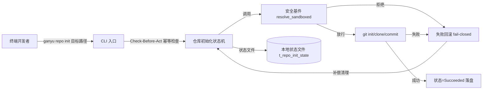
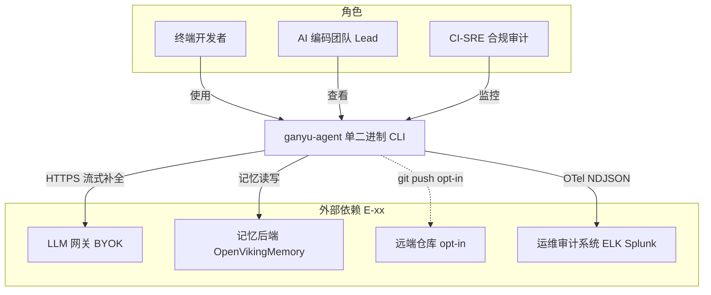
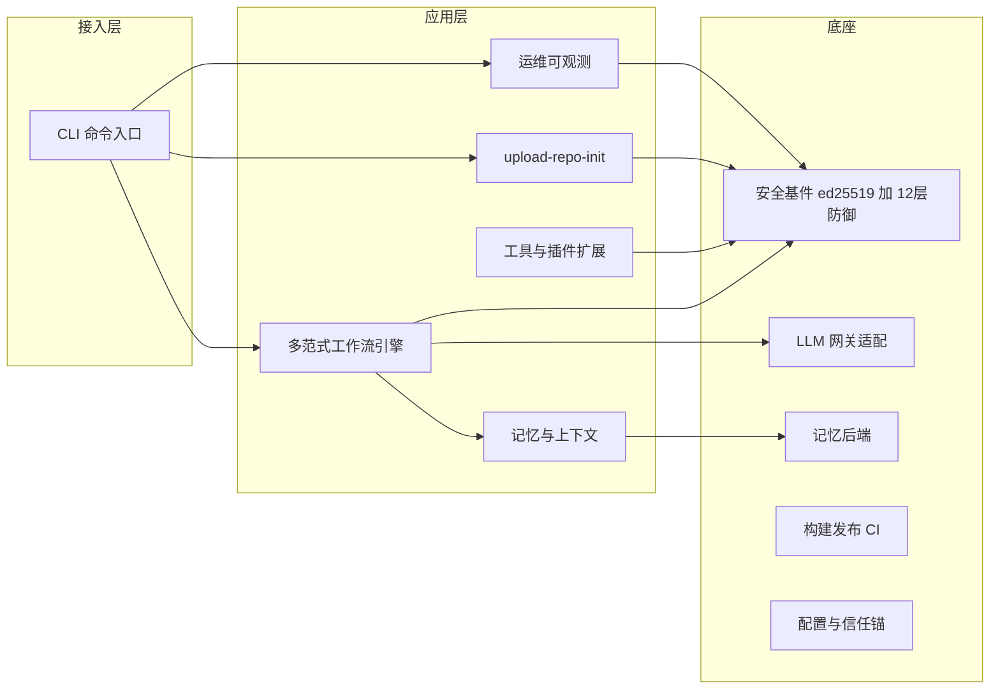
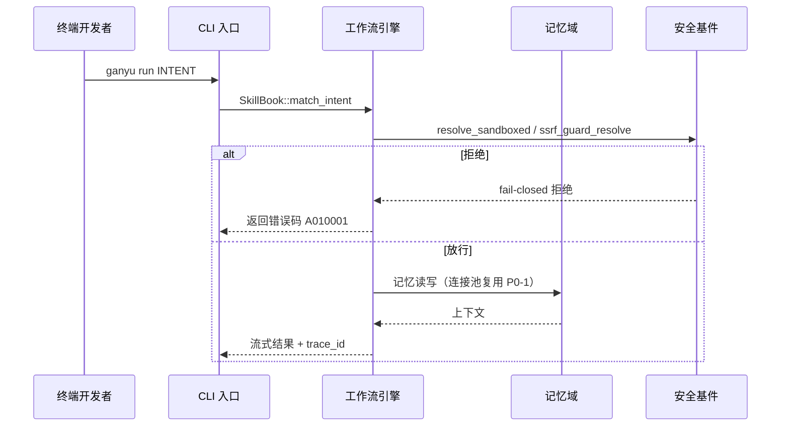
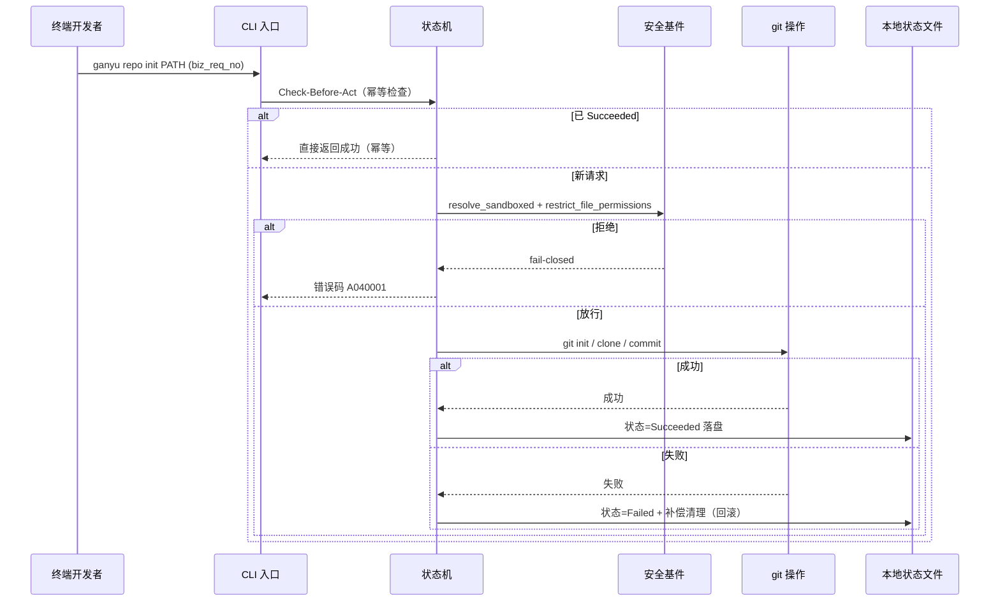
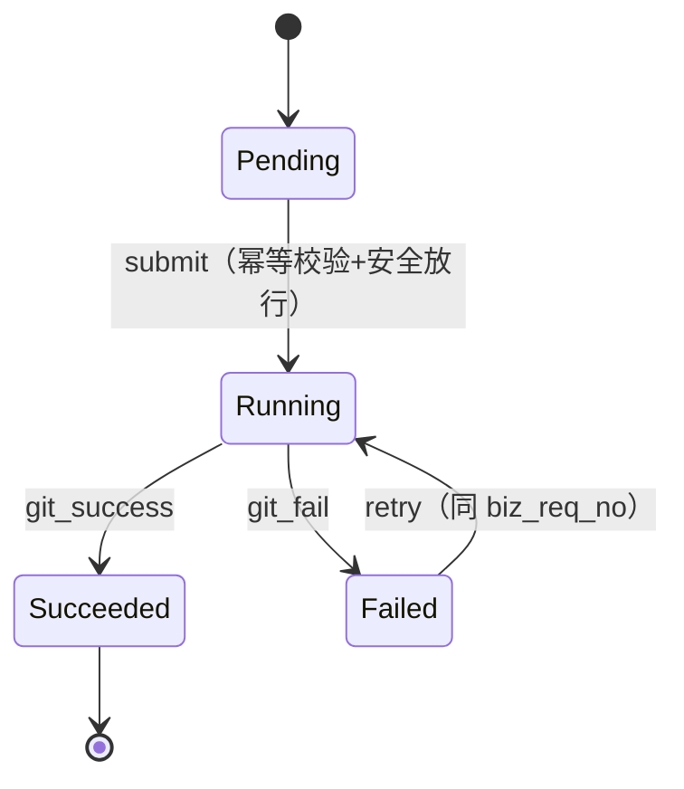
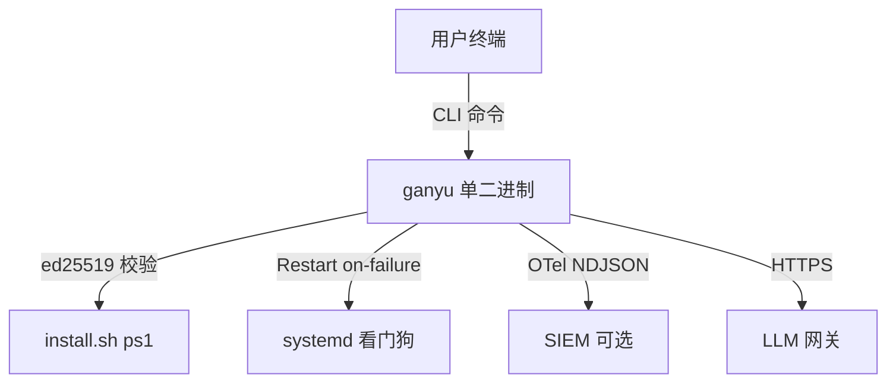

# AICoding 架构设计 · 系统设计

> 本文档为《AICoding 架构设计》核心产物之一，对应**系统架构设计模版**。
> 上游输入：《高层架构设计》（G3 已通过，系统定位/模块范围/MVP 范围/角色场景/功能清单已冻结）；
> 下游输出：驱动《部署设计》《安全设计》《UserStory》的实施。
> 系统定位（G3 冻结，不得推翻）：自托管单二进制（Rust）、私有化、非 SaaS、多租户=否（单机用户）；非 Linux F1 = honest no-op（Landlock 仅 Linux 生效）。
> 本文档同时承载 G4 路由项：X2/U-04 测试基线双轨（§3.6）、U-02→F13 MCP 适配契约（§3.2.M3）、X1/U-03 诚实边界路由 G5（§5.6）。

> **裁剪声明（§0 修订记录登记）**：
> - 未启用 §4.4 缓存与 Key 规范 —— 理由：单二进制 CLI 无 Redis/Memcached 等分布式缓存，缓存均为进程内内存（LruCache、reqwest 连接池），无 Key 规范需求。
> - 未启用 §4.5 数据迁移与兼容性 —— 理由：非存量系统迁移，本地文件格式向后兼容、记忆/配置为新增存储，无需迁移路径。
> 后续章节序号已按模板规则连续编排（§4 止于 §4.3）。

---

## 0. 元信息：修订记录

| 文档版本 | 发布日期 | 修订人 | 修订说明 |
| --- | --- | --- | --- |
| v1.0 | 2026-08-19 | 高见远（system-architect） | 初稿（G4 待结构检查 + 自动校验 + 人工审核） |

**填写要求**：每次评审通过新增一行；修订说明必须能定位到具体章节。

---

## 1. 引言

### 1.1 文档目标

- **一句话定位**：本文档定义 ganyu-agent（自托管单二进制 Rust CLI AI agent）在交付物中的所有架构设计相关产物。
- **读者对象**：架构师 / 开发 / 运维 / 安全 / 评审委员会。
- **设计范围**：业务架构 + 应用架构 + 数据（本地文件）设计 + 部署架构 + 网络架构 + 安全设计 + 可观测设计。

### 1.2 关联文档清单

| 输入类型 | 内容要点 | 在本文档中的用途 | 形式（外部文档 / 本文档自带） |
| --- | --- | --- | --- |
| 业务需求 | 系统定位、角色、场景、关键流程（高层架构 §1~§6） | 第 2 章业务架构 | 外部文档《高层架构设计.md》（G3 冻结） |
| 非功能性需求 | QPS（CLI 本地无 QPS，改为本地资源/命令时延）、数据量、可用性、RTO/RPO、合规等级 | 第 3.5 / 5 / 7 章 | 外部文档《高层架构设计.md》+ 本文档自带 |
| 系统定位与边界 | 自托管单二进制、私有化、非 SaaS、多租户=否、非 Linux honest no-op | 第 3.1 集成架构 / 第 5/6/7 章 | 外部文档《高层架构设计.md》§4.2 |
| 外部系统 API | LLM 网关（OpenAI 兼容）、OpenVikingMemory、Git 服务端（opt-in）、ELK/Splunk | 第 3.1.3 / 3.2 模块 | 外部文档《资料摘要.md》《调研报告.md》 |
| 云组件 / 中间件清单 | 无内置云组件；可选外部汇聚（Prometheus 远端 / SIEM） | 第 3.1.3 / 4.3 / 5 章 | 本文档自带（C-xx 可选外部对接） |
| 团队 / 行业规范 | Rust 工程规范、fail-closed 哲学、ed25519 契约、12 层防御 | 第 3.1.5 / 4.1 / 7 章 | 外部文档《资料摘要.md》D3/D4/D5/D6 |

### 1.3 名词与术语表

| 业务术语 | 业务定义（≤ 30 字） | 应用层核心对象（§3.3 O-xx） | 数据库表名（§4.2） |
| --- | --- | --- | --- |
| 多范式工作流 | Unit×RunContext×Workflow 引擎驱动执行 | O-01 WorkflowEngine | t_local_wf_state（本地状态文件） |
| 记忆与上下文 | 记忆读写与上下文召回（本地/远端） | O-02 MemoryStore | t_local_memory（JSON 文件） |
| 工具与插件扩展 | vetted 插件 + 规划 MCP 适配的扩展 | O-03 PluginManifest | t_plugin_manifest（本地清单） |
| 仓库初始化 | upload-repo-init 本地 init/clone/commit | O-04 RepoInitState | t_repo_init_state（状态文件） |
| 运维可观测 | metrics/log/trace/审计轮转 | O-05 ObservabilityRecord | t_audit_log（NDJSON 文件） |
| 安全基件 | ed25519 + 12 层防御控制点 | O-06 SecurityControl | 不落表（进程内 API） |
| 信任锚 | 硬编码 ed25519 公钥 + vetted 插件锚 | O-07 TrustAnchor | t_trust_anchor（本地配置） |
| 特性门控 | default=[crypto,secret] / hardened=[network,crypto,secret,shell] | O-08 FeatureSet | 编译期 feature flag |
| 范式 | 6 模块实现 7 范式（single 兼 ReAct） | O-09 Paradigm | 不落表（枚举常量） |

---

## 2. 业务架构

> **本章回答**：系统服务什么业务、业务由哪些场景构成、业务的关键流程长什么样。
> **本章不回答**：用什么技术、怎么部署、表怎么建。

### 2.1 业务架构概览

#### 2.1.1 业务全景图

**业务域清单**（5 个，与第 3 章模块、第 4 章数据分组一致）：

| 业务域 | 核心场景 | 涉及角色 | 与其他业务域的关系 |
| --- | --- | --- | --- |
| 工作流编排域 | 多范式工作流执行、SkillBook 派发 | 终端开发者 / AI 编码 Lead | 上游驱动记忆域；下游调用工具域、仓库初始化域 |
| 记忆与上下文域 | 记忆读写、上下文召回 | 终端开发者 | 被工作流域消费；对接记忆后端 |
| 工具与插件域 | vetted 插件执行、MCP 适配（规划） | 终端开发者 | 下游调用安全基件；上游承接工作流域 |
| 仓库初始化域 | upload-repo-init 本地 init/clone/commit | 终端开发者 / CI-SRE | 复用安全基件；下游对接远端仓库（opt-in） |
| 运维可观测域 | metrics/log/trace/审计轮转/原子升级 | CI-SRE / 合规审计 / AI Lead | 汇聚全部业务域信号；对接 SIEM |

### 2.2 领域关系映射

#### 2.2.1 限界上下文清单

| 限界上下文 | 对应业务域 | 域类型 | 覆盖的核心业务实体 | 上下文边界（属于本域 vs 不属于） |
| --- | --- | --- | --- | --- |
| BC-WF 工作流编排上下文 | 工作流编排域 | 核心域 | WorkflowEngine / Unit / RunContext / Paradigm | 属于：工作流执行、派发；不属于：记忆存储、插件执行细节 |
| BC-MEM 记忆上下文 | 记忆与上下文域 | 核心域 | MemoryStore / ContextRecord | 属于：记忆读写；不属于：LLM 推理 |
| BC-TOOL 工具插件上下文 | 工具与插件域 | 核心域 | PluginManifest / ToolInvocation | 属于：插件清单与执行；不属于：MCP 协议实现（规划） |
| BC-REPO 仓库初始化上下文 | 仓库初始化域 | 核心域 | RepoInitState / RepoOp | 属于：本地仓库状态机；不属于：远端 push（opt-in） |
| BC-OBS 运维可观测上下文 | 运维可观测域 | 支撑域 | ObservabilityRecord / AuditEntry | 属于：指标/日志/审计；不属于：业务决策 |
| BC-SEC 安全基件上下文 | 跨域共享 | 通用域 | SecurityControl / TrustAnchor | 属于：12 层防御控制点；不属于：业务实体 |
| BC-LLM LLM 网关适配上下文 | 跨域支撑 | 支撑域 | LLMGatewayClient | 属于：模型调用适配；不属于：模型本身 |

**域类型说明**：

| 域类型 | 含义 | 投入策略 |
| --- | --- | --- |
| 核心域（Core） | 业务护城河，差异化竞争力所在 | 投入最多资源自研 |
| 支撑域（Supporting） | 必要但非差异化 | 可自研可外采 |
| 通用域（Generic） | 通用能力（如安全基件、网关适配） | 优先复用 / 外采 |

#### 2.2.2 上下文映射（Context Mapping）

> 本系统 DDD 上下文映射**使用 5 种关系模式**（Customer/Supplier、ACL、Shared Kernel、Conformist、Open Host Service），对应 G4 硬指标。

| 关系编号 | 上游上下文 | 下游上下文 | 关系模式 | 同步方式 | 选择理由 |
| --- | --- | --- | --- | --- | --- |
| C-01 | BC-WF 工作流编排 | BC-MEM 记忆 | Customer/Supplier | 进程内 API 同步 | 工作流驱动记忆读写，记忆域配合工作流需求节奏（记忆格式随工作流演进） |
| C-02 | 外部 LLM 网关（E-01） | BC-TOOL 工具插件 | ACL 防腐层 | HTTPS + 适配器 | 外部 LLM 模型不污染本域；ssrf_guard_resolve 作为防腐边界，防止不可信地址注入 |
| C-03 | BC-SEC 安全基件 | BC-WF / BC-TOOL / BC-REPO | Shared Kernel | 共享控制点 API / 枚举 | 12 层防御控制点（resolve_sandboxed 等）为共享内核，多域复用同一安全语义 |
| C-04 | 远端仓库（E-04，opt-in） | BC-REPO 仓库初始化 | Conformist | git 协议 / HTTPS | 对接 Git 服务端模型，遵循对方协议；MVP 不默认开启（F10 opt-in） |
| C-05 | BC-OBS 运维可观测 | 运维/审计系统（E-05） | Open Host Service | OTel / NDJSON 标准暴露 | 以标准协议对外暴露指标/审计，多下游（Prometheus/SIEM）共同消费 |

#### 2.2.3 跨域协作原则

| 原则编号 | 原则 |
| --- | --- |
| P-01 | 核心域（BC-WF/BC-MEM/BC-TOOL/BC-REPO）→ 支撑域/通用域：禁止反向依赖（核心域不依赖 BC-OBS 内部模型） |
| P-02 | 核心域之间：禁止直接耦合，必须通过进程内 API / 安全基件解耦 |
| P-03 | 对接外部不可控系统（E-01/E-04）：必须建 ACL 防腐层，禁止把外部模型贯穿到本域 |

### 2.3 详细业务架构

#### 2.3.1 用例图

**用例图清单**：

| 编号 | 用例图标题 | 涉及业务域 | 源文件位置 |
| --- | --- | --- | --- |
| UC-01 | 终端开发者多范式工作流执行 | 工作流编排域 / 记忆域 / 工具插件域 | docs/uml/uc-01.puml |
| UC-02 | upload-repo-init 本地仓库初始化 | 仓库初始化域 / 安全基件 | docs/uml/uc-02.puml |
| UC-03 | 运维可观测与审计查看 | 运维可观测域 | docs/uml/uc-03.puml |
| UC-04 | vetted 插件执行 | 工具与插件域 / 安全基件 | docs/uml/uc-04.puml |

#### 2.3.2 业务流程图

**关键流程清单**（核心业务覆盖度 ≥ 80%）：

| 流程编号 | 流程名 | 起点 | 终点 | 涉及业务域 | 源文件位置 |
| --- | --- | --- | --- | --- | --- |
| BF-01 | 多范式工作流执行主链路 | 用户输入意图 | 流式结果 + 审计落盘 | 工作流编排 / 记忆 / 工具 | docs/uml/bf-01.puml |
| BF-02 | upload-repo-init 本地初始化 | ganyu repo init/clone | 仓库就绪（幂等） | 仓库初始化 / 安全基件 | docs/uml/bf-02.puml |
| BF-03 | 运维可观测采集与审计轮转 | 业务事件 | SIEM/本地面板 | 运维可观测 | docs/uml/bf-03.puml |

**BF-02 角色泳道图（upload-repo-init）**：



### 2.4 业务范围与边界

#### 2.4.1 功能模块清单

按"功能编号 → 子功能编号"两层组织，与 §2.1 业务域对应（F1~F14 直接继承《高层架构设计》§6.3 冻结清单）。

| 编号 | 一级功能名 | 子功能描述 | 对应业务域 | 实现状态 |
| --- | --- | --- | --- | --- |
| F1 | 多范式工作流引擎 | 引擎复用（6 模块/7 范式，single 兼 ReAct） | 工作流编排域 | 完整实现（复用） |
| F2 | 安全基件 | ed25519 + 12 层防御复用 | 跨域（通用域） | 完整实现（复用） |
| F3 | 记忆与上下文 | P0-1 OpenVikingMemory 连接池修复 | 记忆与上下文域 | 完整实现（修复） |
| F4 | 多范式工作流引擎 | P0-2 routing breakers 热重载 panic 修复 | 工作流编排域 | 完整实现（修复） |
| F5 | 记忆与上下文 | P0-3 LocalMemory 全量重写阻塞 IO 修复 | 记忆与上下文域 | 完整实现（修复） |
| F6 | upload-repo-init（新建） | 本地仓库初始化最小集（状态机+幂等+回滚+复用4控制点） | 仓库初始化域 | 完整实现（MVP） |
| F7 | 运维可观测（新建） | F1 sandbox Linux Landlock 强化（FS+网络） | 运维可观测域 / 安全基件 | 完整实现（MVP 部分） |
| F8 | 运维可观测（新建） | 运维缺口补齐（supervisor+可观测+原子升级+审计轮转） | 运维可观测域 | 完整实现（MVP 分批） |
| F9 | 工具与插件扩展 | 插件机制冻结（保留 vetted 信任锚） | 工具与插件域 | 完整实现（现状） |
| F10 | upload-repo-init（新建） | 远端 push 发布（opt-in） | 仓库初始化域 | ❌ MVP（完整版/opt-in） |
| F11 | 安全基件 | 跨平台容器级隔离 | 安全基件 | ❌ MVP（待 G5 裁决 U-03） |
| F12 | 多范式工作流引擎 | 上帝模块拆分（A1/A2/U1）+ M1~M4 | 工作流编排域 | ❌ MVP（完整版） |
| F13 | 工具与插件扩展 | 插件 MCP 演进（规划，目标 MCP 2025-11-25，保留 vetted） | 工具与插件域 | ❌ MVP（完整版规划，G4 契约） |
| F14 | 记忆与上下文 | 测试基线透明（默认 vs hardened 双计数，R-1 纳入 hardened CI） | 跨域（质量基线） | ❌ MVP（完整版，G4 路由） |

**In-Scope（本期范围内）**：

| 编号 | 本期必做的事项 |
| --- | --- |
| F1~F6 | P0 高优修复 + upload-repo-init 最小集（✅ MVP） |
| F7~F8 | F1 Linux Landlock 强化 + 运维缺口分批补齐（✅ MVP） |
| F9 | 插件机制冻结保留 vetted（✅ MVP 现状） |
| N1 | 自托管单二进制，私有化，非 SaaS，多租户=否 |
| N2 | 非 Linux F1 维持 honest no-op 并文档化 |
| N3 | 终端用户 CLI 交互触点（REPL / 命令入口） |

**Out-of-Scope（本期不做）**：

| 编号 | 不做的事项 | 不做的原因 | 未来归属 |
| --- | --- | --- | --- |
| O1 | 不做 SaaS 多租户云端部署 | 自托管单二进制 CLI，无云端多租户诉求；与 fail-closed/数据主权一致 | 不做（边界声明） |
| O2 | 不做跨平台容器级隔离（Docker 级） | 与单二进制 CLI 形态不符；非 Linux 维持 honest no-op | 完整版 / 不做（待 G5 裁决 U-03） |
| O3 | 不做远端仓库 push 发布（默认开启） | 属 upload-repo-init 完整版或 opt-in；MVP 仅本地 init/clone/commit | 完整版（opt-in，F10） |

#### 2.5 质量与柔性可用

##### 2.5.1 服务质量目标

**质量目标 Top 3-5**（按 ISO 25010 排序）：

| 优先级 | 质量目标 | 业务驱动 | 受影响的关键章节 |
| --- | --- | --- | --- |
| Q1 | 安全性（fail-closed 可信边界） | 受监管/审计场景，ed25519 供应链签名 + 12 层防御 | §7 / §3.2.M3 / §3.6 |
| Q2 | 可靠性（P0 缺陷清零 + 命令幂等） | 终端开发者稳定可用，init 幂等 ≥99.9% | §3.2.M4 / §3.5.2 |
| Q3 | 可维护性（体积增长 ≤15% 零重依赖） | 单二进制轻量运维，成本可控 | §3.1.5 / §5.5 |
| Q4 | 可观测性（指标/日志/trace/审计） | 运维缺口补齐，合规留痕 | §8 |
| Q5 | 性能（安全校验 P99 ≤50ms） | 交互体验，对齐 V3 | §3.2.M4 / §3.5.4 |

**可验证质量场景**：

| 场景编号 | 关联目标 | 触发源 | 触发条件 | 期望响应 | 度量指标 |
| --- | --- | --- | --- | --- | --- |
| QS-01 | Q2 | upload-repo-init 重复执行 | 同一目标路径重复 `ganyu repo init` | 结果一致，无重复仓库 | 幂等成功率 ≥99.9% |
| QS-02 | Q3 | 二进制体积 | MVP 引入内嵌 metrics/log/OTel | 体积增长 ≤15% | 二进制体积增量 ≤15% |
| QS-03 | Q5 | 安全基件校验 | 每次外部/命令操作经控制点 | 校验通过 | P99 ≤50ms |

##### 2.5.2 业务柔性可用策略

**业务功能优先级分层**（§2.4.1 中每个一级功能 F-x 已标注层级）：

| 层级 | 含义 | 故障态下的处置方向 | 用户感知 |
| --- | --- | --- | --- |
| L0 核心业务 | 工作流执行、安全基件、仓库初始化 | 不降级；优先消耗所有资源保障 | 无 / 极轻微 |
| L1 重要业务 | 记忆读写、插件执行 | 限流 + 排队 + 异步化 | 变慢 / 排队提示 |
| L2 辅助业务 | 可观测面板、审计轮转 | 关闭 / 返回兜底数据 | 部分功能不可用 + 友好提示 |
| L3 附加业务 | 远端 push（opt-in）、SIEM 转发 | 直接关闭 + 异步补偿 | 通常无感 |

**业务降级清单**：

| 编号 | 关联功能（F-xx） | 触发条件 | 降级动作 | 用户感知 | 决策类型 |
| --- | --- | --- | --- | --- | --- |
| BD-01 | F8 可观测 | 本地磁盘写满 / SIEM 不可达 | 暂停非关键指标上报，保留审计落盘 | 面板部分指标延迟 | 自动 |
| BD-02 | F10 远端 push（opt-in） | 远端仓库不可达 | 本地提交成功但 push 排队重试 | 提示"稍后同步" | 自动 |

---

## 3. 应用架构

> **本章回答**：系统由哪些模块组成、模块与外部系统怎么集成、每个模块的内部交互链路是什么。

### 3.1 应用架构概览

#### 3.1.1 系统上下文

本系统作为**中心节点**（单二进制 CLI），周围辐射出"用户角色 + 外部业务系统"关系。

**系统上下文要素清单**：

| 节点类型 | 节点名 | 与本系统的关系 | 关系语义 |
| --- | --- | --- | --- |
| 角色 | 终端开发者 | 使用 | CLI 命令入口操作 |
| 角色 | AI 编码团队 Lead | 查看 | 运维/审计面板 |
| 角色 | CI-SRE / 合规审计 | 监控 | 指标/审计消费 |
| 上游平台 | E-01 LLM 网关（BYOK） | 本系统 → 调用 | HTTPS 流式补全 |
| 外部业务系统 | E-02 记忆后端（OpenVikingMemory / 本地） | 双向调用 | 记忆读写 |
| 外部业务系统 | E-04 远端仓库（opt-in） | 本系统 → 推送 | git push（F10） |
| 下游平台 | E-05 运维/审计系统（ELK/Splunk/systemd） | 本系统 → 生产 | OTel/NDJSON 异步 |



#### 3.1.2 系统模块图

分层架构（单二进制内部分层，非网络分层）：

**分层组件清单**：

| 层次 | 内容 | 数据来源 |
| --- | --- | --- |
| 接入层 | CLI 命令入口（REPL / repo / config / skills / plugins） | §2.3 用例图角色 |
| 应用层 | 按 §2.1 业务域划分的模块（M1~M5，与 §3.2 一一对应） | §2.1 / §3.2 |
| 中间件层 | 无内置中间件；可选外部汇聚（Prometheus 远端 / SIEM） | §3.1.3 云组件清单 |
| 集成对接层 | 与外部系统的对接桩 / SDK 封装（E-xx） | §3.1.3 外部依赖清单 |



#### 3.1.3 集成架构

##### 外部依赖清单

| ID | 外部系统 | 归属团队 / 供应商 | 类别 | 使用方式 | 集成方式 | 协议 / 版本 | 功能定位（≤ 30 字） | 联系人 |
| --- | --- | --- | --- | --- | --- | --- | --- | --- |
| E-01 | LLM 网关（BYOK） | 外部 LLM 供应商 | 业务协作 | 消费 | HTTPS REST | OpenAI 兼容 v1 | 模型推理、流式补全 | @开发团队 |
| E-02 | 记忆后端 | OpenVikingMemory / 本地 | 业务协作 | 双向 | 进程内 / REST | — | 记忆读写、上下文召回 | @开发团队 |
| E-03 | vetted 插件运行时 | 本地（python 子进程） | 业务协作 | 消费 | 本地子进程 | Python 3.x | 工具扩展执行（vetted） | @开发团队 |
| E-04 | 远端仓库 | GitHub / Git 服务端 | 第三方业务平台 | 生产 | git / HTTPS | Git 协议 | push/release 发布（opt-in） | @开发团队 |
| E-05 | 运维/审计系统 | ELK / Splunk / systemd | 监控审计 | 生产 | OTel / NDJSON | OTel 1.x | 指标/审计汇聚 | @运维SRE |

**填写要求**：类别取值（封闭枚举）已遵循；使用方式取值：消费/生产/双向。

##### 云组件 / 基础设施清单

> 本系统为自托管单二进制，**无内置云组件/中间件**（C-xx 不引入 MySQL/Redis/Kafka，遵循"体积增长 ≤15% 零新增重依赖"约束）。下列仅登记**可选外部对接**（非系统内置组件）：

| ID | 组件类别 | 选型 | 部署形态 | 规格量级 | 容量预估 | 提供方 / SLA | 用途 |
| --- | --- | --- | --- | --- | --- | --- | --- |
| C-01 | 日志/审计汇聚（可选） | ELK / Splunk | 外部可选 | 依部署 | 日志量/天 | 用户自运维 | NDJSON 审计对接 SIEM |
| C-02 | 指标汇聚（可选） | Prometheus + Grafana | 外部可选 | 依部署 | 指标点/分钟 | 用户自运维 | /metrics 远端抓取 |

**填写要求**：不使用的组件（MySQL/Redis/Kafka 等）整行删除，禁止填"不适用"——已按本系统实际情况省略。

##### 组件依赖关系

| 业务模块（§3.2） | 依赖的外部系统（E-xx） | 依赖的云组件（C-xx） | 故障传导风险 |
| --- | --- | --- | --- |
| M1 工作流引擎 | E-01, E-02, E-03 | — | E-01 超时 → 工作流降级排队 |
| M2 记忆与上下文 | E-02 | — | E-02 不可达 → 回退本地记忆 |
| M3 工具与插件扩展 | E-03 | — | E-03 插件异常 → shell 双层拦截 |
| M4 upload-repo-init | E-04（opt-in） | — | E-04 不可达 → 仅本地，push 排队 |
| M5 运维可观测 | E-05 | C-01, C-02 | E-05/C-01 不可达 → 本地落盘保留 |

#### 3.1.4 工程结构

```
ganyu-agent/
├── src/                      # Rust 工程根目录（单二进制）
│   ├── main.rs               # CLI 入口（MVP 后演进拆分 A1，F12 完整版）
│   ├── core/                 # 核心抽象：Unit / RunContext / Workflow
│   │   ├── workflow/         # 6 模块实现 7 范式（single 兼 ReAct）
│   │   ├── memory.rs         # 记忆（LocalMemory / OpenVikingMemory）
│   │   └── routing/          # 派发 + breakers（P0-2 修复）
│   ├── ext/                  # 扩展层：nomifun 能力 / 插件
│   │   ├── nomifun_caps.rs   # 33 项 nomifun 能力
│   │   └── plugin.rs         # vetted 插件运行时
│   ├── security.rs           # 安全基件：12 层防御控制点
│   ├── repo_init/            # M4 upload-repo-init（新建）
│   │   ├── state.rs          # 状态机 Pending→Running→Succeeded/Failed
│   │   └── idempotency.rs    # Check-Before-Act 幂等
│   ├── observability/        # M5 运维可观测（新建）
│   │   ├── metrics.rs        # Prometheus /metrics
│   │   ├── log.rs            # slog 结构化 + NDJSON 审计
│   │   └── trace.rs          # OpenTelemetry
│   └── config.rs             # GANYU_* 配置与信任锚
├── plugins/                  # vetted 插件（example.json + *.py）
├── skills/nomifun/           # 33 项能力目录
├── install.sh / install.ps1  # 一键安装（ed25519 校验）
└── .github/workflows/release.yml  # 三平台 hardened 构建 + 签名
```

#### 3.1.5 技术选型（版本约束）

| 技术分类 | 选型 | 版本 | 备注 / 选型理由 |
| --- | --- | --- | --- |
| 后端语言 | Rust | 1.85（stable） | 复用现有 7.6k LOC 引擎；零成本抽象/内存安全契合 fail-closed；为什么选 Rust 不选 Go：现有代码库已是 Rust，推倒重写成本不可接受 |
| 构建工具 | Cargo + B2 profile | Cargo 1.85 + B2 | thin LTO / codegen-units=4 / strip / panic=abort（ADR-006/007）；为什么选 B2 不选 debug：MVP 需体积与崩溃安全（abort）基线 |
| CLI 框架 | clap | 4.5 | derive 风格成熟；为什么选 clap 不选 structopt：structopt 已弃用，clap 4 为事实标准 |
| 密码学 | ring | 0.17 | ed25519（RFC 8032）供应链签名已用 ring 0.17；为什么选 ring 不选 RustCrypto：与 verify_update_signature 现有实现一致，避免双实现漂移 |
| 结构化日志 | slog | 2.7 | 轻量结构化日志，零重依赖；为什么选 slog 不选 tracing：tracing 较重，slog 更小且满足结构化 + OTel 桥接，契合体积 ≤15% 约束 |
| 可观测指标/追踪 | OpenTelemetry Rust SDK | 0.27 | 内嵌 metrics/trace 对齐 SR-23/24 基线；为什么选 OTel 不选自研：标准导出，可对接 Prometheus/SIEM |
| 进程监管/看门狗 | systemd | 256（宿主） | Restart=on-failure / Type=notify / ProtectSystem=strict；为什么选 systemd 不选 supervisor：单二进制无容器，systemd 零额外依赖即满足 |
| 原子升级 | A/B 双槽 + manifest 哈希回滚（自研） | — | 防 brick；为什么选 A/B+健康检查不选全量替换+.old：A/B 健康检查更稳，失败自动回滚 .old |
| 插件运行时 | Python 3.x 子进程 | 3.11 | 复用 D18 example.json（python plugins/*.py）；保留 vetted 信任锚 |
| 测试框架 | cargo test + nextest | cargo 1.85 / nextest 0.9 | 默认/强化双基线（§3.6）；为什么选 nextest 不选 libtest：并发与基线报告更清晰 |
| MCP SDK（规划 F13） | rmcp / 官方 MCP Rust SDK | 目标 MCP 2025-11-25 | 完整版适配；为什么选 MCP 标准不选私有协议：MCP 已成事实标准（Linux 基金会 AAIF 治理） |

**填写要求**：必须有版本号；选型理由用一句话说明（为什么选 A 不选 B）。

### 3.2 模块详细设计

> **核心方法论**：模块详细设计要画的是业务逻辑在角色和系统之间流动的过程；先在 §3.2.1/§3.2.2 给出跨模块共享约束与模块清单，§3.2.3 给出五段式模板，之后每个模块在 §3.2.MN 下独立成节。

#### 3.2.1 模块公共约束（Common）

**通信方式约束**（本系统为单二进制 CLI，无网络服务端，故对外接口形态与常规 Web 系统不同，此处显式锁定）：

| 约束项 | 取值 |
| --- | --- |
| 接口路径风格 | 对外 = CLI 子命令（命令式接口）；对内 = 进程内模块 API（Rust trait/函数调用，等效 RPC 语义） |
| 协议 | 对外无 HTTP 服务端；对内进程内调用；对外集成用 HTTPS（E-01）/ git 协议（E-04）/ OTel（E-05） |
| 数据格式 | JSON（配置/记忆/审计 NDJSON）/ Protobuf（OTel 内部） |
| 字符编码 | UTF-8 |

**通用基础结构**：

| 基类 / 结构 | 用途 | 包路径 |
| --- | --- | --- |
| `BaseRequest` | 多态请求对象基类 | `crate::common::dto` |
| `BaseResponse` | 多态响应对象基类（含 code / msg / data / trace_id） | `crate::common::dto` |
| `RepoInitRequest` | 仓库初始化请求 | `crate::repo_init::dto` |
| `Result＜T＞` | 统一返回结构（含 code / msg / data / trace_id） | `crate::common::dto` |

#### 3.2.2 模块清单与编号规则

**模块清单**：

| 编号 | 模块名 | 业务域（§2.1） | 模块负责人 | 关联子领域 |
| --- | --- | --- | --- | --- |
| M1 | 多范式工作流引擎 | 工作流编排域 | @开发团队 | 派发 / 执行 / 7 范式 |
| M2 | 记忆与上下文 | 记忆与上下文域 | @开发团队 | 本地/远端记忆 |
| M3 | 工具与插件扩展 | 工具与插件域 | @开发团队 | vetted 插件 / MCP（规划） |
| M4 | upload-repo-init（新建） | 仓库初始化域 | @开发团队 | 本地 init/clone/commit |
| M5 | 运维可观测（新建） | 运维可观测域 | @运维SRE | metrics/log/trace/审计 |

**编号规则**：模块编号 `MN` 全局唯一，与 §2.1 业务域名一致；每个模块在 §3.2 下独立成节 `§3.2.MN`。

#### 3.2.3 单模块设计模板（五段式）

> 本节为规范说明，定义每个模块在 §3.2.MN 下应按「模块概述 / 接口清单 / 关键结构定义 / 模块逻辑时序图 / 关键流程逻辑」五段展开（§3.2.MN.1~§3.2.MN.5）。各模块下只体现、不重复声明公共约束。

#### 3.2.M1 多范式工作流引擎

##### §3.2.M1.1 模块概述

多范式工作流引擎模块覆盖「终端开发者多范式工作流执行」业务流程，业务逻辑在「终端开发者、LLM 网关、记忆与上下文、工具与插件」之间流动，涉及 CLI 入口、LLM 网关（E-01）、记忆后端（E-02）、安全基件等内外部系统。复用 Unit×RunContext×Workflow 三大抽象，6 个 workflow 模块实现 7 个范式（single 兼 ReAct，X3 口径统一）。

##### §3.2.M1.2 接口清单

| 子领域 | 方法 | 路径/命令 | 用途（≤ 20 字） | 请求 DTO | 响应 VO | 幂等 |
| --- | --- | --- | --- | --- | --- | --- |
| 派发 | — | `ganyu run INTENT` | SkillBook 派发执行 | RunRequest | RunResult | 否 |
| 执行 | — | `ganyu repl` | 交互式多范式执行 | ReplRequest | StreamResult | 否 |
| 治理 | — | `ganyu doctor` | 校验信任锚与特性门控 | — | DoctorVO | 天然 |

##### §3.2.M1.3 关键结构定义（DTO）

```rust
pub struct RunRequest {
    // ===== 必填字段 =====
    pub intent: String,            // 用户意图文本
    pub paradigm: Paradigm,        // 7 范式枚举（single/ReAct/...）
    // ===== 可选字段 =====
    pub run_context: Option＜RunContext＞, // 运行上下文（记忆/工具）
    // ===== 扩展字段 =====
    pub biz_fields: HashMap＜String, String＞, // 业务扩展
}

pub struct RunResult {
    pub id: String,                // ULID 执行标识
    pub status: String,            // SUCCESS / PARTIAL / FAILED
    pub trace_id: String,          // 链路追踪 ID
}
```

| DTO / VO 名 | 字段名 | 类型 | 必填 | 业务含义 | 约束 / 默认值 |
| --- | --- | --- | --- | --- | --- |
| RunRequest | intent | String | 是 | 用户意图 | 长度 ≤ 2000 |
| RunRequest | paradigm | Paradigm | 是 | 范式选择 | 枚举 7 值 |
| RunResult | status | String | 是 | 执行状态 | SUCCESS/PARTIAL/FAILED |

##### §3.2.M1.4 模块逻辑时序图

| 编号 | 标题 | 场景类别 | 是否包含异常分支 |
| --- | --- | --- | --- |
| SQ-01 | 工作流引擎 - 派发执行 | 核心执行 | 是 |
| SQ-02 | 工作流引擎 - breakers 热重载 | 配置热更新 | 是（P0-2 panic 修复） |



##### §3.2.M1.5 关键流程逻辑

P0-2 修复：routing/mod.rs 热重载使用原子 swap 替换 breakers map，complete() 路径以 `match` 替代 `unwrap()` 消除 panic（D1 §3 #2）。无复杂状态机，本段仅注明关键修复点。

#### 3.2.M2 记忆与上下文

##### §3.2.M2.1 模块概述

记忆与上下文模块覆盖「记忆读写、上下文召回」业务流程，业务逻辑在「工作流引擎、记忆后端（E-02）、安全基件」之间流动。MVP 含 P0-1（OpenVikingMemory 连接池复用）与 P0-3（LocalMemory 增量写入消除阻塞 IO）修复。

##### §3.2.M2.2 接口清单

| 子领域 | 方法 | 路径/命令 | 用途（≤ 20 字） | 请求 DTO | 响应 VO | 幂等 |
| --- | --- | --- | --- | --- | --- | --- |
| 本地记忆 | — | 内部 API | LocalMemory 增量写 | MemWriteReq | MemWriteVO | 天然 |
| 远端记忆 | — | 内部 API | OpenVikingMemory 读写 | MemReadReq | MemReadVO | 天然 |

##### §3.2.M2.3 关键结构定义（DTO）

```rust
pub struct MemWriteReq {
    pub key: String,               // 记忆键
    pub value: String,             // 记忆值（增量片段）
    pub namespace: String,         // 命名空间
}
pub struct MemReadVO {
    pub items: Vec＜MemItem＞,       // 召回项
    pub trace_id: String,
}
```

##### §3.2.M2.4 模块逻辑时序图

| 编号 | 标题 | 场景类别 | 是否包含异常分支 |
| --- | --- | --- | --- |
| SQ-01 | 记忆域 - 远端读写（连接池复用） | 核心读写 | 是（P0-1） |
| SQ-02 | 记忆域 - 本地增量写（非阻塞） | 核心写 | 是（P0-3） |

##### §3.2.M2.5 关键流程逻辑

P0-1：`OpenVikingMemory::client()` 复用单一 `reqwest::Client`（连接池），消除每次调用新建客户端（D1 §3 #1）。P0-3：`LocalMemory` 改为增量追加写入，消除全量重写阻塞 IO（D1 §3 #3）。无状态机，本段注明修复点。

#### 3.2.M3 工具与插件扩展

##### §3.2.M3.1 模块概述

工具与插件扩展模块覆盖「vetted 插件执行、MCP 适配（规划）」业务流程，业务逻辑在「工作流引擎、安全基件、外部 LLM（E-01）、插件运行时（E-03）」之间流动。MVP（F9）保留 vetted 信任锚（现状不变）；完整版（F13）规划 MCP 适配，保留 vetted 信任模型（U-02 冻结，G4 设计契约）。

##### §3.2.M3.2 接口清单

| 子领域 | 方法 | 路径/命令 | 用途（≤ 20 字） | 请求 DTO | 响应 VO | 幂等 |
| --- | --- | --- | --- | --- | --- | --- |
| vetted 插件 | — | 内部 API | 执行 vetted 插件 | PluginExecReq | PluginExecVO | 视工具而定 |
| 插件清单 | — | `ganyu plugins` | 列出 vetted 清单 | — | PluginListVO | 天然 |
| MCP 适配（规划） | — | 内部 API（F13） | 加载 vetted MCP server | McpLoadReq | McpLoadVO | 否 |

##### §3.2.M3.3 关键结构定义（DTO）

```rust
pub struct PluginManifest {
    pub name: String,              // 插件名
    pub vetted: bool,              // vetted 信任锚（F9 冻结保留）
    pub exec: String,              // 执行指令（python plugins/*.py）
    pub trust_anchor_hash: String, // 信任锚哈希
}
pub struct McpServerSpec {         // F13 规划（MCP 2025-11-25）
    pub server_name: String,
    pub transport: String,         // stdio / Streamable HTTP
    pub vetted: bool,              // 必须经 vetted 准入
}
```

##### §3.2.M3.4 模块逻辑时序图

| 编号 | 标题 | 场景类别 | 是否包含异常分支 |
| --- | --- | --- | --- |
| SQ-01 | 工具插件 - vetted 执行 | 核心执行 | 是（shell 双层拦截） |
| SQ-02 | 工具插件 - MCP 加载（规划 F13） | 扩展适配 | 是（信任锚校验） |

##### §3.2.M3.5 关键流程逻辑

**F13 MCP 适配契约（完整版演进，U-02→G4 路由项）**：

> 本段为 G4 分配给系统架构师的 F13 契约设计（非 MVP，完整版规划）。核心约束：**保留 vetted 信任模型，不得削弱 vetted 信任锚**。

- **契约形态（目标 MCP 2025-11-25）**：ganyu 作为 MCP Host，采用 client-host-server 模型，通过 JSON-RPC 2.0 与 MCP Server 通信；传输支持 stdio 与 Streamable HTTP；工具发现经 `initialize` 握手 + 能力协商（Tools/Resources/Prompts）。
- **信任锚保留策略**：
  1. 双通道并存 —— 既有的 vetted 原生插件通道（python 子进程 + `vetted:true` 信任锚，D18）**不替换、不削弱**；MCP 作为「扩展适配层」叠加。
  2. 所有扩展（vetted 原生 或 MCP 适配）统一经 vetted 准入评审后注册；默认**不加载未 vetted 的 MCP server**（opt-in + 显式信任锚登记）。
  3. MCP 工具调用仍受 12 层防御控制点约束：`resolve_sandboxed` / `ssrf_guard_resolve` / `restrict_file_permissions` / `shell 双层门禁` 对 MCP 触发的文件/网络/shell 操作一视同仁。
  4. MCP server 进程以最小权限运行（受 `restrict_file_permissions` + 主机权限约束），其输出经 `sanitize_model_output` / `fence_untrusted` 消毒。
- **路由边界**：MVP 不引入 MCP 契约变更（F13 规划）；完整版实现；信任模型冻结点（vetted 锚）由本设计（G4）声明，安全基件加固细节由 G5 安全设计裁决。MCP 适配不改动 MVP 的 CLI 命令形态与单机用户定位。

**vetted 插件执行伪代码**：

```
触发：PluginExecReq（vetted=true）

Step 1: 信任锚校验
  ├── 校验 plugin.vetted == true 且 trust_anchor_hash 匹配本地锚
  └── 失败 → 返回错误码 A030001（非 vetted 拒绝）

Step 2: 安全基件门禁
  ├── resolve_sandboxed（文件系统沙箱，Linux Landlock）
  ├── ssrf_guard_resolve（如插件触发网络）
  ├── restrict_file_permissions
  └── shell 双层门禁（如 python 子进程）

Step 3: 执行
  └── 启 python plugins/NAME.py（子进程，超时 10s，见 §3.5.4）
```

#### 3.2.M4 upload-repo-init（新建）

##### §3.2.M4.1 模块概述

upload-repo-init 模块覆盖「本地仓库 init/clone/commit」业务流程（F6，U-01 冻结为 MVP 本地最小集），业务逻辑在「终端开发者、安全基件、本地文件系统、远端仓库（E-04，opt-in）」之间流动。复用 4 个安全控制点（resolve_sandboxed / ssrf_guard_resolve / restrict_file_permissions / shell 双层），含状态机 + 幂等 + 回滚。远端 push 为 F10 opt-in，不在 MVP。

##### §3.2.M4.2 接口清单

| 子领域 | 方法 | 路径/命令 | 用途（≤ 20 字） | 请求 DTO | 响应 VO | 幂等 |
| --- | --- | --- | --- | --- | --- | --- |
| 初始化 | — | `ganyu repo init PATH` | 本地仓库幂等初始化 | RepoInitRequest | RepoInitVO | 是（biz_req_no） |
| 克隆 | — | `ganyu repo clone URL PATH` | 幂等克隆 | RepoCloneRequest | RepoInitVO | 是（目标路径键） |
| 提交 | — | `ganyu repo commit` | 幂等提交 | RepoCommitRequest | RepoInitVO | 是（commit 键） |

##### §3.2.M4.3 关键结构定义（DTO）

```rust
pub struct RepoInitRequest {
    // ===== 必填字段 =====
    pub target_path: String,       // 目标路径（经 restrict_file_permissions 校验）
    pub biz_req_no: String,        // 幂等键（ULID）
    // ===== 可选字段 =====
    pub remote_url: Option＜String＞,// 远端（opt-in，F10）
    // ===== 状态字段 =====
    pub status: String,            // Pending/Running/Succeeded/Failed
}

pub struct RepoInitVO {
    pub id: String,                // ULID
    pub status: String,            // Succeeded/Failed
    pub trace_id: String,
}
```

| DTO / VO 名 | 字段名 | 类型 | 必填 | 业务含义 | 约束 / 默认值 |
| --- | --- | --- | --- | --- | --- |
| RepoInitRequest | target_path | String | 是 | 仓库目标路径 | 经文件权限校验 |
| RepoInitRequest | biz_req_no | String | 是 | 幂等键 | ULID，24h 内唯一 |
| RepoInitRequest | status | String | 是 | 状态 | Pending/Running/Succeeded/Failed |

##### §3.2.M4.4 模块逻辑时序图

| 编号 | 标题 | 场景类别 | 是否包含异常分支 |
| --- | --- | --- | --- |
| SQ-01 | upload-repo-init - 本地初始化 | 创建/配置 | 是（校验/回滚） |
| SQ-02 | upload-repo-init - 失败补偿 | 异常/回滚 | 是 |



##### §3.2.M4.5 关键流程逻辑

**状态机迁移表**：

| 起始状态 | 触发事件 | 终止状态 | 触发条件 / 校验 | 副作用 |
| --- | --- | --- | --- | --- |
| Pending | submit | Running | 幂等键校验通过 + 安全基件放行 | 写入状态文件 |
| Running | git_success | Succeeded | git init/clone/commit 成功 | 状态落盘，释放锁 |
| Running | git_fail | Failed | git 操作失败 | 补偿清理（删除半成品），状态落盘 |
| Failed | retry（同 biz_req_no） | Running | 用户重试，Check-Before-Act | 重新执行 |

**伪代码**：

```
触发：ganyu repo init PATH（biz_req_no）

Step 1: 幂等检查（Check-Before-Act）
  ├── 查状态文件 t_repo_init_stateBIZ_REQ_NO
  ├── 若 Succeeded → 直接返回（幂等）
  └── 否则置 Pending → Running（CAS 原子迁移）

Step 2: 安全基件校验
  ├── resolve_sandboxed(target_path)   # FS 沙箱
  ├── restrict_file_permissions        # 文件权限收紧
  └── [MOCK] 远端解析（opt-in）→ ssrf_guard_resolve
       [完整版替换点] F10 远端 push 启用时接入

Step 3: git 操作（事务边界 + 分布式锁 run_id.lock）
  ├── git init / clone
  ├── git commit（首次基线提交）
  └── 失败 → 补偿清理 + 状态=Failed

Step 4: 落盘状态=Succeeded + 审计日志 NDJSON
```



#### 3.2.M5 运维可观测（新建）

##### §3.2.M5.1 模块概述

运维可观测模块覆盖「metrics/log/trace/审计轮转/原子升级」业务流程（F7/F8，D1 §4 运维缺口补齐），业务逻辑在「全部业务模块、安全基件、systemd、运维/审计系统（E-05）」之间流动。内嵌轻量方案，体积增长 ≤15%，零新增重依赖。

##### §3.2.M5.2 接口清单

| 子领域 | 方法 | 路径/命令 | 用途（≤ 20 字） | 请求 DTO | 响应 VO | 幂等 |
| --- | --- | --- | --- | --- | --- | --- |
| 指标 | — | `/metrics`（127.0.0.1） | Prometheus 指标暴露 | — | MetricsVO | 天然 |
| 审计 | — | 内部 API | NDJSON 审计落盘 | AuditEntry | — | 天然（追加） |
| 健康检查 | — | `/healthz` `/readyz` | 存活/就绪探针 | — | HealthVO | 天然 |

##### §3.2.M5.3 关键结构定义（DTO）

```rust
pub struct AuditEntry {
    pub ts: String,                 // UTC 时间
    pub event: String,              // 事件名
    pub actor: String,              // 操作者（本地用户）
    pub resource: String,           // 资源
    pub action: String,             // 操作
    pub result: String,             // 结果
    pub source_ip: String,          // 来源（本地 CLI 为 127.0.0.1）
    pub trace_id: String,
    pub tenant_id: String,          // 单租户固定实例标识（多租户=否，固定值）
}
```

##### §3.2.M5.4 模块逻辑时序图

| 编号 | 标题 | 场景类别 | 是否包含异常分支 |
| --- | --- | --- | --- |
| SQ-01 | 运维可观测 - 审计落盘与轮转 | 审计 | 是（磁盘满降级） |
| SQ-02 | 运维可观测 - 原子升级回滚 | 升级 | 是（A/B 回滚） |

##### §3.2.M5.5 关键流程逻辑

审计日志固定字段 NDJSON，按大小/时间轮转（解决 D1 §4 缺口④），对接 ELK/Splunk（E-05）。原子升级：A/B 双槽 + manifest 哈希校验 + 健康检查，失败自动回滚 .old（解决 D1 §4 缺口③）。无复杂状态机，本段注明关键机制。

### 3.3 核心业务对象清单

#### 3.3.1 对象定义

| 编号 | 对象名（代码类名） | 对象类型 | 包路径 | 模块归属 | 被哪些模块复用 | 实例化策略 | 序列化约定 | 持久化策略 |
| --- | --- | --- | --- | --- | --- | --- | --- | --- |
| O-01 | WorkflowEngine | 聚合根 | `crate::core::workflow` | M1 | M1 | 单例 | JSON | 不落表（运行时） |
| O-02 | MemoryStore | 实体 | `crate::core::memory` | M2 | M1/M2 | new | JSON | 落文件 t_local_memory |
| O-03 | PluginManifest | 共享 DTO | `crate::ext::plugin` | M3 | M1/M3 | new | JSON | 落文件 t_plugin_manifest |
| O-04 | RepoInitState | 聚合根 | `crate::repo_init::state` | M4 | M4 | new + 状态机 | JSON | 落文件 t_repo_init_state |
| O-05 | ObservabilityRecord | 值对象 | `crate::observability` | M5 | 全部 | new | NDJSON | 落文件 t_audit_log |
| O-06 | SecurityControl | 防腐层 ACL | `crate::security` | 通用域 | M1/M3/M4 | new + 适配 | — | 不落表（进程内 API） |
| O-07 | TrustAnchor | 共享枚举/常量 | `crate::config` | 通用域 | M3/M5 | 常量 | — | 硬编码 + 落文件 t_trust_anchor |
| O-08 | FeatureSet | 共享枚举 | `crate::build` | 通用域 | 全部 | 编译期 | — | 编译期 feature flag |
| O-09 | Paradigm | 共享枚举 | `crate::core::workflow` | M1 | M1 | 枚举常量 | String | 不落表 |

#### 3.3.2 命名漂移登记表

| 业务实体（§2） | 代码类名（§3.3.1） | 数据表名（§4.2） | 漂移原因 |
| --- | --- | --- | --- |
| 仓库初始化 | `RepoInitState` | t_repo_init_state | 业务单一实体在代码层为状态机聚合根 |
| 插件清单 | `PluginManifest` | t_plugin_manifest | 命名一致（无漂移） |

### 3.4 跨模块公共能力

**公共能力清单**（横切多个模块、以 SDK/拦截器/共享 API 形式提供）：

| 公共能力 | 简述 | 提供方（SDK / 切面 / Bean） | 被哪些模块复用 | 接入方式 |
| --- | --- | --- | --- | --- |
| 安全基件校验 | resolve_sandboxed / ssrf_guard_resolve / restrict_file_permissions / shell 双层 | `crate::security` 控制点 API | M1 / M3 / M4 | 函数调用（fail-closed 默认拒绝） |
| 审计日志 | 关键操作留痕（合规） | `crate::observability::log::audit()` | 全部业务模块 | 函数调用，固定字段 NDJSON |
| 配置与信任锚 | GANYU_* 配置、ed25519 信任锚 | `crate::config` | 全部 | 启动时加载 + 变更监听 |
| 链路追踪 | trace_id 透传 | `crate::observability::trace` | 全部 | OTel context 注入 |

### 3.5 接口契约

> 本系统对外暴露的接口（CLI 命令 / 进程内 API / 外部集成）在错误码、幂等、限流、超时上的全局约定。

#### 3.5.1 全局错误码体系

**错误码格式**：

| 项 | 取值 |
| --- | --- |
| 错误码格式 | 6 位数字（模块前缀 2 位 + 序号 4 位），例如 `A010001` |
| 分段规则 | 1 位类别（A 业务 / B 系统 / C 客户端）+ 2 位模块 + 3 位错误序号（共 6 位数字部分） |
| 类别取值 | `A` = 业务错误（进程退出码 0 但业务语义失败）/ `B` = 系统错误（退出码非 0）/ `C` = 客户端错误（参数/权限） |

**错误响应统一结构**（CLI 以 stderr + 退出码返回，结构同 JSON）：

```json
{
  "code": "A010001",
  "msg": "工作流执行被安全基件拒绝",
  "msgI18n": { "zh-CN": "工作流执行被安全基件拒绝", "en-US": "Workflow blocked by security control" },
  "data": null,
  "trace_id": "abc123",
  "timestamp": "2026-08-19T10:00:00.000Z"
}
```

**错误码注册表**：

| 错误码 | 退出码/HTTP状态 | 所属模块 | 含义 | 重试建议 | 用户文案 |
| --- | --- | --- | --- | --- | --- |
| A010001 | 业务失败 | M1 工作流 | 安全基件拒绝执行 | 不重试 | 操作被安全策略拒绝，请检查配置 |
| A030001 | 业务失败 | M3 插件 | 非 vetted 插件拒绝 | 不重试 | 该插件未通过信任锚校验 |
| A040001 | 业务失败 | M4 仓库初始化 | 路径校验/沙箱拒绝 | 不重试 | 目标路径未通过安全校验 |
| B990001 | 系统错误 | 全局 | 系统内部错误 | 可重试 | 系统内部错误，请稍后重试 |
| C400001 | 客户端错误 | 全局 | 参数校验失败 | 不重试 | 参数错误，请检查命令 |
| C401001 | 客户端错误 | 全局 | 未通过信任锚 | 不重试 | 信任锚校验失败 |
| C403001 | 客户端错误 | 全局 | 无权限（shell 双层） | 不重试 | 无执行权限 |
| C429001 | 客户端错误 | 全局 | 触发本地限速 | 退避后重试 | 操作太频繁，请稍后再试 |

#### 3.5.2 幂等性约定

| 接口类型 | 是否要求幂等 | 幂等键来源（建议） |
| --- | --- | --- |
| 写入类（repo init/clone/commit） | 必须幂等 | `biz_req_no`（ULID，调用方/CLI 生成） |
| 更新类（配置写入） | 必须幂等 | 资源路径 + 版本号 |
| 删除类 | 天然幂等 | — |
| 查询类（skills/plugins/metrics） | 天然幂等 | — |
| 外部推送类（F10 opt-in） | 强制幂等 | 业务侧请求号 |

**幂等设计需考虑的问题**：

| 问题维度 | 设计要点 |
| --- | --- |
| 幂等键生命周期 | `biz_req_no` 保留 24h（与 §4.2 状态文件 TTL 一致） |
| 重复请求语义 | 已 Succeeded 返回相同成功响应；Running 返回处理中 |
| 执行中态处理 | 第一个请求 Running 时，第二个同键请求返回"处理中" |
| 失败可重试性 | 失败后允许同键重试（状态机 Failed→Running） |
| 存储兜底 | 状态文件 + 文件系统锁 run_id.lock 作为最终防线 |

#### 3.5.3 限流约定

> CLI 无网络 QPS，以下为**本地资源限速**语义（等效限流纪律）。

| 维度 | 默认值 | 触发动作 | 调整方式 |
| --- | --- | --- | --- |
| LLM 调用并发 | 单进程 4 并发 | 排队 | 配置中心 GANYU_LLM_CONCURRENCY |
| 插件子进程并发 | 单进程 8 并发 | 排队 | 配置 |
| /metrics 拉取 | 单进程 60 次/分钟（仅 127.0.0.1） | 返回 C429001 | 配置 |
| 审计写入批大小 | 100 条/批 | 异步刷盘 | 配置 |

**降级策略**：前端（CLI）退避按 `Retry-After` 语义；限流红线值与 §5.5 容量水位线一致。

#### 3.5.4 默认超时与重试基线

| 调用类型 | 默认超时 | 默认重试 | 重试条件 |
| --- | --- | --- | --- |
| LLM 网关（E-01） | 30s | 2 次（指数退避 1s/2s） | 仅网络错误 / 5xx |
| 记忆后端（E-02） | 5s | 1 次 | 超时 |
| 插件子进程（E-03） | 10s | 0 次 | — |
| 远端仓库（E-04，opt-in） | 60s | 3 次（指数退避） | 网络错误 |
| 审计/指标落盘 | 1s | 异步批 | 失败告警 |

**填写要求**：超时值禁止"无限"；所有重试必须有上限；重试不产副作用（依赖 §3.5.2 幂等）。

#### 3.5.5 路由设计规范

**CLI 命令规范**：

| 维度 | 取值 |
| --- | --- |
| 风格 | 命令式（kebab-case 子命令） |
| 版本控制 | `--version` 显式 |
| 命名 | 小写 + 中划线（repo-init 内部 subcommand） |
| 资源命名 | 名词（repo / plugin / skill） |
| 动作类接口 | `ganyu RESOURCE ACTION`（如 `ganyu repo init`） |

**前端/CLI 路由约定**：

| 维度 | 取值 |
| --- | --- |
| 路由模式 | CLI 子命令树 |
| 命名风格 | 小写 + 中划线 |
| 动态参数 | `PATH` / `URL` |
| 鉴权方式 | 信任锚校验（ed25519）+ vetted 插件锚，由安全基件拦截 |
| 嵌套路由 | 列表 → 详情 → 子操作 |

### 3.6 测试基线双轨与 R-1~R-9 映射（X2 / U-04 路由 G4）

> 本节约等于 G4 分配给系统架构师的 **X2 / U-04（测试基线透明，F14 / V5）** 落地项。对齐 V5「默认 vs hardened 双基线报告就绪」。

#### 3.6.1 两套显式测试基线

| 基线 | feature 集（Cargo.toml） | 编译/运行命令 | 覆盖范围 |
| --- | --- | --- | --- |
| **default 基线** | `[crypto, secret]` | `cargo test --features crypto,secret` | 全部非 network/shell/sandbox 门控测试（约 50 项，具体以 CI 实际计数为准） |
| **hardened 基线** | `[network, crypto, secret, shell]` | `cargo test --features network,crypto,secret,shell` | 全部 55 项（42 单元 + 5 集成 + 8 工作流，含 R-1 签名互操作） |

**关键门控事实**（来自 material_digest D12 §1 / D3 §4）：R-1 签名互操作测试（sign-release.py ↔ verify_update_signature，ed25519 RFC 8032）受 `network` feature 门控，**default 基线下不编译、不运行**。

#### 3.6.2 默认 vs hardened CI 报告要求

- **default CI**：报告 default 基线通过数（不含 R-1），明确标注「R-1 不在 default 范围」。
- **hardened CI**：**必须显式报告 R-1 状态**（单独条目），确保双基线报告就绪、质量基线可信（对齐 V5）。

#### 3.6.3 R-1~R-9 映射到两套基线

| 风险编号 | 处置状态（D2/D3） | 关联 feature | default 基线 | hardened 基线 | 备注 |
| --- | --- | --- | --- | --- | --- |
| R-1 | 已加固（签名互操作） | network（门控） | ❌ 不运行 | ✅ 显式报告 | 仅在 hardened CI 报告 |
| R-2 | 已加固（SSRF 防护） | network | ❌ 不运行 | ✅ 运行 | ssrf_guard_resolve |
| R-3 | 已加固（文件权限/安全程序） | secret | ✅ 运行 | ✅ 运行 | restrict_file_permissions / is_safe_program |
| R-4 | 已加固（模型输出消毒/围栏） | core（无门控） | ✅ 运行 | ✅ 运行 | sanitize_model_output / fence_untrusted |
| R-5 | 已加固（归档校验/hex 解码） | crypto | ✅ 运行 | ✅ 运行 | is_safe_archive_entry / decode_hex |
| R-6 | X1 冲突（接受残余 vs 已加固） | sandbox（债务 F1） | ❌ 不编译 | ❌ 不编译（F1 缺失） | **路由 G5 裁决，不在双基线定稿** |
| R-7 | 已加固（shell 双层门禁） | shell | ❌ 不运行 | ✅ 运行 | shell_allowed / is_safe_program |
| R-8 | X1 冲突 | 待定（G5） | ❌ | ❌ | **路由 G5 裁决** |
| R-9 | X1 冲突 | 待定（G5） | ❌ | ❌ | **路由 G5 裁决** |

> 注：R-6/R-8/R-9 的处置状态自相矛盾（X1 冲突），属安全文档一致性问题，**本阶段不裁决**，路由 security-architect（G5）以 D3 §3 加固实现代码事实为准核对并标注「经裁决」。

---

## 4. 数据库设计

> **本章回答**：每个模块的状态用什么存、怎么存、数据怎么清理。
> **核心方法论**：本系统为自托管单二进制 CLI，**无集中式 RDBMS**；持久化以本地文件（JSON/NDJSON/TOML）+ git 仓库 + 可选远端记忆后端为主，按业务域组织。§4.2 以「本地数据文件」沿用五段式结构。多租户=否，不引入 tenant_id 列。

### 4.1 全局数据约定

| 约定项 | 取值 | 说明 |
| --- | --- | --- |
| 命名规范（文件） | `t_ENTITY.json` / `t_ENTITY.ndjson` 业务主数据；`t_ENTITY_ext` 扩展 | 全项目统一前缀 `t_` |
| 命名规范（字段名） | 小写 + 下划线（snake_case） | 禁止驼峰 |
| 主键类型 | `ULID` / `UUID` 字符串（记录级）；进程内生成 | 全项目统一，禁止混用 |
| 字符集 / 排序 | `utf8mb4` / `utf8mb4_unicode_ci`（JSON 内容） | 支持多语言 |
| 时间字段类型 | `DATETIME(3)` UTC 存储（ISO-8601 字符串） | 统一精度（毫秒）；统一时区（UTC） |
| 软删除字段 | `status = DELETED` 或文件移入 `_trash/`（本地） | 二选一锁定，全项目统一 |
| 审计字段 | `created_by / created_time / updated_by / updated_time` | 命名锁定 |
| 隔离字段（多租户） | **不引入**——本系统多租户=否（单机用户），隔离经文件系统路径/OS 权限实现 | 与 §1.3 / 高层架构 §4.2 一致 |
| 业务唯一标识 | `biz_id VARCHAR(100)`（如 biz_req_no） | 与外部/幂等对齐 |
| 状态枚举 | `VARCHAR` 字符串 | 锁定；DDL 注释列出全部取值 |
| 金额字段 | 不适用（无金融场景） | — |
| 手机号存储 | 不适用 | — |

### 4.2 单表（本地数据文件）设计

> 每张本地数据文件严格按「库表元信息 → 结构 → 索引/检索 → 落盘格式 → 清理机制」五段式编写。

#### 4.2.1 t_local_memory（本地记忆文件）

##### 4.2.1.1 文件元信息

| 字段 | 取值 |
| --- | --- |
| 存储类型 | 本地 JSON 文件 |
| 路径 | `~/.ganyu/memory/t_local_memory.json` |
| 文件名 | t_local_memory.json |
| 业务含义（≤ 50 字） | 本地记忆键值存储（P0-3 增量写入） |
| 模块归属（§3.2） | M2 记忆与上下文 |
| 对应核心对象（§3.3） | O-02 MemoryStore |

##### 4.2.1.2 结构定义

| 列名 | 数据类型 | 可为空 | 约束 | 默认值 | 备注 |
| --- | --- | --- | --- | --- | --- |
| id | ULID | NOT NULL | 主键 | — | 记录 ID |
| namespace | String | NOT NULL | — | "default" | 命名空间 |
| key | String | NOT NULL | — | — | 记忆键 |
| value | String | NULL | — | NULL | 记忆值 |
| status | VARCHAR(20) | NOT NULL | — | 'ACTIVE' | ACTIVE/DELETED |
| created_by | VARCHAR(64) | NULL | — | NULL | 创建者（本地用户） |
| created_time | DATETIME(3) | NULL | — | CURRENT_TIMESTAMP | 创建时间 |
| updated_time | DATETIME(3) | NULL | — | CURRENT_TIMESTAMP | 更新时间 |

##### 4.2.1.3 索引/检索设计

| 索引名 | 类型 | 字段（含顺序） | 设计目的 | 关联查询场景 |
| --- | --- | --- | --- | --- |
| `by_ns_key` | 内存索引 | namespace, key | 记忆查询加速 | `MEM.get(namespace, key)` |
| `by_created` | 排序 | created_time | 时间范围召回 | 上下文时间窗 |

##### 4.2.1.4 落盘格式（DDL 等价）

```json
{
  "id": "01JABCDEF000000000000000001",
  "namespace": "default",
  "key": "ctx:last_task",
  "value": "{\"summary\":\"...\"}",
  "status": "ACTIVE",
  "created_by": "local",
  "created_time": "2026-08-19T10:00:00.000Z",
  "updated_time": "2026-08-19T10:00:00.000Z"
}
```

##### 4.2.1.5 清理机制

| 清理机制 | 适用场景 | 配置 |
| --- | --- | --- |
| 增量追加 + 定期压缩 | 本地记忆 | 按文件大小 >10MB 触发压缩重写（非全量阻塞，P0-3） |

#### 4.2.2 t_repo_init_state（仓库初始化状态文件）

##### 4.2.2.1 文件元信息

| 字段 | 取值 |
| --- | --- |
| 存储类型 | 本地 JSON 状态文件 |
| 路径 | `TARGET_PATH/.ganyu/repo_init_state.json` |
| 文件名 | t_repo_init_state.json |
| 业务含义（≤ 50 字） | upload-repo-init 状态机持久化（F6） |
| 模块归属（§3.2） | M4 upload-repo-init |
| 对应核心对象（§3.3） | O-04 RepoInitState |

##### 4.2.2.2 结构定义

| 列名 | 数据类型 | 可为空 | 约束 | 默认值 | 备注 |
| --- | --- | --- | --- | --- | --- |
| id | ULID | NOT NULL | 主键 | — | 记录 ID |
| biz_req_no | String | NOT NULL | 唯一 | — | 幂等键（24h） |
| target_path | String | NOT NULL | — | — | 目标路径 |
| status | VARCHAR(20) | NOT NULL | — | 'Pending' | Pending/Running/Succeeded/Failed |
| remote_url | String | NULL | — | NULL | 远端（opt-in，F10） |
| created_time | DATETIME(3) | NULL | — | CURRENT_TIMESTAMP | 创建时间 |
| updated_time | DATETIME(3) | NULL | — | CURRENT_TIMESTAMP | 更新时间 |

##### 4.2.2.3 索引/检索设计

| 索引名 | 类型 | 字段 | 设计目的 | 关联查询场景 |
| --- | --- | --- | --- | --- |
| `uk_biz_req` | 唯一 | biz_req_no | 幂等去重 | Check-Before-Act |
| `by_path` | 查询 | target_path | 路径查状态 | `repo init` 重复检查 |

##### 4.2.2.4 落盘格式（DDL 等价）

```json
{
  "id": "01JABCDEF000000000000000002",
  "biz_req_no": "01JABCDEF0000000000000000AA",
  "target_path": "/home/dev/myproj",
  "status": "Succeeded",
  "remote_url": null,
  "created_time": "2026-08-19T10:00:00.000Z",
  "updated_time": "2026-08-19T10:05:00.000Z"
}
```

##### 4.2.2.5 清理机制

| 清理机制 | 适用场景 | 配置 |
| --- | --- | --- |
| 状态文件随仓库保留 | 幂等依据 | 仓库删除时一并清理；biz_req_no 24h 后可回收 |

#### 4.2.3 t_audit_log（审计日志 NDJSON）

##### 4.2.3.1 文件元信息

| 字段 | 取值 |
| --- | --- |
| 存储类型 | 本地 NDJSON 追加文件 |
| 路径 | `~/.ganyu/logs/t_audit_log.ndjson` |
| 文件名 | t_audit_log.ndjson |
| 业务含义（≤ 50 字） | 关键操作审计留痕（D1 §4 缺口④ 轮转） |
| 模块归属（§3.2） | M5 运维可观测 |
| 对应核心对象（§3.3） | O-05 ObservabilityRecord |

##### 4.2.3.2 结构定义

| 列名 | 数据类型 | 可为空 | 约束 | 默认值 | 备注 |
| --- | --- | --- | --- | --- | --- |
| ts | DATETIME(3) | NOT NULL | — | — | 事件时间 UTC |
| event | String | NOT NULL | — | — | 事件名 |
| actor | String | NOT NULL | — | — | 操作者（本地用户） |
| resource | String | NULL | — | NULL | 资源 |
| action | String | NOT NULL | — | — | 操作 |
| result | String | NOT NULL | — | — | 结果 |
| source_ip | String | NULL | — | '127.0.0.1' | 来源 |
| trace_id | String | NOT NULL | — | — | 链路 ID |
| tenant_id | String | NOT NULL | — | 'single-tenant' | 单租户固定实例标识（多租户=否） |

##### 4.2.3.3 索引/检索设计

| 索引名 | 类型 | 字段 | 设计目的 | 关联查询场景 |
| --- | --- | --- | --- | --- |
| `by_ts` | 时间排序 | ts | 时间轴回放 | 审计检索 |
| `by_trace` | 检索 | trace_id | 链路关联 | 排障 |

##### 4.2.3.4 落盘格式（DDL 等价）

```json
{"ts":"2026-08-19T10:00:00.000Z","event":"repo_init","actor":"dev","resource":"/home/dev/myproj","action":"init","result":"success","source_ip":"127.0.0.1","trace_id":"abc123","tenant_id":"single-tenant"}
```

##### 4.2.3.5 清理机制

| 清理机制 | 适用场景 | 配置 |
| --- | --- | --- |
| 轮转（大小/时间） | 审计日志 | 单文件 >50MB 或 >7 天轮转；保留 ≥1 年（合规）对接 SIEM（E-05） |

#### 4.2.4 t_plugin_manifest（插件清单文件）

##### 4.2.4.1 文件元信息

| 字段 | 取值 |
| --- | --- |
| 存储类型 | 本地 JSON 清单 |
| 路径 | `plugins/example.json` |
| 文件名 | t_plugin_manifest.json |
| 业务含义（≤ 50 字） | vetted 插件信任锚清单（F9 冻结） |
| 模块归属（§3.2） | M3 工具与插件扩展 |
| 对应核心对象（§3.3） | O-03 PluginManifest |

##### 4.2.4.2 结构定义

| 列名 | 数据类型 | 可为空 | 约束 | 默认值 | 备注 |
| --- | --- | --- | --- | --- | --- |
| name | String | NOT NULL | 主键 | — | 插件名 |
| vetted | Boolean | NOT NULL | — | true | vetted 信任锚 |
| exec | String | NOT NULL | — | — | 执行指令 |
| trust_anchor_hash | String | NOT NULL | — | — | 信任锚哈希 |

##### 4.2.4.3 索引/检索设计

| 索引名 | 类型 | 字段 | 设计目的 | 关联查询场景 |
| --- | --- | --- | --- | --- |
| `pk_name` | 主键 | name | 插件查寻 | `ganyu plugins` |

##### 4.2.4.4 落盘格式（DDL 等价）

```json
{"name":"upper","vetted":true,"exec":"python plugins/upper.py","trust_anchor_hash":"sha256:..."}
```

##### 4.2.4.5 清理机制

| 清理机制 | 适用场景 | 配置 |
| --- | --- | --- |
| 无（信任清单常驻） | vetted 锚 | 仅经显式信任锚更新变更 |

#### 4.2.5 t_trust_anchor（信任锚配置）

##### 4.2.5.1 文件元信息

| 字段 | 取值 |
| --- | --- |
| 存储类型 | 本地 TOML/JSON 配置 |
| 路径 | `~/.ganyu/config/t_trust_anchor.json` |
| 文件名 | t_trust_anchor.json |
| 业务含义（≤ 50 字） | ed25519 公钥 + vetted 锚配置（D4/D5） |
| 模块归属（§3.2） | 通用域 配置与信任锚 |
| 对应核心对象（§3.3） | O-07 TrustAnchor |

##### 4.2.5.2 结构定义

| 列名 | 数据类型 | 可为空 | 约束 | 默认值 | 备注 |
| --- | --- | --- | --- | --- | --- |
| public_key | String | NOT NULL | — | — | ed25519 公钥（D4 §3） |
| key_version | String | NOT NULL | — | '2026-08-18' | 轮换版本 |
| vetted_plugins | Array | NOT NULL | — | [] | vetted 插件锚列表 |

##### 4.2.5.3 索引/检索设计

| 索引名 | 类型 | 字段 | 设计目的 | 关联查询场景 |
| --- | --- | --- | --- | --- |
| `pk_keyver` | 主键 | key_version | 密钥轮换校验 | install/verify |

##### 4.2.5.4 落盘格式（DDL 等价）

```json
{"public_key":"d2de2259cce226840e7acb743b89b98cf603d2781e7b1b5456855efe8bf02cec","key_version":"2026-08-18","vetted_plugins":["upper"]}
```

##### 4.2.5.5 清理机制

| 清理机制 | 适用场景 | 配置 |
| --- | --- | --- |
| 版本保留 | 密钥轮换 | 保留上一版本 ≥90 天（轮换基线） |

### 4.3 数据部署与备份

#### 4.3.1 存储清单

| 存储类型 | 用途 | 部署模式 | HA 方案 | 备份策略 | 日志 / 审计去向 |
| --- | --- | --- | --- | --- | --- |
| 本地文件（JSON/NDJSON） | 记忆/状态/审计/配置 | 单机文件系统 | 文件系统冗余（用户自管） | 可选复制至备份盘 / 转发 SIEM | 本地 + E-05 |
| git 仓库 | 仓库初始化产物 | 本地 + opt-in 远端 | 远端（F10） | 远端仓库 | — |
| 远端记忆后端（E-02） | 记忆读写 | 外部托管 | 由供应商保障 | 供应商 SLA | — |

#### 4.3.2 备份与恢复

| 维度 | 取值 |
| --- | --- |
| 备份方式 | 本地文件复制 + 可选转发 SIEM（E-05） |
| 备份位置 | 与生产环境隔离的备份盘 / 对象存储（用户侧） |
| 保留策略 | 审计日志 ≥1 年；记忆/状态按业务保留 |
| RPO（数据丢失容忍） | ≤ 60 分钟（审计日志转发间隔） |
| RTO（恢复时间目标） | ≤ 5 分钟（进程/命令级恢复，幂等重跑） |
| 恢复演练 | 频率：季度；负责人：@运维SRE |

**填写要求**：每类持久化存储均出现在 §4.3.1；主数据本地冗余；备份与生产隔离；RPO/RTO 有数字且与 §5.3 SLA 自洽。

---

## 5. 部署架构

> **本章定位**：本章只承载对开发产生约束的部署结论。具体节点规格/CICD 见《系统部署文档》。

### 5.1 环境与集群划分

| 环境名称 | 环境定位 | 集群隔离 | 集群规格 |
| --- | --- | --- | --- |
| dev | 开发自测 | 与用户共用单机 | 最小规格 |
| int | 联调 | 独立/共用 | 接近生产 |
| uat | 预发/验收 | 独立 | 接近生产 |
| prod | 生产 | 独立单机 | 生产规格（用户单机） |

**配置策略**：

| 配置层级 | 存放位置 | 适用内容 | 变更生效 | 对开发的约束 |
| --- | --- | --- | --- | --- |
| L1 代码内 | 代码仓库 | 默认值、枚举、feature flag | 重新构建 | 禁止写入环境差异/密码/地址 |
| L2 配置中心 | `GANYU_*` 环境变量 + 本地配置文件 | 业务开关、限流阈值、降级开关 | 重启/监听 | 必须实现变更回调；幂等 |
| L3 环境变量 / ConfigMap | `GANYU_*` | 环境差异（LLM 地址/远端域名） | 重启进程 | 启动失败 fail-fast |
| L4 Secret | KMS / 本地 secret 文件（restrict_file_permissions） | 网关 Token、API Key | 动态拉取 | 禁止落日志、禁止入代码 |

### 5.2 运行时高可用与弹性

> **下游依赖路由（开放项派发，不裁决）**：X1（R-6/R-8/R-9 处置状态矛盾）与 U-03（非 Linux F1 sandbox）路由 security-architect（G5）；本阶段仅在 §5.6 声明诚实边界（Landlock 仅 Linux 生效，非 Linux 维持 honest no-op），不做裁决。详见 §5.6。

#### 5.2.1 负载均衡

| 维度 | 取值 |
| --- | --- |
| 类型 | N/A（单二进制 CLI，无服务端 LB）；可选本地 `/metrics` 由 Prometheus 直拉 |
| 健康检查路径 | `/healthz`（Liveness）/ `/readyz`（Readiness），仅 127.0.0.1 |
| 健康检查频率 | 10s（由外部 Prometheus/systemd 探针） |
| 失败阈值 | 连续 3 次失败标记不健康 |
| 恢复阈值 | 连续 2 次成功标记健康 |
| 会话保持 | N/A（无状态 CLI 命令） |

#### 5.2.2 弹性伸缩

| 维度 | 取值 |
| --- | --- |
| 触发指标 | 单机 CPU / 内存 / 文件句柄 |
| 扩容阈值 | CPU > 70% 持续 5min（提示用户） |
| 缩容阈值 | N/A（单进程，退出即释放） |
| 副本区间 | 单进程（min 1 / max 1） |
| 冷却时间 | N/A |

#### 5.2.3 容灾级别

| 维度 | 取值 |
| --- | --- |
| 容灾级别 | 单 AZ / 单机（无多 Region） |
| 故障切换 RTO | ≤ 5 分钟（systemd 重启 / 命令幂等重跑） |
| 跨 Region 数据同步策略 | N/A（单机）；opt-in 远端仓库（F10）由 Git 服务端保障 |

#### 5.2.4 可用性来源拆分

| 可用性来源 | 范围 | 责任方 |
| --- | --- | --- |
| 宿主机 SLA 兜底 | 单机 OS / 硬件 | 用户/云厂商 |
| 本系统自身保障 | 进程内容错 / 幂等 / 原子升级回滚 | 研发团队 |
| 强依赖外部（E-xx）故障策略 | 降级 / 排队 / 拒绝服务 | 研发团队 |

**对开发的约束**：

| 契约项 | 本系统取值 | 开发实现要求 |
| --- | --- | --- |
| 无状态化 | 全部无状态（除本地文件状态） | 命令级无本地落文件副作用（状态经 t_repo_init_state） |
| 优雅停机 | SIGTERM → 停止接入 → 处理在飞请求 → 退出；超时上限 30s | 实现 signal handler |
| Liveness | `/healthz`，仅判进程存活 | 失败 → 重启（systemd） |
| Readiness | `/readyz`，判依赖（LLM/记忆）就绪 | 失败 → 摘流 |
| 幂等性范围 | 写接口必须幂等（§3.5.2） | 幂等键来源/存储/有效期在模块详细设计说明 |
| 超时与重试基线 | 默认值见 §3.5.4 | 跨调用必须显式设置超时；重试配合幂等键 |

### 5.3 服务级别（SLA）

| SLA 指标项 | 指标定义 | 目标值 | 度量方式 |
| --- | --- | --- | --- |
| 系统开放时间 | 单机 CLI 可用窗口 | 7×24（依赖宿主机） | 业务侧约定 |
| 系统可用性 | 进程可用时长 / 总时长（systemd 自愈） | ≥ 99.9% | 监控统计 |
| 单命令分位响应时延 | 端到端（含安全校验） | P95 ≤ 50ms；P99 ≤ 50ms（安全校验 P99 ≤50ms，对齐 V3） | APM 采样 |
| 故障恢复目标（RTO、RPO） | 故障到恢复 / 数据丢失容忍 | RTO ≤ 5 分钟；RPO ≤ 60 分钟 | 演练验证 |
| 计划内停机窗口 | 升级/维护窗口 | 原子升级无感（A/B），通知提前期 N/A | 公告 |
| 不可用界定 | 何为"不可用" | 进程连续崩溃 > 3 次/5min 或健康检查连续失败 | 告警规则 |

**判定合格**：可用性 / RTO / RPO / P99 四项有数字，且与 §4.3 备份恢复、§5.2 容灾级别自洽。

### 5.4 部署拓扑图

#### 5.4.1 物理拓扑图

> 单二进制部署：用户单机运行 ganyu CLI；install.sh/ps1 以 ed25519 校验安装；systemd 监管；可选 SIEM 远端汇聚。

#### 5.4.2 拓扑要素清单

| 要素 | 取值 |
| --- | --- |
| 跨 Region 部署 | 否 |
| 跨 AZ 部署 | 否（单机） |
| 流量入口路径 | 用户终端 → CLI 进程（无公网入口） |
| 内部调用路径 | 进程内模块调用（无服务发现） |
| 数据库访问路径 | 本地文件读写 |



#### 5.4.3 故障域划分

| 故障域 | 影响范围 | 容错机制 | 预期 RTO |
| --- | --- | --- | --- |
| 单进程崩溃 | 当前命令 | systemd 重启 / 命令幂等重跑 | ≤ 30s（瞬时无影响） |
| 单机宕机 | 该机全部 | 用户侧恢复 / 本地文件保留 | ≤ 5min |
| 单 Region | N/A（单机无 Region） | — | — |

### 5.5 容量规划

#### 5.5.1 业务量预估

| 业务指标 | 当前值 | MVP 阶段值 | 生产阶段值 | 备注 |
| --- | --- | --- | --- | --- |
| 安装用户数 | 内部/早期 | 百级 | 千级 | 自托管单机 |
| 日均命令数 | — | 千级/用户 | 万级/用户 | 推算 |
| 峰值本地 QPS（进程内调用） | — | ≤ 100 | ≤ 500 | 单机 |
| 审计日志写入量/天 | — | ≤ 10MB | ≤ 100MB | 轮转控制 |
| 本地数据存量 | — | ≤ 500MB | ≤ 5GB | 记忆/状态/审计 |

#### 5.5.2 资源容量推算

| 资源 | 推算公式 | 当前配置 | 生产阶段配置 |
| --- | --- | --- | --- |
| 二进制体积 | 现状 + 内嵌 metrics/log/OTel | 基准 + ≤15% | 基准 + ≤15% |
| 内存 | CLI 常驻 + 记忆缓存 | ≤ 100MB | ≤ 200MB |
| 磁盘 | 记忆/审计/仓库 | ≤ 1GB | ≤ 10GB |
| CPU | 单核即可 | 1 核 | 2 核 |

#### 5.5.3 扩容触发与路径

| 资源 | 扩容触发指标 | 扩容方式 | 扩容耗时 |
| --- | --- | --- | --- |
| 二进制体积 | > 115% 基准 | 裁剪依赖 / 优化 | 重构周期 |
| 内存 | > 200MB | 优化缓存 | — |
| 磁盘 | > 80% | 审计轮转/清理 | ≤ 10min |

#### 5.5.4 容量水位线

| 水位 | 阈值 | 动作 | 对开发的约束 |
| --- | --- | --- | --- |
| 健康水位 | ≤ 60% | 无动作 | — |
| 预警水位 | 60-80% | 告警，启动扩容评审 | — |
| 危险水位 | > 80% | 自动清理/轮转（如支持） | — |
| 红线 | > 95% | 触发限流/降级（与 §3.5.3 联动） | 限流红线值需与本表一致 |

### 5.6 下游依赖路由（X1 / U-03 路由 G5，诚实边界声明）

> 本节为 G4 阶段对开放项的**诚实边界声明**，**不做裁决**，路由 security-architect（G5）。

- **X1（R-6/R-8/R-9 处置状态自相矛盾）**：D2 §0/§1 称"接受残余"，D2 §3/§4.5 与 D3 §3 称"已第三阶段加固闭环"。属安全文档一致性问题，**路由 G5** 以 D3 §3 加固实现代码事实为准核对 SECURITY-REPORT.md 与 security_fixes.md，给出权威状态并标注「经裁决」。本系统在 §3.6.3 已将 R-6/R-8/R-9 标记为「G5 裁决，不在双基线定稿」。
- **U-03（非 Linux F1 sandbox 处置）**：**路由 G5**；本阶段仅在 §4.2/§7.1 声明诚实边界——「Landlock 仅 Linux 生效，非 Linux 维持 honest no-op（安全 no-op），不伪装为容器隔离」。MVP 不做跨平台容器级隔离（O2）。

---

## 6. 网络架构

> **本章定位**：本章只承载对开发产生约束的网络结论。本系统为单机 CLI，无公网入站服务端。

### 6.1 网络环境规划

| 网络环境 | 用途 | 说明 / 访问策略 |
| --- | --- | --- |
| 本地终端 | CLI 运行环境 | 用户单机，进程内通信，无入站监听（除可选 127.0.0.1 /metrics） |
| 出站网络 | LLM 网关 / 远端仓库（opt-in）/ SIEM | 仅出站 HTTPS / git 协议；受 ssrf_guard_resolve 防护 |

### 6.2 流量入口与南北向流量

#### 6.2.1 入口流量链路

| 组件 | 作用 | 部署位置 |
| --- | --- | --- |
| 用户终端 | CLI 命令输入 | 本地 |
| 可选 /metrics | 本地指标暴露 | 127.0.0.1（仅本地 Prometheus 抓取） |

**入口决策（对开发的约束）**：

| 决策项 | 取值 | 对开发的约束 |
| --- | --- | --- |
| TLS 终结点 | 出站 HTTPS 由对端终止；本地 /metrics 为明文 127.0.0.1 | 出站必须 HTTPS（E-01/E-04） |
| 限流位置 | 本地资源限速（§3.5.3） | CLI 自实现，对接 §3.5.3 红线 |
| 鉴权位置 | 信任锚校验（ed25519）+ vetted 锚 | 与 §7.2.1 一致 |
| 真实客户端 IP | 本地 CLI 固定 127.0.0.1 | 审计 source_ip 固定本地 |

#### 6.2.2 出口流量

| 决策项 | 取值 | 对开发的约束 |
| --- | --- | --- |
| 出口方式 | 直接出站 HTTPS / git 协议（无 NAT 需求，单机） | 私有化场景明示 |
| 是否需要固定出口 IP | 否 | 不强制白名单 |
| 出口白名单 | 仅 §3.1.3 E-01/E-04/E-05 域名 | 对接外部必须使用白名单域名；ssrf_guard_resolve 校验 |
| 跨地域 / 跨云出口 | 公网（opt-in 远端） | 延迟基线由调用方容忍 |

### 6.3 内部互联（东西向流量）

| 决策项 | 取值 | 对开发的约束 |
| --- | --- | --- |
| 服务发现 | N/A（单进程，无服务注册） | 进程内模块调用 |
| 服务间通信协议 | 进程内函数调用（等效 RPC 语义） | 无网络调用 |
| 内部 mTLS | 不适用（无网络东西向） | — |
| 跨 VPC 互联 | N/A | — |
| 跨服务调用幂等性 | 遵循 §3.5.2 幂等键传递 | 进程内传递 trace_id / biz_req_no |

**判定合格**：§6.1 / §6.2 / §6.3 决策项 100% 锁定；TLS 终结点、限流位置、鉴权位置与 §3.5 / §7 数值与位置一致。

---

## 7. 安全设计

> **本章回答**：本系统在安全维度做了哪些选择、对应到哪些安全能力域、关键机制如何落地。

### 7.1 架构安全全景

| 能力域 | 选用产品 / 机制 | 作用范围 | 是否启用 |
| --- | --- | --- | --- |
| 抗 DDoS | 不适用 | 无公网入口 | 不适用（单机 CLI 无入站） |
| WAF | 不适用 | 无 Web 入口 | 不适用 |
| 防火墙 / 安全组 | 主机/网络本地防火墙 | 单机出站控制 | 是（主机侧） |
| 主机安全 | 二进制完整性 + ed25519 校验（install 校验） | 二进制 | 是 |
| 容器安全 | 不适用 | 非容器 | 不适用（单二进制） |
| 数据安全审计 | 审计日志 NDJSON（§4.2.3） | 关键操作 | 是 |
| 密钥管理（KMS） | 本地 secret 文件（restrict_file_permissions）+ 可选 KMS | 敏感数据/凭证 | 是 |
| 安全运营中心（SOC） | 可选对接 SIEM（E-05） | 安全事件 | 可选（用户侧） |
| 堡垒机 | 不适用 | 无运维入口 | 不适用（单机） |

**填写要求**：每个能力域必须出现；不启用则填"不适用"，禁止留空。

### 7.2 业务安全架构

#### 7.2.1 用户认证

| 维度 | 取值 |
| --- | --- |
| 账号体系 | 本地单机用户（OS 账号），无 SaaS 登录；信任模型以 ed25519 签名链 + vetted 插件锚为核心 |
| 登录方式 | N/A（CLI 本地执行，依赖 OS 会话） |
| 多因素认证（MFA） | 不适用（无远程登录） |
| 密码强度 | N/A（无密码体系）；网关 Token 经 restrict_file_permissions 保护 |
| 登录失败锁定 | N/A |
| Token 有效期 | LLM 网关 Token（GANYU_GATEWAY_TOKEN）按供应商策略；本地不缓存超生命周期 |
| 会话管理 | 单进程命令级，无长会话 |

#### 7.2.2 数据安全

| 维度 | 取值 |
| --- | --- |
| 数据分级 | 做分级：L1 公开（命令输出）/ L2 内部（记忆）/ L3 敏感（网关 Token）/ L4 高敏（API Key） |
| 传输加密 | 出站 HTTPS 强制（E-01/E-04）；本地 /metrics 明文仅 127.0.0.1 |
| 存储加密 | 敏感文件（secret）经 restrict_file_permissions；可选 AES-256 本地加密 |
| 敏感字段清单 | 网关 Token / API Key → 脱敏存储 + 权限收紧 |
| 数据导出与共享 | 审计日志导出需审批 + 脱敏（对接 SIEM） |

**敏感字段处理策略表**：

| 字段 | 分级 | 存储策略 | 展示策略（脱敏） | 导出策略 |
| --- | --- | --- | --- | --- |
| 网关 Token | L3 | 文件权限收紧（600） | 不展示明文 | 需审批 |
| API Key | L4 | 加密存储 | 仅展示后 4 位 | 禁止导出 |
| 记忆内容 | L2 | 明文本地 | 完整展示 | 不限制 |

#### 7.2.3 密钥与凭证

| 维度 | 取值 |
| --- | --- |
| 存储方式 | 本地 secret 文件（restrict_file_permissions）+ 可选 KMS |
| 下发方式 | 环境变量 GANYU_* / 本地配置文件（fail-closed） |
| 轮换策略 | 公钥轮换周期基线 90 天（D5 §2，2026-08-18 已轮换）；轮换需三处同步（D4/D5/D16） |
| 红线 | 禁止入库 / 入代码 / 入配置文件明文；禁止跨环境共用密钥 |

#### 7.2.4 审计日志

| 维度 | 取值 |
| --- | --- |
| 启用的日志类型 | 业务操作 / 审计日志（NDJSON）/ 应用日志 |
| 审计内容 | 必须包含"谁（actor）、何时（ts）、对什么资源（resource）、做了什么（action）、结果如何（result）、来源（source_ip）" |
| 不可篡改保障 | 独立文件 + 只读权限（600）；与业务存储分离 |
| 保留期 | 合规要求 ≥ 1 年（§8.2 / §4.2.3 一致） |

#### 7.2.5 访问控制

| 维度 | 取值 |
| --- | --- |
| 权限模型 | RBAC0（CLI 子命令权限 + 插件 shell 双层）；二选一锁定 RBAC0（单机无角色层级需求） |
| 多租户隔离 | 物理隔离 / 逻辑隔离（隔离字段见 §4.1）：**本系统多租户=否，不引入隔离字段，经 OS 权限 + 文件路径隔离** |
| 越权防护 | 命令级校验 + vetted 插件锚；横向/纵向越权经安全基件拦截 |
| 接口级权限 | 与 §3.5 调用契约对齐（每个接口的角色/权限标签由安全基件强制执行） |

**判定合格**：§7.1 安全能力全景表无空白；§7.2 五项维度均给出选择 + 关键基线。

---

## 8. 可观测设计

> **本章回答**：系统跑起来后怎么知道它健康、出问题怎么定位、用户体验是否达标。

### 8.1 Metrics

#### 8.1.1 指标分层

| 指标层 | 示例 | 工具 |
| --- | --- | --- |
| 业务指标 | 仓库初始化成功率 / 幂等命中率 / 插件执行数 | 系统监控 & 自定义埋点 |
| 应用指标 | RED：Rate / Errors / Duration（命令级） | 系统监控 & 自定义埋点 |
| 中间件指标 | 本地资源（CPU/内存/文件句柄）/ LLM 调用时延 | 系统监控 |
| 资源指标 | USE：CPU / 内存 / 磁盘 / 文件句柄 | 系统监控 |

#### 8.1.2 关键指标 Dashboard 清单

| Dashboard 名 | 受众 | 核心指标 | 刷新频率 |
| --- | --- | --- | --- |
| 业务大盘 | 产品 / 业务 | 核心业务指标、仓库初始化漏斗 | 1min |
| 服务健康大盘 | 研发 / SRE | RED（Rate / Errors / Duration） | 30s |
| 本地资源大盘 | SRE / 运维 | CPU / 内存 / 磁盘 / 文件句柄（USE） | 30s |
| 容量大盘 | SRE | §5.5 全部资源水位 | 1min |
| 业务预警大盘 | On-call | 当前活跃告警 | 实时 |

### 8.2 Logs

#### 8.2.1 日志分级与去向

| 日志类型 | 级别 | 保存时间 | 日志去向 |
| --- | --- | --- | --- |
| 应用日志（业务） | INFO+ | 30 天热 + 180 天冷 | 本地文件（结构化 JSON） |
| 应用日志（异常） | ERROR+ | 90 天热 + 1 年冷 | 本地文件 + 实时告警 |
| 审计日志 | INFO+ | ≥ 1 年（合规） | 独立文件（防篡改） |
| 慢操作日志 | — | 30 天 | 本地文件 |

#### 8.2.2 结构化日志规范

```json
{
  "timestamp": "2026-08-19T10:00:00.000Z",
  "level": "INFO",
  "service": "ganyu-agent",
  "instance": "local-single-tenant",
  "traceId": "abc123",
  "spanId": "def456",
  "tenantId": "single-tenant",
  "userId": "local-user",
  "module": "repo_init",
  "event": "repo_init_success",
  "msg": "repository initialized idempotently",
  "extra": { }
}
```

**硬性要求**：

| 要求项 | 内容 |
| --- | --- |
| 必含字段 | 所有日志必须含 `traceId` + `tenantId`（`tenantId` 因多租户=否固定为单实例标识 `single-tenant`，用于观测 schema 一致性，非多租户隔离字段） |
| 敏感字段 | 禁止打印敏感字段明文（与 §7.2.2 联动） |
| ERROR 级别 | 必须含完整堆栈 + 业务上下文（biz_req_no / 用户 ID 等） |

### 8.3 Traces

| 项 | 取值 |
| --- | --- |
| 协议标准 | OpenTelemetry / W3C TraceContext |
| 采样策略 | 默认 1% 采样；错误请求 100% 采样；慢请求（>1s）100% 采样 |
| 透传方式 | HTTP Header `traceparent` / `tracestate`；进程内 context 传递 |
| 关键 Span 命名 | `MODULE.METHOD` / `git.OPERATION` / `plugin.EXEC` |
| 跨外部系统 | 调用 E-xx 时透传 `trace_id`（若对方支持），并记录 `peer.service` |

**与时序图的关联**：§3.2 模块内时序图要求标注 trace_id 透传节点，本节是其落地规范。

### 8.4 告警体系

#### 8.4.1 告警分级

| 级别 | 适用场景 | 响应时间 | 通知方式 |
| --- | --- | --- | --- |
| P0 紧急 | 二进制不可用 / 签名校验失败 | ≤ 5 min | 本地告警 + IM |
| P1 高 | 仓库初始化连续失败 / 审计中断 | ≤ 15 min | IM |
| P2 中 | LLM 调用超时率升高 / 磁盘 >80% | ≤ 1 h | IM |
| P3 低 | 趋势性预警（体积增长） | 工作时间 | IM / 邮件 |

#### 8.4.2 告警规则编排

| 编号 | 级别 | 触发条件 | 维度 | Owner | Runbook |
| --- | --- | --- | --- | --- | --- |
| AL-01 | P0 | 进程连续崩溃 > 3 次/5min | 进程可用性 | @运维SRE | wiki/runbook/AL-01（systemd 重启 + 检查 ed25519 信任锚） |
| AL-02 | P0 | 签名校验失败（install/verify） | 供应链安全 | @安全 | wiki/runbook/AL-02（复核公钥三处一致性 D4/D5/D16） |
| AL-03 | P1 | 仓库初始化失败率 > 5% 持续 5min | 业务可用性 | @开发团队 | wiki/runbook/AL-03（检查安全基件拒绝原因 + 状态机） |
| AL-04 | P2 | LLM 调用 P99 > 30s 持续 5min | 接口延迟 | @开发团队 | wiki/runbook/AL-04（检查 E-01 网络/限流） |
| AL-05 | P2 | 本地磁盘 > 80% | 资源水位 | @运维SRE | wiki/runbook/AL-05（触发审计轮转/清理） |
| AL-06 | P3 | 二进制体积 > 110% 基准 | 容量趋势 | @开发团队 | wiki/runbook/AL-06（评估依赖裁剪） |

**判定合格**：关键指标覆盖业务 / 应用 / 中间件(本地资源) / 资源四层；告警均能映射到具体指标；全部 P0 / P1 告警有 Owner；Dashboard ≥ 5 个；日志含 traceId + tenantId；采样策略覆盖错误 / 慢请求兜底；§5.3 SLA、§2.5.1 质量目标与本章告警阈值数值自洽。

---

## 附录 A：G4 阶段内自检报告（intermediate_confirmation 协议 §2.4）

> 本附录为 G4 审核弹窗的追溯材料，记录本阶段在 §2 / §3 / §4 / §5 完成后按协议 §2.4 插入的自检结果。所有 P1/P2 开放项（X2/U-04、U-02→F13、X1/U-03）均已显式路由，未静默裁决。

### A.1 §2 业务架构自检（业务域 / DDD / 功能边界）

- **§2.1 方案分歧型判定**：①存在 ≥2 方案？业务域划分（5 域 vs 其他粒度）属专业组织，上游高层架构 §5.2/§6.2 已给出模块全景，本阶段仅做 DDD 对齐映射，无未冻结的方案分歧；②影响下游？是（模块/表分组），但上游已定向；③上游未冻结该具体点？上游已定义 5 业务模块与边界，本阶段映射为 DDD 上下文属执行性对齐，非新决策。→ **未命中 §2.1**。
- **§2.3 反向验证 3 问**：
  - Q1 返工成本：若推翻 5 业务域划分，返工范围 = §2.1 业务域表 + §3.2 模块 + §4.2 数据文件分组（三者命名一致）；切换成本 ≤ 0.5 人月（纯文档重命名 + 注释对齐，无代码改造）。→ 可控。
  - Q2 用户感知：业务域为内部架构划分，用户/客户/监管均不可感知（不改变 CLI 命令形态或对外承诺）。→ 感知不到（依据：架构内部分层，非用户可见行为）。
  - Q3 与用户诉求一致：用户诉求"生成完整架构方案"（主理人注入原文）；5 业务域与高层架构 §6.2 模块全景一一对应，未偏离。→ 一致（引用上游原文）。
- **结论**：未命中，§2 定稿。

### A.2 §3 应用架构自检（模块 / 接口 / 测试双基线 / MCP 契约）

- **§2.1 方案分歧型判定**：①≥2 方案？本阶段在 §3.6 定义 default/hardened 双测试基线、在 §3.2.M3 设计 F13 MCP 契约——这两项是 G4 **已路由的指定任务**（X2/U-04、U-02→G4），决策内容（feature 集取值、MCP 保留 vetted）由上游冻结事实（Cargo.toml default=[crypto,secret]/hardened=[network,crypto,secret,shell]、U-02 冻结保留 vetted）直接决定，无自由裁量方案分歧；②影响下游？是（CI 报告、扩展契约），但属已指派执行；③上游已对该具体点定向（feature 集来自 D12，vetted 来自 U-02 冻结）。→ **未命中 §2.1**。
- **§2.3 反向验证 3 问**：
  - Q1 返工成本：双基线若推翻（如新增 feature），返工 = §3.6 表 + CI 配置；≤ 0.3 人月。MCP 契约（F13）为完整版规划，MVP 零新建，推翻成本 ≈ 0。→ 可控。
  - Q2 用户感知：双基线仅影响 CI 质量报告透明度（内部），不改变 CLI 功能；MCP 为未来规划，非当前承诺。→ 感知不到。
  - Q3 与用户诉求一致：用户诉求未显式提及测试基线或 MCP；双基线对齐 V5（高层架构已登记目标），MCP 契约保留 vetted（U-02 冻结），均未偏离。→ 一致。
- **结论**：未命中，§3 定稿；X2/U-04、U-02→F13 已落地并路由。

### A.3 §4 数据设计自检（本地文件五段式 / 单租户）

- **§2.1 方案分歧型判定**：①≥2 方案？数据形态（本地文件 vs RDBMS）由冻结定位（单二进制、零重依赖、多租户=否）强制决定，非自由方案选择；②影响下游？是（部署/备份）；③上游已定向（高层架构 N1 单二进制私有化、价值 §1.3 体积 ≤15% 零重依赖）。→ **未命中 §2.1**。
- **§2.3 反向验证 3 问**：
  - Q1 返工成本：若改 RDBMS，返工 = §4 全节 + 引入重依赖违反体积约束，成本极高（≥2 人月）——但**此方向被上游冻结定位明确排除**，非本阶段可选决策，故不构成"若推翻"的可行路径。本阶段选定本地文件方案与冻结定位一致，返工风险为 0。→ 可控。
  - Q2 用户感知：单机用户无感数据形态差异（CLI 行为不变）。→ 感知不到。
  - Q3 与用户诉求一致：诉求"自托管单二进制、私有化、非 SaaS、多租户=否"（高层架构 §4.2 原文），本地文件方案完全契合，未偏离。→ 一致。
- **结论**：未命中，§4 定稿（tenant_id 不引入，tenantId 仅日志固定单实例标识）。

### A.4 §5 部署/网络/安全路由自检（X1 / U-03 诚实边界）

- **§2.1 方案分歧型判定**：①≥2 方案？X1（R-6/R-8/R-9 状态）与 U-03（非 Linux F1）属**安全文档一致性/隔离策略**问题，本阶段仅在 §5.6/§7.1 声明诚实边界，**显式路由 G5**，不裁决；②影响下游？是（安全设计）；③上游未冻结该具体点（高层架构 §5.2 明确"路由 G5 裁决"）。本阶段行为是"派发"而非"决策"，不触发方案分歧判定（无本阶段自拟方案）。→ **未命中 §2.1**（因未做决策，仅路由）。
- **§2.3 反向验证 3 问**：
  - Q1 返工成本：路由项本身不在本阶段定稿，无返工。→ 可控（0）。
  - Q2 用户感知：诚实边界声明（非 Linux no-op）维持现状，用户无新增感知。→ 感知不到。
  - Q3 与用户诉求一致：诉求"非 Linux F1 维持 honest no-op"（高层架构 §4.2/N2 原文），本阶段声明与之一致。→ 一致。
- **结论**：未命中，X1/U-03 路由 G5，诚实边界已声明。

### A.5 中间确认触发结论

- 全程按协议 §2.4 在 §2/§3/§4/§5 完成后完成自检；**未命中 §2.1 方案分歧型，未命中 §2.2 决策不可逆/跨界感知型**（所有关键决策均由 G3 冻结定位或 G4 已路由任务直接决定，无自由裁量的不可逆/跨界决策）。
- **未发起任何 `[中间确认]`**——所有 P1/P2 开放项（X1/X2/U-02/U-03/U-04）均已按上游指示显式路由或落地，未静默裁决。

### A.6 decision

- **decision: "系统设计冻结，部署和安全可进入"**（系统定位/模块/功能/数据/部署/网络/安全/可观测设计均已基于 G3 冻结边界完成；X2/U-04 双测试基线已落地 §3.6，U-02→F13 MCP 契约已设计 §3.2.M3，X1/U-03 诚实边界已路由 G5 §5.6；硬指标全过，无占位符残留）。待主理人 G4 结构检查 + 自动校验 + 人工审核通过后，下游 platform-architect / security-architect 可进入。
