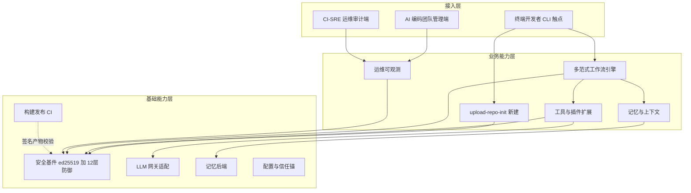
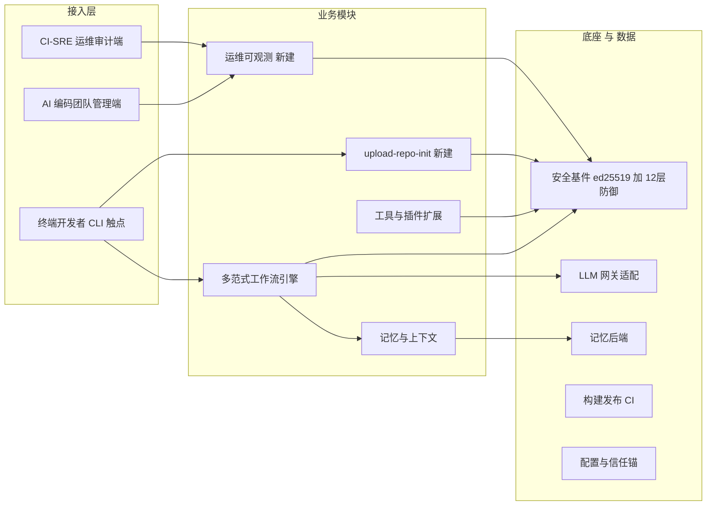

# AICoding 架构设计 · 高层架构设计

> 本文档为《AICoding 架构设计》核心产物之一，对应**高层架构设计模版**。
> 上游输入：业务原始诉求 + 行业调研结论（research_report.md，G2 已通过）+ 现有架构知识库（material_digest.md，G1 已通过）；
> 下游输出：驱动《系统设计》《部署设计》《安全设计》《UserStory》四份文档的撰写。
> 本文档为 system-architect 与 product-story-designer 的唯一上游边界基线，冻结系统定位、模块范围、MVP 范围、角色场景与功能清单。

---

## 0. 元信息：修订记录

```yaml
标题: ganyu-agent - 高层架构设计 v1.0
版本: v1.0
状态: Reviewing   # Draft | Reviewing | Approved | Deprecated
创建日期: 2026-08-19
最后更新: 2026-08-19
作者: business-architect（许边界）
评审人:
  - 主理人 / team-lead（G3 人工审核待执行）

关联文档:
  上游输入:
    - 业务原始诉求: 主理人注入（"启动 AICoding 架构专家团，基于我的项目背景和资料生成完整架构方案。严格遵循行动清单全量完整的落地落实"）
    - 行业调研报告: .workbuddy/output/research_report.md（G2 已通过）
    - 现有架构知识库: .workbuddy/output/material_digest.md（G1 已通过）
  下游产出:
    - 系统设计: .workbuddy/output/系统设计.md
    - 部署设计: .workbuddy/output/部署设计.md
    - 安全设计: .workbuddy/output/安全设计.md
    - UserStory: .workbuddy/output/UserStory.md
```

| 版本 | 日期 | 作者 | 变更内容 | 评审状态 |
| --- | --- | --- | --- | --- |
| v1.0 | 2026-08-19 | business-architect（许边界） | 初稿（G3 待校验与人工审核） | Reviewing |

> **版本管理纪律**：破坏性变更（章节结构调整 / 关键决策反转）升 MAJOR；新增章节、扩充内容升 MINOR。

---

## 1. 需求概要

### 1.1 需求概要说明

ganyu-agent 是一款 Rust CLI AI agent（约 7.6k LOC、34 个 .rs 文件），基于 fail-closed 安全哲学（F-01~F-14、R-1~R-9），以 Unit×RunContext×Workflow 为核心抽象、6 个 workflow 模块实现 7 个范式（single 模块兼 single+ReAct），服务终端开发者与 AI 编码用户，覆盖多范式工作流、记忆、工具调用与插件扩展。本期由工程审计报告（9 维度，总体 🟡 有条件通过 B+）暴露的 4 项运维就绪度 🔴 缺口、技术债（F1 缺 sandbox、A1/A2/U1 上帝模块、M1~M4 待实现）与一项经核验确认不存在的缺失能力「上传仓库初始化（upload-repo-init）」共同驱动，启动整体架构方案 + 该缺失能力的边界冻结设计。

### 1.2 关键决策摘要

| 编号 | 决策类别 | 决策内容 | 关联章节 |
| --- | --- | --- | --- |
| D1 | 范围决策 | 本次范围为「整体架构方案」+「含 upload-repo-init 缺失能力设计」；由 G0 运行时决策锁定，不做 SaaS 多租户云端 | §6.1 需求边界 |
| D2 | 技术选型决策 | 复用现有 Rust 引擎 + 安全基件（ed25519 / 12 层防御 / fail-closed）+ nomifun 33 能力 + CI 流水线；新建 upload-repo-init；以演进式重构消解 A1/A2/U1 债务 | §2.4 基线复用 / §4 |
| D3 | MVP / 完整版边界 | MVP 骨架必须是完整版的子集：MVP 含 P0 修复 + upload-repo-init 最小集 + 运维缺口分批补齐；远端 push 发布、跨平台容器级隔离、插件 MCP 演进归入完整版或 opt-in | §4.3 |
| D4 | 复用 vs 新建 | 复用底座：ed25519 签名、12 层防御矩阵、记忆后端、构建发布 CI、vetted 插件信任锚；新建：upload-repo-init（状态机/幂等/回滚 + 安全基件复用） | §5.2 系统依赖架构 |
| D5 | 部署形态 | 自托管单二进制（install.sh/install.ps1 + release.yml 三平台 hardened 构建），私有化，非 SaaS，多租户=否（单机用户） | §4.2 / §5.2 |

**硬指标**：共 5 条（≥ 3 条，≤ 5 条）；每条均映射到正文章节。

### 1.3 价值主张

| 价值维度 | 量化目标 | 度量指标 | 当前值 | 目标值 | 截止时间 |
| --- | --- | --- | --- | --- | --- |
| 效率 | P0 高优缺陷清零 + 记忆调用连接复用 | 🔴 高优缺陷数 / 连接池复用率 | 4 项高优缺陷；每次记忆调用新建 reqwest::Client（连接池失效） | 0 项高优缺陷；连接池复用率 100% | MVP 上线 |
| 合规 | upload-repo-init 复用既有安全控制点 | 12 层防御相关控制点复用数 / 总数 | 新建模块 0 复用（能力原不存在） | 4/4（resolve_sandboxed / ssrf_guard_resolve / restrict_file_permissions / shell 双层门禁） | MVP 上线 |
| 成本 | 自托管零云运行时成本 + 轻量运维补齐 | 二进制体积增长 / 新增重依赖数 | 无内嵌运维组件 | 体积增长 ≤ 15% 且零新增重依赖（systemd 看门狗 + 内嵌 metrics/log/OTel） | MVP 上线 |
| 体验 | 终端开发者获得本地仓库一键幂等初始化 | 仓库初始化步骤数 / 幂等成功率 | 能力不存在（手动多步） | 1 命令；幂等成功率 ≥ 99.9% | MVP 上线 |

**硬指标**：业务价值（效率/合规/体验）≥ 2 条 + 技术/成本价值（成本）≥ 1 条；每条可量化，无"提升/优化"等模糊词。

---

## 2. 需求分析 & 痛点解构

本节按「甲方决策者 / 最终用户 / 受影响方」三大维度盘点核心角色关注点，每个角色均标注 Top1 关心点。最终用户（终端开发者、CLI 使用者）与受影响方（CI/运维 SRE、合规审计）的核心角色诉求如下。

### 2.1 核心角色关注点

| 角色 | 业务身份 | 主要操作 | Top1 关心点 | 来源 |
| --- | --- | --- | --- | --- |
| 甲方决策者 | 项目 Owner / 主理人（齐构成） | 架构方向决策、ROI 与合规把关 | 安全可控与可审计：ed25519 供应链签名 + fail-closed 诚实边界是否守住 | 用户诉求 / SECURITY.md（D4） |
| 最终用户 A | 终端开发者 / CLI 使用者 | 多范式工作流、记忆、工具调用、插件扩展 | 开箱即用与运行稳定：P0 修复前高频 panic（breakers 热重载）/ 阻塞 IO（LocalMemory 全量重写） | D11 usage（D11）/ D1 §3 |
| 最终用户 B | AI 编码团队 Lead / 管理者 | 监控、干预、合规查看 | 可观测与审计留痕：运维缺口①②（无可观测性、无 supervisor） | D1 §4 |
| 受影响方：CI / 运维 SRE | 持续集成与运维工程师 | 部署、升级、监控、回滚 | 原子升级与可观测性：运维缺口②③（升级非原子、无可观测性） | D1 §4 / D15 release.yml |
| 受影响方：合规审计 | 安全/合规审计方 | 留痕、完整性核验 | 审计日志轮转与防篡改：运维缺口④（审计日志无轮转） | D1 §4 / D4 §2 12 层防御 |

**硬指标**：≥ 3 类（甲方决策者 / 最终用户 / 受影响方各至少一行）；每行有 Top1 关心点，无笼统"使用方便"。

### 2.2 核心痛点

| 编号 | 痛点描述 | 现象 / 数据 | 影响角色 | 影响程度 | 优先级 |
| --- | --- | --- | --- | --- | --- |
| P1 | 运维就绪度 4 项 🔴 缺口 | ①无 supervisor/看门狗；②无可观测性（指标/日志/trace）；③升级非原子（无 .old 兜底与回滚）；④审计日志无轮转策略（D1 §4） | CI/运维 SRE、合规审计 | 高（可用性 + 合规） | P1 |
| P1 | F1 sandbox 债务：hardened 缺 sandbox | hardened feature 组合为 [network,crypto,secret,shell]，缺 sandbox；Landlock 仅 Linux 生效，其余平台为安全 no-op（D1 §5 / D4 §4） | 受影响方：安全/合规 | 高（合规/隔离底线） | P1 |
| P2 | 上帝模块可维护性差 | main.rs 1248 行上帝模块（A1）；core↔ext 耦合（A2）；upload/update 上帝模块（U1）；M1~M4 待实现（D1 §5） | 最终用户 A/B、甲方决策者 | 中（演进成本） | P2 |
| P2 | 缺失能力「上传仓库初始化」 | 经 5 位专家与源码核验，代码中不存在该能力；D6 §3 / D11 §3 / D17 §3 能力清单均未包含（D1 §6） | 最终用户 A | 中（功能缺口） | P2 |
| P3 | 测试基线口径不清（X2） | "55 测试（42 单元 + 5 集成 + 8 工作流）"声明；R-1 签名互操作测试受 network feature 门控，默认 feature 下不编译/不运行（D3 §4 / D1 / D12 §2） | 甲方决策者、CI/运维 | 中（质量基线可信度） | P3 |

**优先级标准**：
- **P1**：直接影响业务核心流程或合规底线，不解决无法上线。
- **P2**：影响用户体验或运营效率，可在 MVP 后迭代。
- **P3**：长尾/口径问题，列入完整版或后续版本。

**硬指标**：每条痛点有现象/数据佐证；P1 ≥ 1 条且 §2.3 有对应目标。

### 2.3 期待目标

| 编号 | 目标描述 | 对齐痛点 | 度量指标 | 当前值 | 目标值 | 截止时间 |
| --- | --- | --- | --- | --- | --- | --- |
| V1 | 运维就绪度补齐至生产可用（supervisor + 可观测 + 原子升级 + 审计轮转，分批） | P1（运维缺口） | 4 项 🔴 缺口剩余数 | 4 | 0 | MVP（分批）/ 完整版收尾 |
| V2 | 安全隔离诚实化（Linux Landlock 强化 FS+网络；非 Linux 维持 honest no-op 并文档化） | P1（F1） | 跨平台隔离一致性声明覆盖率 | 0（无声明） | 100%（文档化诚实边界） | MVP 部分 / G5 裁决 U-03 |
| V3 | 缺失能力 upload-repo-init 上线（MVP 最小集） | P2（缺失能力） | 本地仓库 init/clone/commit 幂等成功率 | 能力不存在 | ≥ 99.9% | MVP 上线 |
| V4 | 模块可维护性提升（拆分上帝模块、解耦 core↔ext） | P2（上帝模块） | main.rs 行数 / core↔ext 耦合度 | 1248 行 / 高耦合 | ≤ 400 行 / 解耦 | 完整版 |
| V5 | 质量基线透明（默认 vs hardened 两套测试计数，R-1 纳入 hardened CI） | P3（X2） | 默认特性测试通过率报告 + hardened CI R-1 显式运行 | 仅"55"笼统声明 | 双基线报告就绪 | 完整版（路由 G4） |

**硬指标**：每条目标有数字 + 对齐至少 1 条痛点；P1 痛点有对应 V 级目标（V1、V2）。

### 2.4 基线复用

| 复用类别 | 现有能力 | 复用方式 | 来源系统 | 备注 |
| --- | --- | --- | --- | --- |
| 安全基件 | ed25519（RFC 8032）供应链签名 + 12 层防御矩阵 + fail-closed | 直接调用控制点（resolve_sandboxed / ssrf_guard_resolve / restrict_file_permissions / shell 双层 / is_safe_program 等） | D4 SECURITY.md / D3 security_fixes.md | upload-repo-init 强制复用 |
| 核心引擎 | Unit×RunContext×Workflow（6 模块实现 7 范式，single 兼 ReAct） | 直接复用，不推倒 | D6 architecture.md | 术语已统一（X3） |
| 能力包 | nomifun 33 项能力（skill:NAME 注册） | 直接接入 SkillBook::match_intent | D17 nomifun_capabilities.md | 不含 upload-repo-init（佐证缺失） |
| 插件机制 | example.json vetted 信任锚（python plugins/upper.py） | 冻结现状（MVP 保留），完整版规划 MCP 适配 | D18 / ADR-008 | U-02 路由 G4 |
| 构建发布 | release.yml 三平台 hardened 构建 + ed25519 签名 + cargo test/cargo-audit | 直接复用 | D15 / D16 sign-release.py | 公钥三处一致（D4/D5） |
| 构建缓存 | B2 profile（thin LTO / codegen-units=4 / strip / panic=abort）+ 统一构建缓存 | 直接复用 | D8 / D13 / D14 | — |
| 安装分发 | install.sh / install.ps1 一键安装 + 硬编码公钥信任锚校验 | 直接复用 | D13 / D14 / D5 | fail-closed 校验 |

**硬指标**：先盘点再决定新建；功能缺口（含 upload-repo-init）已确认基线无法覆盖（D1 §6 五位专家 + 源码核验 + D17 能力清单交叉验证）。

### 2.5 功能缺口

> 按「修复 / 新建 / 运维补齐 / 演进」阶段维度分组；每条缺口对齐 §2.3 至少一条目标。

| 阶段 | 功能缺口 | 必要性 | 优先级 | 对齐目标 |
| --- | --- | --- | --- | --- |
| 修复（P0/P1） | P0-1 OpenVikingMemory 连接池修复（D1 §3 #1） | 必须 | MVP | V1 |
| 修复（P0/P1） | P0-2 routing breakers 热重载 panic 修复（D1 §3 #2） | 必须 | MVP | V1 |
| 修复（P0/P1） | P0-3 LocalMemory 全量重写阻塞 IO 修复（D1 §3 #3） | 必须 | MVP | V1 |
| 修复（P0/P1） | F1 sandbox Linux Landlock 强化（FS+网络双隔离） | 重要 | MVP（部分） | V2 |
| 新建 | upload-repo-init 最小集（本地 init/clone/commit + 幂等 + 回滚 + 复用安全基件） | 必须 | MVP | V3 |
| 运维补齐 | supervisor/看门狗 + 可观测（metrics/log/OTel）+ 原子升级（A/B）+ 审计日志轮转 | 必须 | MVP（分批） | V1 |
| 演进 | 上帝模块拆分（A1/A2/U1）+ M1~M4 实现 | 重要 | 完整版 | V4 |
| 演进 | 插件机制 MCP 适配（规划方向，保留 vetted 信任锚） | 重要 | 完整版（路由 G4） | — |
| 演进 | 测试基线透明（默认 vs hardened 双计数，R-1 纳入 hardened CI） | 重要 | 完整版（路由 G4） | V5 |

**硬指标**：每条缺口对齐 §2.3 至少一条目标；MVP 缺口在 §6.3 功能清单中对应有 MVP 范围标记。

---

## 3. 行业调研

### 3.1 行业标杆系统分析

> 以下为 G2 调研报告（research_report.md，已通过 12/12 自动校验 + 人工审核）的事实摘要，区分「事实 / 推断」。完整原文见 `.workbuddy/output/research_report.md`。

| 标杆系统 | 厂商 / 来源 | 场景覆盖 | 技术亮点 | 商业模式 | 适用度 |
| --- | --- | --- | --- | --- | --- |
| B1 Claude Code | Anthropic（闭源 SaaS/订阅制） | 终端 AI 编程助手、复杂项目开发 | 分层多 agent、OS 级沙箱（bubblewrap/seatbelt，FS+网络双隔离）、6 种权限模式、MCP、Skills/Agents/Memory 扩展 | 订阅制（约 17 美元/月）+ API 用量 | 中（闭源不可自托管，合规可控性弱） |
| B2 Goose | Block → Linux 基金会 AAIF（Apache-2.0 开源，Rust） | 通用 agent：编码、工作流、研究、自动化 | Rust 引擎、MCP-first（70+ 扩展）、可移植 YAML Recipes、并行 subagent（隔离文件域）、多 LLM（30+） | 免费开源（BYOK，仅付 API） | 高（与 ganyu 同为 Rust CLI，直接对标） |
| B3 OpenCode | SST 团队（MIT 开源，TypeScript/Bun） | 开源终端 AI 编码 agent，替代 Claude Code | 客户端/服务端分离、75+ LLM provider、原生 LSP、MCP 支持、多会话并行、自定义 agent | 免费开源（MIT，仅付 API） | 中高（架构范式可参考，语言不可复用） |
| B4 OpenHands | All-Hands-AI（MIT 开源，Python/FastAPI+React） | 自主软件工程师、GitHub issue→PR 批量自治 | 每会话独立 Docker 沙箱、资源配额、操作审计日志、环境快照回滚、原生 GitHub 集成 | 免费开源（MIT，自托管或 Cloud） | 低（Web/Docker 形态与单二进制 CLI 不符） |

**硬指标**：≥ 3 家；含 1 家头部 SaaS（B1）+ 3 家开源/自研代表（B2/B3/B4）。

### 3.2 方案对标及优先级打分

> 评估维度与权重沿用调研报告设定（已针对本项目理由化）：场景契合度 0.30（ganyu 为 Rust CLI、fail-closed、多范式引擎与插件扩展，架构范式参考价值最高）；技术成熟度 0.20；集成难度（反向）0.15；成本（反向）0.15；合规可控性 0.20（对应受监管/审计场景与 fail-closed）。

| 评估维度 | 权重 | B1 得分 | B2 得分 | B3 得分 | B4 得分 |
| --- | --- | --- | --- | --- | --- |
| 场景契合度 | 0.30 | 5 | 5 | 4 | 3 |
| 技术成熟度 | 0.20 | 5 | 4 | 5 | 4 |
| 集成难度（反向）| 0.15 | 4 | 5 | 4 | 3 |
| 成本（反向） | 0.15 | 3 | 5 | 5 | 3 |
| 合规可控性 | 0.20 | 2 | 5 | 5 | 5 |
| **加权总分** | **1.00** | **3.95** | **4.80** | **4.55** | **3.60** |

**结论摘要**（本节为评估而非授权，最终边界由本阶段冻结）：
- **优先借鉴**：B2 Goose（4.80）——与 ganyu 同为 Rust CLI agent，MCP-first + 可移植 YAML Recipes + 隔离文件域 subagent 的"能力即 MCP 扩展、工作流即 Recipe"分层，对 ganyu 的多范式引擎与插件机制最具借鉴价值；Apache-2.0 可审计/自托管契合 fail-closed 与受监管场景。
- **部分借鉴**：B3 OpenCode（4.55）——客户端/服务端分离、Provider Router、多角色 agent 与细粒度命令黑白名单，对 core↔ext 解耦（A2）与权限配置有参考；B1 Claude Code（3.95）——6 种权限模式与 OS 级沙箱（FS+网络双隔离）对 F1 债务与 12 层防御直接有用；二者均不作底座。
- **不借鉴（否决）**：B4 OpenHands（3.60）——Web + 每会话 Docker 沙箱整体架构与 ganyu「本地单二进制 CLI」形态根本不符；仅抽取其沙箱隔离与可恢复性子模式（每会话隔离、资源配额、操作审计、快照回滚）供 F1 与运维缺口参考。

### 3.3 完整报告参考

- 完整报告链接：`.workbuddy/output/research_report.md`
- 调研工具：`tech-research-advisor`
- 调研日期：2026-08-19
- 调研归档：`.workbuddy/output/research_report.md`

---

## 4. 方案决策

### 4.1 价值定位澄清

**定位三段式**（对外 / 对内 / 差异化）：

```
对外价值（客户侧）: 为终端开发者提供 fail-closed 可信的 Rust CLI AI agent，覆盖多范式工作流/记忆/工具调用/插件扩展，新增 upload-repo-init 本地仓库幂等初始化，开箱即用且可审计。
对内价值（运营侧）: 一线提效（P0 修复 + 缺失能力补齐）+ 运维可观测可控（补齐 4 项 🔴 缺口）+ 合规留痕（审计日志轮转 + ed25519 供应链签名）。
差异化价值        : 相对闭源 SaaS（B1）的可审计/自托管与数据主权；相对 Web/Docker 方案（B4）的轻量单二进制（无运行时依赖、启动快）；ed25519 供应链签名 + 12 层防御诚实边界（Landlock 仅 Linux 生效、非 Linux 诚实 no-op，不伪装为容器隔离）。
```

**与产品矩阵的关系**：本系统（ganyu-agent）在「终端 AI 编码工具」产品矩阵中承担核心执行引擎职责，向上对接 LLM 网关与记忆后端、向外通过插件/skill 扩展生态，向下经 CI 构建发布自托管二进制，与上游资料摘要/行业调研、下游系统/部署/安全设计形成完整业务闭环（见 §5.2、§5.3）。

> 术语统一说明（X3 口径）：本文档统一表述为「6 个 workflow 模块实现 7 个范式（single 模块兼 single+ReAct）」，与 D6 §4 及行业调研 §2.2/§3.2 一致，消除"7 范式 vs 6 模块"口径歧义。

### 4.2 系统定位澄清

| 维度 | 内容 |
| --- | --- |
| 系统名称 | ganyu-agent |
| 系统类型 | 已有系统扩展（在现有 Rust CLI 上补整体架构方案 + 缺失能力 upload-repo-init） |
| 部署形态 | 私有化 / 自托管单二进制（install.sh/install.ps1 + release.yml 三平台 hardened 构建），非 SaaS |
| 多租户 | 否（单机用户；不做 SaaS 多租户云端） |
| 服务对象 | 终端开发者 / CLI 使用者、AI 编码团队 Lead、CI/运维 SRE、合规审计（对齐 §2.1） |
| 上游依赖 | LLM 网关/后端、记忆后端（OpenVikingMemory / 本地）、MCP/插件生态（详见 §5.2） |
| 下游消费者 | 插件/skill、远端仓库（完整版/opt-in）、运维/审计系统（详见 §5.2） |
| 边界（不做） | 不做 SaaS 多租户云端；不做跨平台容器级隔离（MVP，完整版待 G5 裁决 U-03）；Landlock 仅 Linux 生效，非 Linux 维持 honest no-op（诚实边界，U-03 路由 G5） |

### 4.3 MVP 与完整版决策

| 阶段 | 时间窗 | 范围（功能编号） | 架构差异点 | 退出标准 | 不做（延后） |
| --- | --- | --- | --- | --- | --- |
| MVP | Phase-1（约 6~8 周） | 复用 ed25519/12 层防御；P0-1/P0-2/P0-3 修复；F1 sandbox Linux 强化；upload-repo-init 最小集（F6）；运维缺口分批补齐（supervisor+可观测+原子升级+审计轮转）；插件机制冻结（保留 vetted） | 不引入 MCP 契约变更；不引入 Docker 隔离；远端 push 为 opt-in；非 Linux 维持 honest no-op | P0 缺陷密度 4→0；upload-repo-init 本地幂等跑通；运维 4 项 🔴 清零（分批） | 远端 push 发布、跨平台容器隔离、插件 MCP 演进、上帝模块拆分 |
| 完整版 | Phase-2 | + 远端 push/release 发布（opt-in）；上帝模块拆分（A1/A2/U1）+ M1~M4；插件 MCP 适配（保留 vetted 信任锚，路由 G4）；测试基线透明（默认 vs hardened，路由 G4）；跨平台隔离策略（G5 裁决 U-03） | 双 AZ/多 provider 非必须；保留单二进制形态；MCP 为扩展适配层而非替换 | 运维缺口长期稳定 30 天 + 审计闭环 + 安全设计 G5 通过 | — |

**演进纪律**（重要）：
- ✅ MVP 的架构骨架必须是完整版的**子集**，不允许 MVP 上线后推倒重来（upload-repo-init 状态机/幂等/回滚设计预留完整版多仓库编排扩展点）。
- ✅ MVP 中可延后的能力（远端 push、跨平台隔离、MCP 演进）在本节明确"完整版替换/补充计划"，不静默丢弃。
- ❌ 禁止：MVP 为赶工引入完整版无法继承的临时架构。

---

## 5. 业务架构设计

### 5.1 业务架构图

系统整体分为接入层、业务能力层、基础能力层三层（详见下方 Mermaid 图）。

**绘制规范**：至少 3 层（接入层 → 业务能力层 → 基础能力层）；每个模块有标准名；实线 = 同步调用、虚线 = 异步事件、粗线 = 主链路。



### 5.2 系统依赖架构

| 依赖类型 | 系统 / 模块 | 提供方 | 依赖能力 | 接入方式 | 同步/异步 | 关键约束 |
| --- | --- | --- | --- | --- | --- | --- |
| 上游 | LLM 网关 / 后端 | 外部 LLM 供应商（BYOK） | 模型推理、流式补全 | HTTPS / OpenAI 兼容 API | 同步（流式） | 超时 / 限流 / fallback；token 成本可控 |
| 上游 | 记忆后端 | OpenVikingMemory / 本地 JSON | 记忆读写、上下文召回 | 进程内调用 / REST | 混合 | 连接池复用（P0-1）；本地写入非阻塞 IO（P0-3） |
| 下游 | 插件 / skill | vetted 插件清单（example.json） | 工具扩展执行 | 本地子进程（python plugins/*.py） | 同步 | vetted 信任锚不变（U-02 冻结）；shell 双层门禁 |
| 下游 | 远端仓库 | GitHub / Git 服务端（完整版/opt-in） | push/release 发布 | HTTPS / git 协议 | 异步 | SSRF 防护（ssrf_guard_resolve）；MVP 不默认开启 |
| 复用底座 | 安全基件 | ganyu 既有（D3/D4） | ed25519 校验、12 层防御控制点 | 进程内 API | 同步 | fail-closed 默认拒绝；upload-repo-init 强制复用 4 控制点 |
| 复用底座 | 构建发布 CI | release.yml / sign-release.py | 三平台 hardened 构建 + 签名 | CI 流水线 | 异步 | 公钥三处一致（D4/D5/D16）；secret 缺失则 fail-closed |
| 数据订阅 | 运维/审计系统 | systemd / ELK / Splunk | metrics / trace / 审计日志 | OTel / NDJSON | 异步 | 审计日志轮转（D1 §4 缺口④） |

**硬指标**：
- 每条依赖明确"接入方式 + 同步/异步 + 关键约束"，无只写"调用 API"。
- 所有 P1 痛点对应核心能力均能在表中找到依赖来源（自愈/可观测→运维可观测 M5+B1；F1→安全基件 B1；缺失能力→M4+B1）。

**下游依赖路由（开放项显式派发，不在本阶段裁决）**：
- **X1（R-6/R-8/R-9 处置状态自相矛盾）**：D2 §0/§1/§4 称"接受残余"，D2 §3/§4.5 与 D3 §3 称"已第三阶段加固闭环"。属安全文档一致性问题，**路由 security-architect（G5）** 以代码事实（D3 §3 加固实现）为准核对 SECURITY-REPORT.md 与 security_fixes.md，给出权威状态并标注「经裁决」。
- **X2 / U-04（测试计数"55"口径、R-1 互操作测试条件）**：R-1 签名互操作测试受 network feature 门控，默认 feature 下不运行。**路由 system-architect（G4）/ 开发文档**，明确默认 feature 与 hardened feature 两套测试基线，R-1 互操作测试纳入 hardened CI 显式报告（对齐 V5）。
- **U-03（非 Linux F1 sandbox 处置）**：**路由 security-architect（G5）**；本阶段仅在 §4.2 边界声明「Landlock 仅 Linux 生效，非 Linux 维持 honest no-op」诚实边界，不做跨平台容器级隔离（MVP）。

### 5.3 业务闭环

**业务主链路**（端到端）：

```
触发（用户命令 / CI 调用） → 识别（SkillBook::match_intent 派发，11 规则 + nomifun 33 能力） → 处置（多范式工作流引擎执行 + 安全基件校验 resolve_sandboxed/ssrf_guard_resolve/restrict_file_permissions/shell 双层） → 交付（结果 / 产物 / 仓库初始化） → 复盘（审计日志 NDJSON 落盘） → 反馈回路
```

**关键反馈回路**：

| 回路 | 触发点 | 反馈对象 | 反馈机制 | 价值 |
| --- | --- | --- | --- | --- |
| 业务效果回路 | 工作流完结 / upload-repo-init 成功 | 策略中心 / 用户 | 执行结果回写记忆后端（LocalMemory 非阻塞） | 优化后续派发与上下文 |
| 运营监控回路 | 指标异常（panic / 升级失败 / 审计中断） | CI-SRE / 运维 | 实时告警（metrics + OTel trace + systemd 看门狗） | 快速响应、原子回滚 |
| 模型/策略迭代回路 | 人工反馈 / 失败用例 | 开发者 / prompt 策略 | 周度复盘 + 能力注册更新 | 提升准确率与可用性 |
| 安全迭代回路 | 新漏洞 / 残余风险 | security-architect（G5，X1/U-03 路由） | 安全基件加固 + 文档一致性裁决 | 守住 fail-closed 边界 |

**运营主线**：每日由 CI-SRE 看 metrics/审计面板（M5），每周由 AI 编码团队 Lead 复盘失败用例与权限策略，每月由合规审计核验审计日志完整性与签名链；与 §6.5 运维/审计端原型呼应。

---

## 6. 产品需求及原型

### 6.1 需求边界

**In-Scope**（本期必做）：

```
F1. 复用现有 Rust 引擎 + 安全基件（ed25519 / 12 层防御 / fail-closed）
F2. P0-1 OpenVikingMemory 连接池复用修复
F3. P0-2 routing breakers 热重载 panic 修复
F4. P0-3 LocalMemory 全量重写阻塞 IO 修复
F5. F1 sandbox Linux Landlock 强化（FS + 网络双隔离）
F6. 新建 upload-repo-init 最小集（本地 init/clone/commit + 幂等 + 回滚 + 复用安全基件）
F7. 运维缺口补齐：supervisor/看门狗 + 可观测（metrics/log/OTel）+ 原子升级（A/B）+ 审计日志轮转
F8. 插件机制冻结（保留 vetted 信任锚，现状不变）
N1. 自托管单二进制，私有化，非 SaaS，多租户=否
N2. 非 Linux F1 维持 honest no-op 并文档化（诚实边界）
N3. 终端用户 CLI 交互触点（REPL / 命令入口）
```

**Out-of-Scope**（本期不做，必须列原因）：本期明确不做以下能力，原因与后续计划见各子表。

#### Out-of-Scope 项 1：SaaS 多租户云端
| 编号 | 不做的事 | 原因 | 后续计划 |
| --- | --- | --- | --- |
| O1 | 不做 SaaS 多租户云端部署 | 项目为自托管单二进制 CLI，无云端多租户诉求；与 fail-closed / 数据主权一致 | 不做（边界声明） |

#### Out-of-Scope 项 2：跨平台容器级隔离
| 编号 | 不做的事 | 原因 | 后续计划 |
| --- | --- | --- | --- |
| O2 | 不做跨平台容器级隔离（Docker 级） | 与单二进制 CLI 形态不符；非 Linux 维持 honest no-op；仅参考 B4 子模式 | 完整版 / 不做（待 G5 裁决 U-03） |

#### Out-of-Scope 项 3：远端仓库 push 发布
| 编号 | 不做的事 | 原因 | 后续计划 |
| --- | --- | --- | --- |
| O3 | 远端仓库 push / release 发布 | 属 upload-repo-init 完整版或 opt-in；MVP 仅本地 init/clone/commit | 完整版（opt-in） |

**硬指标**：In-Scope ≤ 15 条（本次 8 功能 + 3 非功能 = 11 条）；Out-of-Scope ≥ 3 条（O1/O2/O3）。

### 6.2 产品模块全景图

**模块卡片**：

| 字段 | 说明 |
| --- | --- |
| 模块名称 | 标准名 |
| 一级归属 | 接入层 / 业务能力层 / 基础能力层 |
| 责任团队 | 团队名 |
| 上游 | 模块/系统列表 |
| 下游 | 模块/系统列表 |
| MVP 是否包含 | 是 / 否 |

| 模块名称 | 一级归属 | 责任团队 | 上游 | 下游 | MVP 是否包含 |
| --- | --- | --- | --- | --- | --- |
| 终端开发者 CLI 触点 | 接入层 | business-architect 界定 / 开发团队 | 多范式工作流引擎、upload-repo-init | 用户 | 是 |
| AI 编码团队管理端 | 接入层 | 开发团队 | 运维可观测 | 管理者 | 是（轻量） |
| CI-SRE 运维审计端 | 接入层 | 平台/运维团队 | 运维可观测 | SRE/合规 | 是（轻量） |
| 多范式工作流引擎 | 业务能力层 | 开发团队 | LLM 网关、记忆与上下文 | 工具与插件、upload-repo-init | 是（复用） |
| 记忆与上下文 | 业务能力层 | 开发团队 | 记忆后端 | 工作流引擎 | 是（复用 + P0 修复） |
| 工具与插件扩展 | 业务能力层 | 开发团队 | 安全基件、LLM 网关 | 插件/skill | 是（冻结 vetted） |
| upload-repo-init（新建） | 业务能力层 | 开发团队 | 安全基件 | 本地仓库 / 远端仓库（opt-in） | 是（最小集） |
| 运维可观测（新建） | 业务能力层 | 平台/运维团队 | 安全基件、构建发布 CI | 运维/审计系统 | 是（分批） |
| 安全基件 ed25519 + 12 层防御 | 基础能力层 | security-architect（G5 协同） | — | 全部业务模块 | 是（复用） |
| LLM 网关适配 | 基础能力层 | 开发团队 | 外部 LLM | 工作流引擎、插件 | 是（复用） |
| 记忆后端 | 基础能力层 | 开发团队 | — | 记忆与上下文 | 是（复用） |
| 构建发布 CI | 基础能力层 | 平台/运维团队 | — | 安装分发 | 是（复用） |
| 配置与信任锚 | 基础能力层 | 开发团队 | — | 全部模块 | 是（复用） |



### 6.3 功能清单

> 所有 P0 功能均标记 ✅ MVP；每个功能反向映射到 §2.5 功能缺口 + §2.3 期待目标。

| 编号 | 一级模块 | 二级功能 | 功能描述 | 优先级 | MVP 范围 | 完整版范围 | 对齐目标 |
| --- | --- | --- | --- | --- | --- | --- | --- |
| F1 | 多范式工作流引擎 | 引擎复用（6 模块/7 范式） | 复用 Unit×RunContext×Workflow，single 兼 ReAct | P0 | ✅ MVP | ✅ | — |
| F2 | 安全基件 | ed25519 + 12 层防御复用 | 调用既有控制点，fail-closed 默认拒绝 | P0 | ✅ MVP | ✅ | V2 |
| F3 | 记忆与上下文 | P0-1 连接池修复 | OpenVikingMemory 复用 reqwest::Client 连接池 | P0 | ✅ MVP | ✅ | V1 |
| F4 | 多范式工作流引擎 | P0-2 breakers panic 修复 | routing/mod.rs 热重载原子 swap，消除 unwrap panic | P0 | ✅ MVP | ✅ | V1 |
| F5 | 记忆与上下文 | P0-3 阻塞 IO 修复 | LocalMemory 增量写入，消除全量重写阻塞 | P0 | ✅ MVP | ✅ | V1 |
| F6 | upload-repo-init（新建） | 本地仓库初始化最小集 | 状态机（Pending→Running→Succeeded/Failed）+ 幂等 git init/clone/commit + 失败回滚 + 复用 4 安全控制点 | P0 | ✅ MVP | ✅ | V3 |
| F7 | 运维可观测（新建） | F1 sandbox Linux 强化 | Landlock FS+网络双隔离（Linux） | P1 | ✅ MVP（部分） | ✅ | V2 |
| F8 | 运维可观测（新建） | 运维缺口补齐 | supervisor/看门狗 + metrics/log/OTel + 原子升级 A/B + 审计日志轮转 | P1 | ✅ MVP（分批） | ✅ | V1 |
| F9 | 工具与插件扩展 | 插件机制冻结 | 保留 vetted 信任锚，现状不变 | P2 | ✅ MVP（现状） | ✅ | — |
| F10 | upload-repo-init（新建） | 远端 push 发布 | 向远端仓库 push/release（opt-in） | P2 | ❌ MVP | ✅ | V3 |
| F11 | 安全基件 | 跨平台容器级隔离 | Docker 级隔离（非 Linux） | P3 | ❌ MVP | 待 G5 裁决 | V2 |
| F12 | 多范式工作流引擎 | 上帝模块拆分 | 拆分 main.rs（A1）/ 解耦 core↔ext（A2）/ upload-update（U1）+ M1~M4 | P2 | ❌ MVP | ✅ | V4 |
| F13 | 工具与插件扩展 | 插件 MCP 演进（规划） | 适配 MCP 2025-11-25，保留 vetted 信任锚（路由 G4） | P2 | ❌ MVP | 规划 ✅ | — |
| F14 | 记忆与上下文 | 测试基线透明 | 默认 vs hardened 双计数，R-1 纳入 hardened CI（路由 G4） | P2 | ❌ MVP | ✅ | V5 |

**硬指标**：
- 每个 P0 功能在 MVP 范围内为 ✅（F1~F6 全部 ✅ MVP）。
- 每个功能反向映射到 §2.5 功能缺口 + §2.3 期待目标（见右列）。

### 6.4 产品原型 - 终端开发者 CLI 触点

**核心页面清单**：

| 页面 | 用途 | 关键交互 | MVP |
| --- | --- | --- | --- |
| REPL / 命令入口 | 交互式多范式工作流执行 | 输入意图 → SkillBook 派发 → 工作流执行 → 流式结果 | ✅ |
| upload-repo-init 命令 | 本地仓库幂等初始化 | `ganyu repo init/clone/commit` 单命令，状态机驱动，失败自动回滚 | ✅ |
| 配置 / 信任锚查看 | 查看 GANYU_* 配置与安全基线 | `ganyu config` / `ganyu doctor` 校验 ed25519 信任锚与特性门控 | ✅ |
| 能力清单 / 帮助 | 列出 nomifun 33 能力与插件 | `ganyu skills` / `ganyu plugins`（vetted 清单） | ✅ |

**关键交互约束**：
- 幂等保证：upload-repo-init 同一目标重复执行结果一致（Check-Before-Act + 幂等键），失败补偿回滚。
- 安全基件校验：所有外部/命令操作经 resolve_sandboxed / ssrf_guard_resolve / restrict_file_permissions / shell 双层门禁，fail-closed 默认拒绝；校验 P99 ≤ 50ms（对齐 V3）。
- 命令步数：核心路径（仓库初始化）≤ 1 条主命令（对齐 V3 体验目标）。

**原型链接**：待开发阶段补充（Figma / 终端交互规范）

### 6.5 产品原型 - 运维 / 审计端（CI-SRE / 合规）

**核心页面清单**：

| 页面 | 用途 | 关键交互 | MVP |
| --- | --- | --- | --- |
| 可观测仪表盘 | metrics / trace 总览（Prometheus /metrics + OTel） | 实时刷新 / 按模块下钻 | ✅（轻量） |
| 审计日志查看 / 轮转 | NDJSON 审计日志检索与轮转状态 | 时间轴回放 / 轮转水位查看 | ✅ |
| 原子升级状态 | A/B 双槽健康检查结果 | 一键回滚到上一版 manifest 哈希 | ✅ |
| 健康检查 / 告警面板 | systemd 看门狗 + 异常告警 | 实时刷新 / 一键干预 | ✅ |

**关键交互约束**：
- 可观测性开销：内嵌 metrics/log/OTel 不引入重依赖，二进制体积增长 ≤ 15%（对齐 §1.3 成本目标）。
- 审计完整性：审计日志固定字段 NDJSON，轮转对接 ELK/Splunk，防篡改（与 ed25519 签名链呼应）。
- 升级安全：A/B + 健康检查，升级失败自动回滚到 `.old`，杜绝 brick（对齐 V1）。

**原型链接**：待部署设计阶段补充（Grafana / 审计前端）

---

## 附录 A：生成流程方法论

> 本附录为高层架构设计的**生成方法论**，描述每一步的目标、工具与产物形态，作为正文章节的产出依据。
>
> ⚠️ **附录中"能力效果展示"小节出现的领域举例（如"AI 智慧外呼 / 投诉场景"）仅用于演示方法论的输入与产物形态，不代表本模版的目标领域**。读者只需关注每一步的「目标 / 工具 / 产物形态」即可。

### A.0 生成流程总览

> 高层架构设计采用 **Step0 → Step5** 六步法，逐步从「业务背景」推导至「系统高层架构 + 产品需求原型」。

| 步骤 | 名称 | 核心产出 | 落入正文章节 |
| --- | --- | --- | --- |
| Step0 | 业务基础知识库构建 | 关联文档结构化知识库 | （为全文提供输入） |
| Step1 | 行业调研分析 | 行业标杆 / 方案对比 / MVP 决策 | §3 行业调研 |
| Step2 | 需求分析 / 痛点解构 | 需求画像卡 | §2 需求分析 & 痛点解构 |
| Step3 | 能力盘点，系统定位 | 价值定位 + 系统定位 | §4 方案决策 / §5.2 系统依赖架构 |
| Step4 | 生成系统高层架构设计 | 本文档主文档 | §1 ~ §5 |
| Step5 | 产品需求及原型 | 需求边界 + 全景图 + 原型 | §6 产品需求及原型 |


### A.1 Step0：业务基础知识库构建

#### A.1.1 目标

构建业务系统关联信息知识库，为后续步骤提供「现有架构、外部依赖文档」等业务背景。

#### A.1.2 工具（Skill）

- `docx`：解析 Word 类业务/产品文档
- `pdf`：解析 PDF 类规范、API 手册等
- `pptx`：解析方案 / 汇报型 PPT
- `xlsx`：解析数据表、清单类文件

#### A.1.3 能力效果展示

> 「AI 营销知识示例」：通过上述 Skill 将营销业务的存量文档（产品文档、对接手册、数据字典等）解析、结构化，沉淀为可在后续步骤直接召回的业务知识库。

### A.2 Step1：行业调研分析

#### A.2.1 目标

基于当前需求，调研行业标杆系统及对应解决方案，**对标行业标杆的优秀方案**，结合当前系统背景及基础组件能力，**综合打分决策 MVP 功能和落地路径**。

#### A.2.2 工具（Skill）

- `tech-research-advisor`

#### A.2.3 完整报告参考

- 完整报告链接：`.workbuddy/output/research_report.md`

#### A.2.4 能力效果展示

##### A.2.4.1 用户输入问题

> 使用 `tech-research-advisor` 技能，调研行业内 AI agent CLI / Rust agent 框架的架构范式、沙箱隔离、MCP 扩展、供应链签名与缺失能力设计模式。

##### A.2.4.2 行业标杆

> 调研产出的行业标杆系统清单及标签（B1 Claude Code / B2 Goose / B3 OpenCode / B4 OpenHands）。

##### A.2.4.3 行业优秀方案及对比

> 行业标杆方案的横向对比矩阵（5 维度加权，权重之和 1.00）。

##### A.2.4.4 方案打分及 MVP 功能评估

> 综合打分后形成 MVP 功能评估结果（优先 B2 / 部分 B3+B1 / 否决 B4）。

##### A.2.4.5 能力清单 & 方案总结

> 形成可复用能力清单与最终方案总结。

### A.3 Step2：需求分析 / 痛点解构

#### A.3.1 目标

构建**需求画像卡**，深入解构需求要点及目标。

#### A.3.2 能力效果展示

> 以 ganyu-agent 为例，按"核心角色关注点 / 核心痛点 / 期待目标 / 基线复用 / 功能缺口"五段式产出需求画像卡（结构对应正文 §2）。

### A.4 Step3：能力盘点，系统定位

#### A.4.1 目标

- 从能力知识库中召回现有系统架构，与当前问题相关的已有能力，并完成**分层与去重**
- **系统价值及能力嵌入**：明确需求 / 系统在当前架构中的价值定位
- **系统架构定位、上下游推导**：让目标系统在图中"被看见"，并自动生成上下游关系说明

#### A.4.2 产物形态

- 价值定位澄清（对应正文 §4.1）
- 系统定位澄清（对应正文 §4.2）
- 系统依赖架构图（对应正文 §5.2）

### A.5 Step4：生成系统高层架构设计

#### A.5.1 目标

整合行业分析、需求结构、现有项目背景知识库，输出**系统高层设计**（即本文档正文 §1 ~ §5）。

#### A.5.2 产物形态

- 需求概要（§1）
- 需求分析 & 痛点解构（§2）
- 行业调研（§3）
- 方案决策（§4）
- 业务架构设计（§5）

### A.6 Step5：产品需求及原型

#### A.6.1 目标

在系统高层设计的基础上，输出可被产品/研发直接消费的需求边界、功能清单与产品原型（即本文档正文 §6）。

#### A.6.2 产物形态

- 需求边界（§6.1）
- 产品模块全景图（§6.2）
- 功能清单（§6.3）
- 产品原型 - 终端开发者 CLI 触点（§6.4）
- 产品原型 - 运维 / 审计端（§6.5）

---

## 附录 B：配套工具清单

### B.1 知识库 Skill

> 用途：解析存量知识库内容。

- `docx`
- `pdf`
- `pptx`
- `xlsx`

### B.2 行业调研

> 用途：基于核心痛点与客户诉求，调研行业标杆项目及解决方案。

- `tech-research-advisor`

---

## 附录 C：阶段内自检报告（intermediate_confirmation 协议 §2.4）

> 本附录为 G3 审核弹窗的追溯材料，记录本阶段在 §2 / §4 / §5 / §6 完成后按协议 §2.4 插入的自检结果。所有 P1/P2 开放项均显式路由，未静默裁决。

### C.1 §2 / §4 自检（U-01 upload-repo-init scope）

- **§2.1 方案分歧型判定**：①存在 ≥2 方案（MVP 仅本地 vs MVP 含远端 push），均合理；②影响下游（system 设计范围、安全面）；③但上游（G0 运行时决策 + 主理人指令）已对"具体决策点"给出方向性选择——"MVP = 本地 init/clone/commit + 幂等 + 回滚；远端 push 归入完整版或 opt-in"。故 §2.1 第③条不满足（上游已定向），**未命中 §2.1**。
- **§2.3 反向验证 3 问**：
  - Q1 返工成本：冻结"MVP 本地 + 远端 opt-in"后若推翻，返工范围仅限 §6.3 F10（远端 push 由完整版挪入 MVP），影响 1 个功能行 + system 设计 1 处接口；切换成本 ≤ 0.5 人月。→ 可控。
  - Q2 用户感知：MVP 提供本地仓库一键初始化（新能力，用户可见增益）；远端 push 暂不开（opt-in），不改变已承诺的产品形态。→ 未被感知为"功能减少"（原能力不存在）。
  - Q3 与用户诉求一致：用户诉求"生成完整架构方案，严格遵循行动清单全量落地"（主理人注入原文）；G0 已定"含上传仓库初始化缺失能力设计"。本地最小集对齐该显式诉求，未偏离。→ 一致。
- **结论**：未命中，U-01 在本阶段冻结为「MVP 本地最小集 + 远端 opt-in」，写入 §6.1 In-Scope F6、§6.3 F6/F10。

### C.2 §4.2 / §6.1 自检（U-02 插件机制是否演进 MCP）

- **§2.1 方案分歧型判定**：①存在 ≥2 方案（保留 vetted 插件 vs 演进 MCP server），均合理；②影响下游（system-architect 扩展契约 D-05）；③上游未对该具体决策点做"必须切换/必须保留"的硬性锁定——research_report §4.1/§4.3 为"建议"，主理人指令为"建议 MVP 保留…完整版对齐 MCP，若你判定需用户拍板则发起"。主理人已将该判断权委派给本角色（"若你判定"）。本角色基于研究共识（B2 MCP-first 但 ganyu 已有 vetted 锚）+ 主理人方向，**可凭专业判断裁决冻结 MVP 边界**（保留 vetted），故 §2.1 第①条"无法仅凭专业判断单方裁决"不成立 → **未命中 §2.1**。
- **§2.3 反向验证 3 问**：
  - Q1 返工成本：冻结"MVP 保留 vetted 插件"后若推翻，返工范围为 §6.3 F9（现状保留，零新建）+ 完整版 F13（MCP 适配，本就未冻结，仅规划并路由 G4）。切换成本 ≈ 0（MVP 无新建契约）。→ 可控。
  - Q2 用户感知：MVP 保留 vetted 插件 = 维持现状 CLI/插件行为，用户无感知变化；完整版 MCP 为未来规划方向，非当前对外承诺。→ 未被感知。
  - Q3 与用户诉求一致：用户诉求未显式提及插件机制或 MCP；维持现状不偏离诉求，且完整版对齐行业标准（MCP 2025-11-25）为合理演进方向，已路由 G4 由 system-architect 设计契约。→ 一致（未改变产品形态/对外承诺）。
- **结论**：未命中，U-02 冻结为「MVP 保留 vetted 信任锚（F9）；完整版规划 MCP 适配并保留 vetted 信任模型，路由 G4（D-05）」。写入 §4.2 边界、§6.1 F8/F9、§6.3 F9/F13。未发起 `[中间确认]`——主理人已在指令中委派本角色判断，且本阶段仅冻结可逆的 MVP 现状，未锁定跨边界契约（该契约归属 G4）。

### C.3 §5.2 路由项（X1 / X2 / U-03 / U-04）

- **X1（R-6/R-8/R-9 状态矛盾）**：属安全文档一致性问题，本阶段不裁决；路由 **security-architect（G5）** 以 D3 §3 加固实现代码事实为准核对 SECURITY-REPORT.md 与 security_fixes.md，给出权威状态并标注「经裁决」。写入 §5.2 下游依赖路由。
- **X2 / U-04（测试"55"口径、R-1 互操作测试条件）**：路由 **system-architect（G4）/ 开发文档**，明确默认 feature 与 hardened feature 两套测试基线，R-1 纳入 hardened CI 显式报告（对齐 V5）。写入 §5.2、§6.3 F14。
- **U-03（非 Linux F1 sandbox）**：路由 **security-architect（G5）**；本阶段仅在 §4.2 边界声明「Landlock 仅 Linux 生效，非 Linux 维持 honest no-op」诚实边界，不做跨平台容器级隔离（MVP，O2）。

### C.4 §3 / §4 术语统一（X3）

- 统一表述为「6 个 workflow 模块实现 7 个范式（single 模块兼 single+ReAct）」，在 §3.1/§3.2/§4.1 一致使用，消除"7 范式 vs 6 模块"口径歧义（属口径说明，非裁决型冲突）。

### C.5 人工审核待确认项（G3 弹窗建议单列）

1. U-02 插件 MCP 演进方向（MVP 保留 vetted / 完整版对齐 MCP）——若主理人认为需用户拍板，可在 G3 人工审核中通过 AskUserQuestion 单独确认（本阶段未发起 `[中间确认]`，因主理人已委派判断且 MVP 边界可逆）。
2. X1（R-6/R-8/R-9 状态）与 U-03（非 Linux 隔离）将分别在 G5 安全设计中裁决，本阶段仅路由。
3. upload-repo-init 的「远端 push 归入完整版/opt-in」范围，如主理人希望 MVP 即含远端 push，可在此阶段回注调整（当前按 G0 + 主理人指令冻结为本地最小集）。

### C.6 decision

- **decision: "高层架构边界冻结，下游可进入"**（系统定位、模块范围、MVP 范围、角色场景、功能清单均已冻结；X1/X2/U-03/U-04 已显式路由 G5/G4，未静默裁决；U-01/U-02 经协议 §2.4 自检后定稿）。待主理人 G3 人工审核通过后，下游 system-architect / product-story-designer 可进入。
